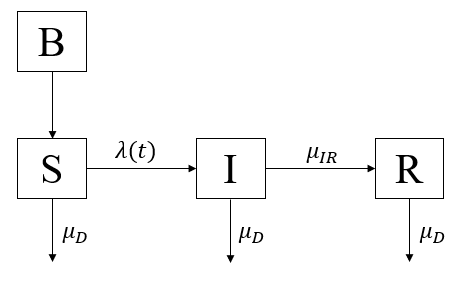
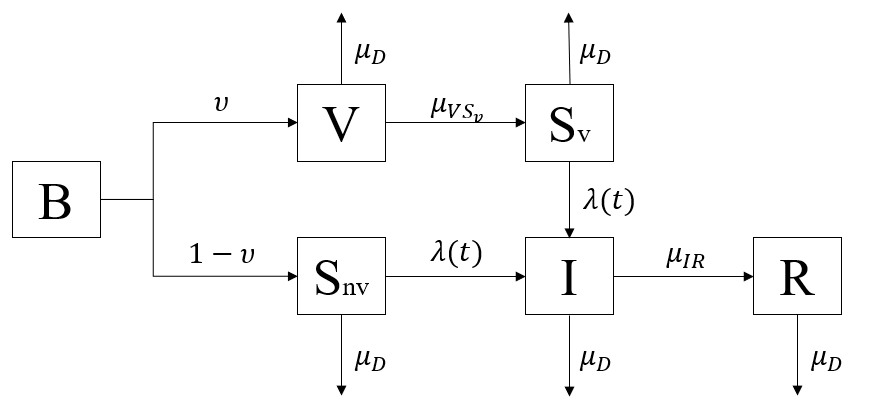

```{r setup, include=FALSE}
knitr::opts_chunk$set(echo=TRUE, message=FALSE, warning=FALSE, paged.print=FALSE)
```


```{r message=FALSE, warning=FALSE, include=FALSE, paged.print=FALSE}
options(
  keep.source=TRUE,
  encoding="UTF-8"
)

set.seed(594709947L)
library(ggplot2)
library(dplyr)
library(plyr)
library(reshape2)
library(magrittr)
library(foreach)
library(pomp)
library(doParallel)

cores = 5  # The number of cores on this machine 
cl = makeCluster(cores)
registerDoParallel(cl)
mcopts = list(set.seed=TRUE)
stopifnot(packageVersion("pomp")>="2.0")
theme_set(theme_bw())
```

## 1. Introduction

Pertussis, also known as whooping cough or the 100-day cough, is a highly contagious bacterial disease in the world. People who get infected might start with a runny nose, fever, and mild cough. Following a fit of coughing, a high-pitched whoop sound or gasp may occur as the person breathes in. The coughing may last for 10 more weeks, which lead to the phrase "100-day cough"[1].

We try to construct a SIR model to understand the transmission process of pertussis. Firstly, we will build a basic SIR model. Secondly, due to wide coverage by the vaccination, we try to combine the effect of vaccine into our SIR model. However, although the percentage of children aged 19-35 months receiving vaccinations for pertussis reached 83.2% currently[2], pertussis reported cases increased over the year, which implies that pertussis vaccine effectiveness wanes over time[3]. So, we want to explore how the vaccine wanes.


## 2. Explanatory Data Analysis

### 2.1 Data Overview

The data was downloaded from Kaggle[4]. Originally, the data only carries week, cases, and incidence per capita. For the sake of analysis and a better understanding of the time, we did some modifies to the dataset. We mapped the week into time, year, and week. We only focus on the Michigan cases from 2006 to 2011. Finally, we get a dataset with 306 rows and 5 columns. Below is the summary table for our dataset and the time plot:

```{r echo=FALSE, message=FALSE, warning=FALSE, paged.print=TRUE}
pertussis = read.csv("pertussis.csv", header = TRUE) 

pertussis = pertussis %>% 
  filter(state == "MI") %>% 
  filter(week > 200000) %>%
  mutate(time = 2000 + as.integer((week-200000)/100) + ((week-200000)-1)%%100/52,
         year = 2000 + as.integer((week-200000)/100),
         week = ((week-200000))%%100) %>%
  select(time, year, week, cases, incidence_per_capita)
pertussis = pertussis %>% filter(year >= 2006)
```

```{r}
summary(pertussis)
```

As we can see from the summary table above, the dataset collected from the first week of 2006 to the last week of 2011 (six years). Also, reported cases show a relatively small range from 0 to 21.


```{r}
pertussis %>%
  ggplot(aes(x = time, y = cases)) +
  geom_line() +
  labs(x = "Year", y = "Reported Cases", 
       title = "Time Plot of Pertussis Reported Cases from 2006 to 2011") +
  theme(plot.title = element_text(hjust = 0.5))
```

From the time plot above, we can see that there is an obvious increase trend for reported cases after 2009 in Michigan, which might indicate that the vaccine of pertussis waned over time.


### 2.2 Cycles Study based on Band Pass Filter

When doing the time series analysis, we are interested in its frequency variation. As we knew, the high-frequency variation might be regarded as noise and low-frequency variation might be regarded as a trend usually. Except for these, the mid-range frequencies might be considered to correspond to the business cycle. In order to extract the business cycle, we can also use the local linear regression approach to simulate the high frequency and low-frequency variation and then remove them to explore the business cycle. 

Now, referring to lecture note 8 "band pass filter" [5], we build a smoothing operation in the time domain to extract business cycles, and then look at its frequency response function as below:

```{r}
Cases = pertussis$cases

Trend = ts(loess(cases ~ as.numeric(time), span = 0.4, data = pertussis)$fitted, 
             start = 2006, frequency = 52)

Noise = ts(Cases - loess(cases ~ as.numeric(time), span = 0.1, data = pertussis)$fitted, 
             start = 2006, frequency = 52)

Cycles = Cases - Trend - Noise

plot(ts.union(Cases, Trend, Noise, Cycles), type = "l", 
     xlab = "Year", main = "Decomposition of Reported Cases as Trend + Noise + Cycles")
```

From the plot above, we can see that there is an increasing trend in reported cases. Also, from the cycles, it looks like most of the pertussis cases were reported in fall roughly, since, in the fall of 2007, 2009, and 2010, there are peaks in the cycles plot. In order to verify if there is a seasonal behavior behind the data, we will use the spectrum analysis below.


### 2.3 Seasonality Study based on Spectrum Analysis

```{r}
par(mfrow=c(2,1),cex=0.8)
spectrum(pertussis$cases, main="Unsmoothed Periodogram")
spectrum_smooth1 = spectrum(pertussis$cases, spans = c(20, 30),
                            main = "Smoothed Periodogram")
```

From the spectrum periodogram above, moving the crossbar to each point along the estimated spectrum, we can find that there is not a significant and dominant frequency in the plot, which indicates that our data might not have an obvious seasonal behavior. Then, we will not consider adding the seasonal covariates into our SIR model.

## 3. SIR Model Construction

### 3.1 Pertussis flow diagram
The first model we construct here is a basic SIR model, with states $X(t)=(S(t),I(t),R(t))$. As we knew, the contagious bacterial disease can be represented by three stages, like susceptible, infectious, and recovered. In addition, since we study the reported situation in a big state, Michigan, we need to take the new birth into account. The population is divided into three stages: susceptible, infectious, and recovered. Assume that all new birth will be a part of susceptible since the main victims of pertussis are children, half of whom are under one year old[1]. The transmission rate from S to I is $\mu_{SI}$, I to R is $\mu_{IR}$. Cases are reported with rate of $\rho$ from infectious.

<center>

</center>

$B=new\ birth$

$S=susceptible$

$I=infected\ \ and\ \ infectious$

$R=recovered$

The moving count from compartment to compartment can be simply modeled as binomial distribution over short time.

The number moving from $S$ to $I$ is:
$$\Delta N_{SI}∼Binomial (S,1−e^{−\lambda(t)\Delta t})$$

and the number moving from $I$ to $R$ is:
$$\Delta N_{IR}∼Binomial (I,1−e^{−\mu_{IR}\Delta t})$$

and the number moving from $S$ or $I$ or $R$ to death is:
$$\Delta N_{*D}∼Binomial (*,1−e^{−\mu_{D}\Delta t})$$
, where * represents $S$ or $I$ or $R$.

Then, we can write down the system of deterministic differential equations:

$\frac{dS}{dt} = B - \Delta N_{SI} - \Delta N_{SD}$

$\frac{dI}{dt} = \Delta N_{SI} - \Delta N_{IR} - \Delta N_{ID}$

$\frac{dR}{dt} = \Delta N_{IR} - \Delta N_{RD}$

We also add a variable H to track the number of incidences entering the infectious set I. In order to find a relatively appropriate measurement model, we tried binomial distribution, normal distribution, and Poisson distribution. Finally, we find that Poisson distribution gave us a better estimate based on the log-likelihood. So, our measurement model is:
$$Cases\sim Poisson(\rho H+1e-10)$$
$$E[Case_{t}|H_t]=\rho H+1e-10$$
$$Var[Case_{t}|H_t]=\rho H+1e-10.$$

### 3.2 Covariates Collection
Before we construct the model, we need to add some covariates into our dataset: $N$ (population in Michigan), $\mu_B$ (birth rate), $\mu_D$ (death rate) and $\nu$ (vaccine coverage rate) (we will need this covariate in our second model).[2][6][7][8]

```{r}
demographics = data.frame(year = 2000:2011,
                        N = c(9918000, 10010000, 10040000, 10070000, 10090000, # population
                                10090000, 10080000, 10050000, 9999000, 9955000,
                                9931000, 9882000),
                        mu_D = c(0.0087, 0.0086, 0.0087, 0.0086, 0.0085, # death rate
                               0.0086, 0.0086, 0.0087, 0.0089, 0.0087,
                               0.0089, 0.0091),
                        mu_B = c(0.0137, 0.0133, 0.0129, 0.013, 0.0128, # birth rate
                                 0.0126, 0.0126, 0.0124, 0.0121, 0.0118, 
                                 0.0116, 0.0116),
                        v = 0.832)
pertussis = pertussis %>% left_join(demographics, by = "year")

pertussis_covar = covariate_table(time = pertussis$time,
                                  N = pertussis$N,
                                  mu_D = pertussis$mu_D,
                                  mu_B = pertussis$mu_B,
                                  v = pertussis$v,
                                  times = "time")
```


### 3.3 Pomp Object Construction

Based on Note 11[9], We consider the Euler’s method for a discrete SIR model to approximate the ordinary differential equations. We also choose the binomial approximation with exponential transition probabilities as the stochastic Euler solution.
```{r}
pertussis_rprocess = "
double dN_SI = rbinom(S, 1-exp(-Beta*I*dt-1e-10));
double dN_IR = rbinom(I, 1-exp(-mu_IR*dt));
double dN_SD = rbinom(S, 1-exp(-mu_D*dt));
double dN_ID = rbinom(I, 1-exp(-mu_D*dt));
double dN_RD = rbinom(R, 1-exp(-mu_D*dt));

int B = nearbyint(N * mu_B * dt);

S += B - dN_SI - dN_SD;
if(S<0) S = 0;
I += dN_SI - dN_IR - dN_ID;
if(I<0) I = 0;
R += dN_IR - dN_RD;
if(R<0) R = 0;
H += dN_IR;
if(H<0) H = 0;
"
pertussis_dmeasure = "
lik = dpois(cases,rho*H+1e-10,give_log);
"
pertussis_rmeasure = "
cases = rpois(rho*H+1e-10);
"
pertussis_rinit = "
S=10000000;
I=10;
R=0;
H=0;
"
pertussis_statenames = c("S","I","R", "H")
pertussis_paramnames = c("Beta","mu_IR","rho")

pertussis_obsnames = "cases"
pertussis_params_guess = c(Beta = 1, mu_IR = 0.0001, rho = 0.7)

pertussis.pomp = pomp(data = pertussis %>% select(cases, time),
                      times = "time", 
                      t0 = pertussis$time[1]-1/52,
                      params = pertussis_params_guess,
                      rprocess = euler(step.fun=Csnippet(pertussis_rprocess),
                                     delta.t=1/365),
                      rmeasure = Csnippet(pertussis_rmeasure),
                      dmeasure = Csnippet(pertussis_dmeasure),
                      covar = pertussis_covar,
                      obsnames = pertussis_obsnames,
                      statenames = pertussis_statenames,
                      paramnames=pertussis_paramnames,
                      rinit=Csnippet(pertussis_rinit),
                      partrans=parameter_trans(log=c("Beta","mu_IR"),
                                               logit="rho"),
                      accumvars="H")
```

### 3.4 Global Likelihood Search Using Random Starting Values

In order to estimate those parameters in the SIR model, we try to use the global search to find the best estimators. We set up three computation levels for the global search. However, since level 3 took a ton of time to run and adjust the parameters, we just run and show level 2 here for reference.

```{r}
run_level = 1
switch(run_level, {
  pertussis_Np=100; pertussis_Nmif=10; pertussis_Neval=10;
  pertussis_Nglobal=10; pertussis_Nlocal=10
  },{
  pertussis_Np=5000; pertussis_Nmif=100; pertussis_Neval=10;
  pertussis_Nglobal=10; pertussis_Nlocal=10
  },
  {
  pertussis_Np=20000; pertussis_Nmif=200; pertussis_Neval=10;
  pertussis_Nglobal=10; pertussis_Nlocal=10
  }
)
```


```{r}
gs_box1 = rbind(Beta = c(0.1, 1),
                mu_IR =c(1e-7, 1e-5),
                rho = c(0.6, 0.9))

pertussis_rw.sd = 0.02
pertussis_cooling.fraction.50 = 0.5

stew(file=sprintf("gs-sir-%d.rda",run_level),{
  t_local = system.time({
  mifs_global = foreach(i=1:pertussis_Nglobal,
    .packages='pomp', .combine=c,
    .export = c("pertussis.pomp", "pertussis_Np", 
                "pertussis_Nmif", "pertussis_rw.sd",
                "pertussis_cooling.fraction.50", 
                "gs_box1")) %dopar%  {
      mif2(pertussis.pomp,
        Np=pertussis_Np,
        Nmif=pertussis_Nmif,
        cooling.fraction.50=pertussis_cooling.fraction.50,
        rw.sd=rw.sd(
          Beta=pertussis_rw.sd,
          mu_IR=pertussis_rw.sd,
          rho=pertussis_rw.sd),
        params = apply(gs_box1, 1, function(x)runif(1,x[1],x[2]))
      )
    }
  })
},seed=81578135,kind="L'Ecuyer")


stew(file=sprintf("lik_gs-sir-%d.rda",run_level),{
  t_global_eval <- system.time({
  liks_global <- foreach(i=1:pertussis_Nglobal,
    .combine=rbind,.packages='pomp',
    .export = c("pertussis_Neval", "pertussis.pomp",
                "mifs_global", "pertussis_Np"))%dopar% {
    evals <- replicate(pertussis_Neval, logLik(
      pfilter(pertussis.pomp, params=coef(mifs_global[[i]]), Np=pertussis_Np)))
    logmeanexp(evals, se=TRUE)
    }
  })
},seed=81578135,kind="L'Ecuyer")

results_global <- data.frame(logLik=liks_global[,1],
  logLik_se=liks_global[,2],t(sapply(mifs_global,coef)))


summary(results_global$logLik,digits=5)
```

Based on level 2, the evaluation of the best result of the global search gives us a likelihood, -777.6 with a standard error 0.067. This took in 31.9 minutes for the maximization and 2.8 minutes for the likelihood evaluation. Plotting these diverse parameter estimates can help to give a feel for the global geometry of the likelihood surface[10].

```{r}
pairs(~logLik+Beta+mu_IR+rho,
  data=subset(results_global))
```

Due to the limited iteration times, it's hard to draw any conclusions based on the pairs plot above.


```{r}
plot(mifs_global)
```

According to the limited computation (Np=5000, Nmif = 100), the performance of our model is good. $\mu_IR$ and $\rho$ converged at the end. Although several $\beta$'s didn't converge, we can briefly tell the range of the best estimator of $\beta$ and, finally $\beta$ should converge in the range of $(1,5)$.

```{r}
idx = which.max(results_global$logLik)
pertussis_mle = unlist(results_global[idx,])
pertussis_mle
```

From [11], we know that pertussis is a highly contagious disease with a reproductive number ($R_0$) of 15–17. Also, we know the infectious period of pertussis is commonly 7 - 9 days, which indicates $\beta\approx \frac{16}{8}=2$. However, as we saw above, $\hat{\beta}=5.27$ and it's quite different from what we expect. Furthermore, $\rho=0.997$ means all patients moved from I to R were reported as the cases in the record, which represents patients are almost impossible to recover by themselves and they will go to the hospital for help and get recorded.


### 3.5 Simulation

We pick the best estimator from the global search to do the simulation.

```{r}
sims = simulate(pertussis.pomp, params = c(pertussis_mle[3:5]),
                nsim = 5, format = "data.frame", include = TRUE)
ggplot(sims,mapping = aes(x = time, y = cases,
                          group = .id, color = ifelse(.id == "data", "data", "simulated"),
                          alpha = ifelse(.id == "data", "data", "simulated"))) +
  geom_line() +
  guides(color = FALSE, alpha = FALSE) +
  scale_color_manual(values = c("data" = "red", "simulated" = 'blue')) +
  scale_alpha_manual(values = c("simulated" = 0.2, "data" = 1))

ggplot(sims,mapping=aes(x=time,y=cases,group=.id,color=ifelse(.id == "data", "data", "simulated")))+
  geom_line()+guides(color=FALSE)+
  facet_wrap(~.id,ncol=2) +
  scale_color_manual(values = c("data" = "red", "simulated" = 'blue'))
```

It seems that the simulations show more flat than the true data. We can see any increases overtime on the simulation, which is contrary to our thought at the beginning. Some observational studies suggest that pertussis infection can provide immunity for 4 to 20 years. Since this immunity fades and does not offer lifelong protection, CDC still recommends pertussis vaccination[12]. Next, we will consider the effect of the vaccine and reconstruct the SIR model into "$VS_vS_{nv}IR$" model.


## 4. "$VS_vS_{nv}IR$" Model Construction

### 4.1 New Pertussis flow diagram
In this new model, We use an $VS_vS_{nv}IR$ model with state $X(t) = (V(t), S_v(t), S_{nv}(t), I(t), R(t)$ giving the number of individuals in the susceptible with and without vaccine and infectious categories, and recovery stage. The idea of the new model was from [12] and [13].


<center>

</center>

$B=new\ birth$

$V=individuals\ who\ get\ vaccinated$

$S_v=susceptible\ with\ vaccine\ but\ no\ longer\ immune\ to\ the\ pertussis$

$S_{nv} = susceptible\ without \ vaccine$

$I=infected\ \ and\ \ infectious$

$R=recovered$

The moving count from compartment to compartment can be simply modeled as a binomial distribution over a short time.

The number moving from $V$ to $S_{v}$ is:
$$\Delta N_{VS_{v}}∼Binomial (V,1−e^{−\mu_{VS_v}\Delta t})$$

The number moving from $S_v$ to $I$ is:
$$\Delta N_{S_vI}∼Binomial (S_v,1−e^{−\lambda(t)\Delta t})$$

The number moving from $S_{nv}$ to $I$ is:
$$\Delta N_{S_{nv}I}∼Binomial (S_{nv},1−e^{−\lambda(t)\Delta t})$$

The number moving from $I$ to $R$ is:
$$\Delta N_{IR}∼Binomial (I,1−e^{−\mu_{IR}\Delta t})$$

and the number moving from $V$ or $S_{v}$ or $S_{nv}$ or $I$ or $R$ to death is:
$$\Delta N_{*D}∼Binomial (*,1−e^{−\mu_{D}\Delta t}),$$
where * represents $V$ or $S_{v}$ or $S_{nv}$ or $I$ or $R$.

Then, we can write down the system of deterministic differential equations:

$\frac{dV}{dt} =  B\times\nu - \Delta N_{VS_{nv}} - \Delta N_{VD}$

$\frac{dS_{v}}{dt} = \Delta N_{VS_{nv}} - \Delta N_{S_{v}I} - \Delta N_{S_vD}$

$\frac{dS_{nv}}{dt} = B\times(1-\nu) - \Delta N_{S_{nv}I} - \Delta N_{S_{nv}D}$

$\frac{dI}{dt} = \Delta N_{S_{v}I} + \Delta N_{S_{nv}I} - \Delta N_{IR} - \Delta N_{ID}$

$\frac{dR}{dt} = \Delta N_{IR} - \Delta N_{RD}$

We still keep the variable H to track the number of incidences entering the infectious set I and use Poisson distribution as the measurement model.
$$Cases\sim Poisson(\rho H+1e-10)$$
$$E[Case_{t}|H_t]=\rho H+1e-10$$
$$Var[Case_{t}|H_t]=\rho H+1e-10.$$

### 4.2 Pomp Object Construction

Based on the assumption above, we use pomp to help us construct our new model.

```{r}
pertussis_rprocess = "
double dN_VSv = rbinom(V, 1-exp(-mu_VSv*dt));

double dN_SvI = rbinom(Sv, 1-exp(-Beta*I*dt));
double dN_SnvI = rbinom(Snv, 1-exp(-Beta*I*dt));
double dN_IR = rbinom(I, 1-exp(-mu_IR*dt));

double dN_VD = rbinom(V, 1-exp(-mu_D*dt));
double dN_SvD = rbinom(Sv, 1-exp(-mu_D*dt));
double dN_SnvD = rbinom(Snv, 1-exp(-mu_D*dt));
double dN_ID = rbinom(I, 1-exp(-mu_D*dt));
double dN_RD = rbinom(R, 1-exp(-mu_D*dt));

int B_Snv = nearbyint(N * mu_B * (1-v) * dt);
int B_V = nearbyint(N * mu_B * v * dt);

V += B_V - dN_VSv - dN_VD;
Sv += dN_VSv - dN_SvI - dN_SvD;
if(Sv<0) Sv = 0;

Snv += B_Snv - dN_SnvI - dN_SnvD;
if(Snv<0) Snv = 0;
I += dN_SvI + dN_SnvI- dN_IR - dN_ID;
if(I<0) I = 0;
R += dN_IR - dN_RD;
if(R<0) R = 0;
H += dN_IR;
if(H<0) H = 0;
"

pertussis_dmeasure = "
lik = dpois(cases,rho*H+1e-10,give_log);
"
pertussis_rmeasure = "
cases = rpois(rho*H+1e-10);
"

pertussis_rinit = "
V=6000000;
Sv=1000000;
Snv=3000000;
I=10;
R=0;
H=0;
"
pertussis_statenames = c("V","Snv","Sv","I","R","H")
pertussis_paramnames = c("Beta","mu_VSv","mu_IR","rho")

pertussis_obsnames = "cases"
pertussis_params_guess = c(Beta = 0.05, mu_VSv=0.01, 
                           mu_IR = 0.01, rho = 0.1)


pertussis.pomp = pomp(data = pertussis %>% select(cases, time),
                      times = "time", 
                      t0 = pertussis$time[1]-1/52,
                      params = pertussis_params_guess,
                      rprocess = euler(step.fun=Csnippet(pertussis_rprocess),
                                       delta.t=1/365),
                      rmeasure = Csnippet(pertussis_rmeasure),
                      dmeasure = Csnippet(pertussis_dmeasure),
                      covar = pertussis_covar,
                      obsnames = pertussis_obsnames,
                      statenames = pertussis_statenames,
                      paramnames=pertussis_paramnames,
                      rinit=Csnippet(pertussis_rinit),
                      partrans=parameter_trans(log=c("Beta","mu_IR","mu_VSv"),
                                               logit="rho"),
                      accumvars="H")

```


### 4.3 Global Likelihood Search Using Random Starting Values

Again, we used a global search to find the best estimators for our new model. Similarly, we set up three computation levels for the global search. However, since level 3 took a ton of time to run and adjust the parameters, we just run and show level 2 here for reference.

```{r}
run_level = 1
switch(run_level, {
  pertussis_Np=100; pertussis_Nmif=10; pertussis_Neval=10;
  pertussis_Nglobal=10; pertussis_Nlocal=10
  },{
  pertussis_Np=5000; pertussis_Nmif=100; pertussis_Neval=10;
  pertussis_Nglobal=10; pertussis_Nlocal=10
  },
  {
  pertussis_Np=20000; pertussis_Nmif=200; pertussis_Neval=10;
  pertussis_Nglobal=10; pertussis_Nlocal=10
  }
)

gs_box2 = rbind(Beta = c(0.1, 1),
                mu_VSv = c(0.01, 0.5),
                mu_IR =c(1e-7, 1e-5),
                rho = c(0.6, 0.9))

pertussis_rw.sd = 0.02
pertussis_cooling.fraction.50 = 0.5

stew(file=sprintf("gs-sirv-%d.rda",run_level),{
  t_local = system.time({
    mifs_global = foreach(i=1:pertussis_Nglobal,
                          .packages='pomp', .combine=c,
                          .export = c("pertussis.pomp", "pertussis_Np", 
                                      "pertussis_Nmif", "pertussis_rw.sd",
                                      "pertussis_cooling.fraction.50", 
                                      "gs_box2")) %dopar%  {
                                        mif2(pertussis.pomp,
                                             Np=pertussis_Np,
                                             Nmif=pertussis_Nmif,
                                             cooling.fraction.50=pertussis_cooling.fraction.50,
                                             rw.sd=rw.sd(
                                               Beta=pertussis_rw.sd,
                                               mu_VSv=pertussis_rw.sd,
                                               mu_IR=pertussis_rw.sd,
                                               rho=pertussis_rw.sd),
                                             params = apply(gs_box2, 1, function(x)runif(1,x[1],x[2]))
                                        )
                                      }
  })
},seed=12345,kind="L'Ecuyer")


stew(file=sprintf("lik_gs-sirv-%d.rda",run_level),{
  t_global_eval <- system.time({
    liks_global <- foreach(i=1:pertussis_Nglobal,
                           .combine=rbind,.packages='pomp',
                           .export = c("pertussis_Neval", "pertussis.pomp",
                                       "mifs_global", "pertussis_Np"))%dopar% {
                                         evals <- replicate(pertussis_Neval, logLik(
                                           pfilter(pertussis.pomp, params=coef(mifs_global[[i]]), Np=pertussis_Np)))
                                         logmeanexp(evals, se=TRUE)
                                       }
  })
},seed=12345,kind="L'Ecuyer")

results_global = data.frame(logLik=liks_global[,1],
                            logLik_se=liks_global[,2],
                            t(sapply(mifs_global,coef)))

summary(results_global$logLik,digits=5)
```

Based on level 2, the evaluation of the best result of the global search gives us a likelihood, -762 with a standard error 0.091. This took in 53.5 minutes for the maximization and 5.2 minutes for the likelihood evaluation. As we can see, the likelihood is better than the SIR model (likelihood = -777.6) a little bit.


```{r}
plot(mifs_global)
```

According to the limited computation (Np=5000, Nmif = 100), the performance of our new model is still good. $\mu_{VS_v}$, $mu_{IR}$, and $\rho$ converged at the end. Although several $\beta$’s didn’t converge, we can briefly tell the range of the best estimator of $\beta$ and finally, $\beta$ should converge in the range of (1,5).


```{r}
idx = which.max(results_global$logLik)
pertussis_mle = unlist(results_global[idx,])
pertussis_mle
```

Again, we find that $\hat{\beta}\approx0.066$ is smaller than 2, which represents with the effect of the vaccine, the transmission rate of pertussis was stopped in some way. Also, $\mu_{VS_v} \approx 0.17$ means around 17% of people who got vaccinated might still get infected by pertussis. However, $\rho\approx0.997$ is still close to 1, which represents that patients are almost impossible to recover by themselves and they will go to the hospital for help and get recorded.

```{r}
sims = simulate(pertussis.pomp, params=c(pertussis_mle[3:6]),
                nsim=5, format="data.frame",include=TRUE)
ggplot(sims,mapping = aes(x = time, y = cases,
                          group = .id, color = ifelse(.id=="data", "data", "simulated"),
                          alpha = ifelse(.id=="data", "data", "simulated"))) +
  geom_line() +
  guides(color = FALSE, alpha = FALSE) +
  scale_color_manual(values=c("data" = "red", "simulated"='blue')) +
  scale_alpha_manual(values=c("simulated" = 0.2, "data" = 1))

ggplot(sims,mapping=aes(x=time,y=cases,group=.id,color=ifelse(.id == "data", "data", "simulated")))+
  geom_line()+guides(color=FALSE)+
  facet_wrap(~.id,ncol=2) +
  scale_color_manual(values = c("data" = "red", "simulated" = 'blue'))
```

It seems that the simulation increases over time a little bit more slowly than the true data. Adding the vaccine rates into our model did help us catch some facts of pertussis transmission dynamics.


## 5. Conclusion and Future Work

In this project, we construct two SIR type model to catch the pertussis transmission dynamics. One is the basic SIR model and another one is "$VS_{v}S_{nv}IR$" model. We found that after adding the effect of pertussis vaccine into SIR model, it did help us improve the model a little bit, and also it did help us detect some signs of coming back of pertussis. In addition, we also find that around 17% of those individuals who got vaccinated might still lose immunity to pertussis. Since $\rho\approx0.997$, we know that almost all people who get infected will be reported as cases. Comparing the likelihood of two models, we find that adding the effect of the pertussis vaccine did help us get a better estimator of those parameters.

However, due to the limitation of computation capacity, we didn't fully use our data. Actually, we have the data from 1980 till 2011, but it took too long to estimate our parameters. So, we only select data from 2006 to 2011. Furthermore, although I have already applied SEIR model for the dataset, it didn't perform well. So, I didn't write it in the project. However, from Wikipedia, we know that pertussis will have 7-10 days incubation period. I thought if we got more time to adjust SEIR model, we should get a better model than the basic SIR model and can also reconstruct our $VS_{v}S_{nv}IR$ model based on SEIR model. For the measurement model, we only tried binomial, Poisson, and normal distribution here. Maybe there are some other distributions fitting the data better. It might be an alternative way for further analysis.


## 6. Reference
[1] Introduction to Pertussis: https://en.wikipedia.org/wiki/Whooping_cough

[2] Rate of Receiving Pertussis Vaccinations: https://www.cdc.gov/nchs/fastats/immunize.htm

[3] Pertussis Vaccine Effectiveness Wanes Over Time: https://www.mdmag.com/medical-news/pertussis-vaccine-wanes-in-effectiveness-over-time

[4] Pertussis Data: https://www.kaggle.com/pitt/contagious-diseases

[5] Band Pass Filter: https://ionides.github.io/531w20/08/notes08-annotated.pdf

[6] Michigan Population: https://www.google.com/search?q=michigan+population&oq=michigan+population&aqs=chrome..69i57.6230j0j4&sourceid=chrome&ie=UTF-8

[7] Crude Birth Rate: https://www.mdch.state.mi.us/osr/natality/tab1.1.asp

[8] Crude Death Rate: https://www.mdch.state.mi.us/pha/osr/deaths/USMIcrudedxrt.asp

[9] Pomp Object: https://ionides.github.io/531w20/11/notes11.pdf

[10] Note 12: https://ionides.github.io/531w20/12/notes12.pdf

[11] Reproductive number of pertussis: https://www.ecdc.europa.eu/en/publications-data/expert-consultation-pertussis

[12] Pertussis immunity: https://www.cdc.gov/pertussis/about/prevention/index.html

[13] 2016 Project 7: https://ionides.github.io/531w16/final_project/Project07/submit/final_project_step1.html

[14] 2018 Project 39: https://ionides.github.io/531w18/final_project/39/final.html

[15] 2018 Project 37: https://ionides.github.io/531w18/final_project/37/final.html