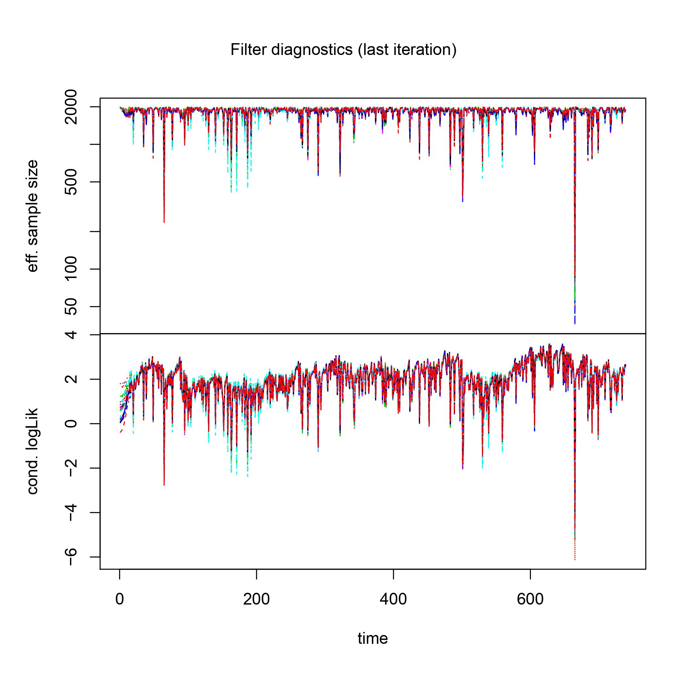
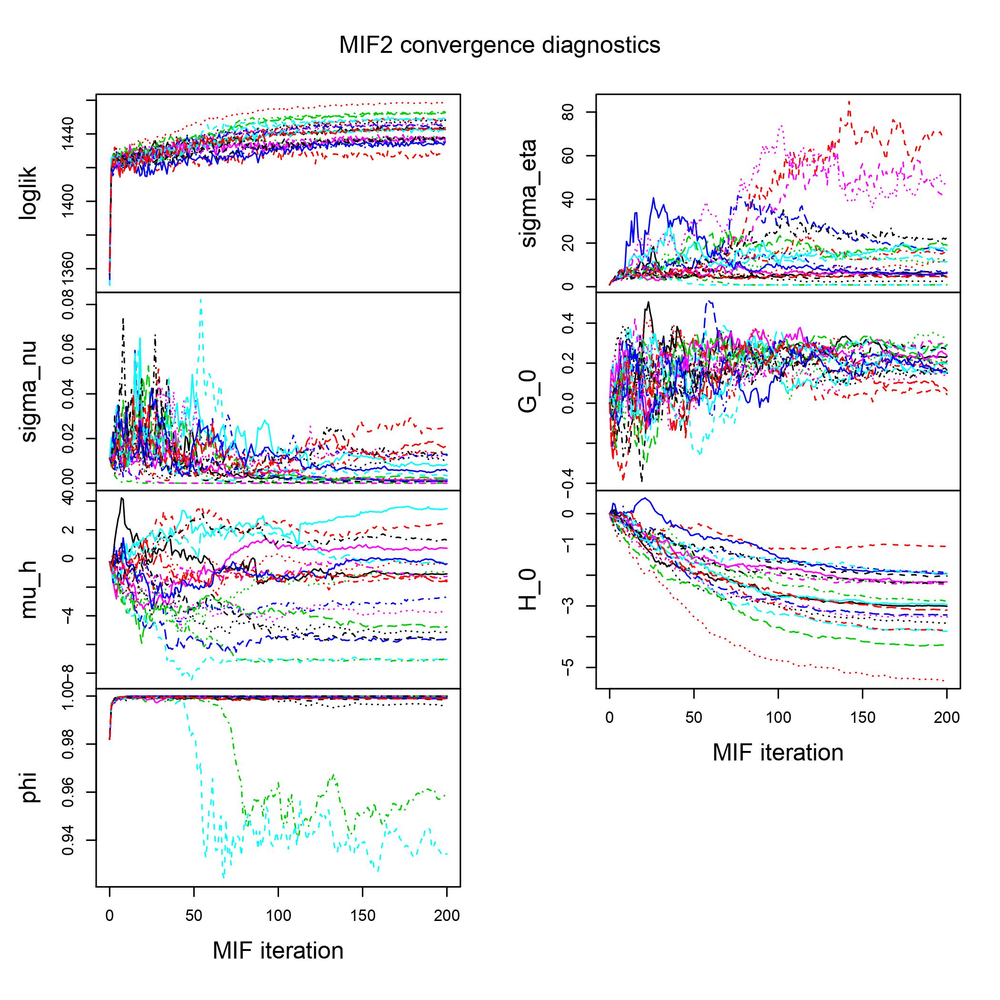
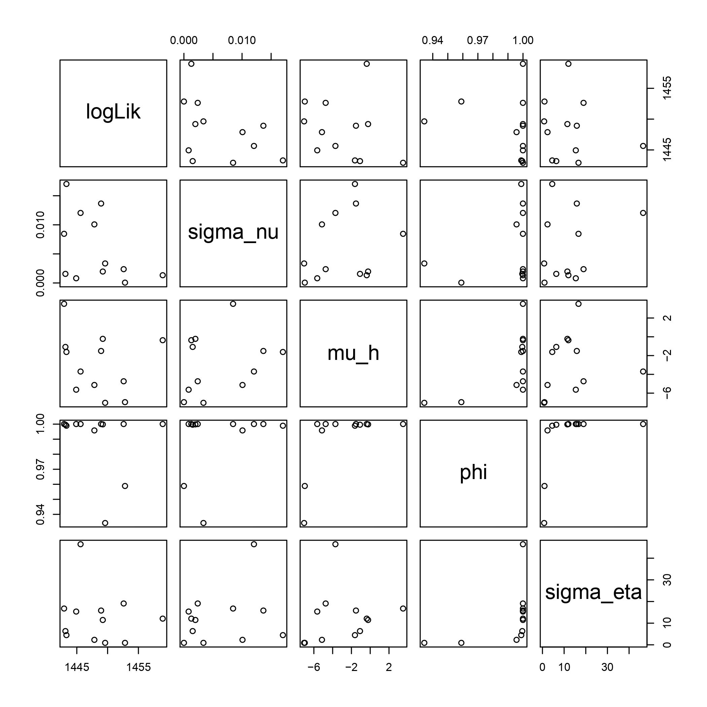
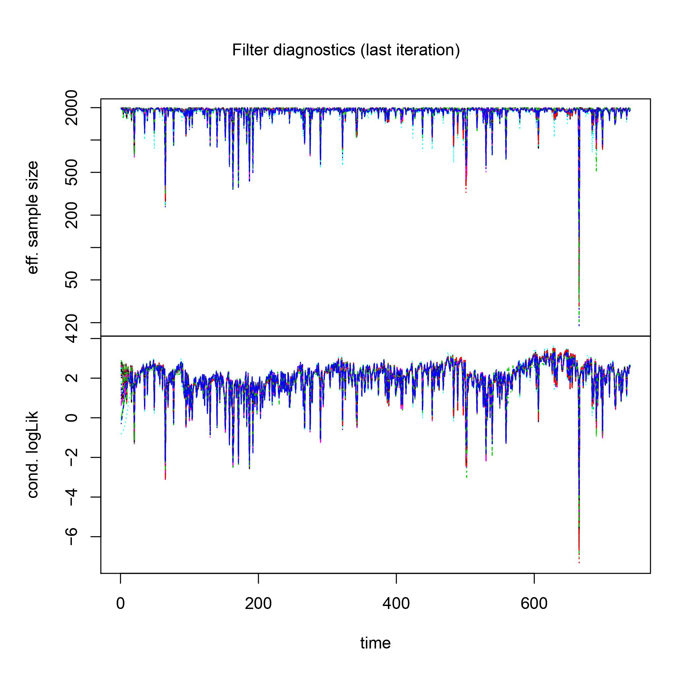
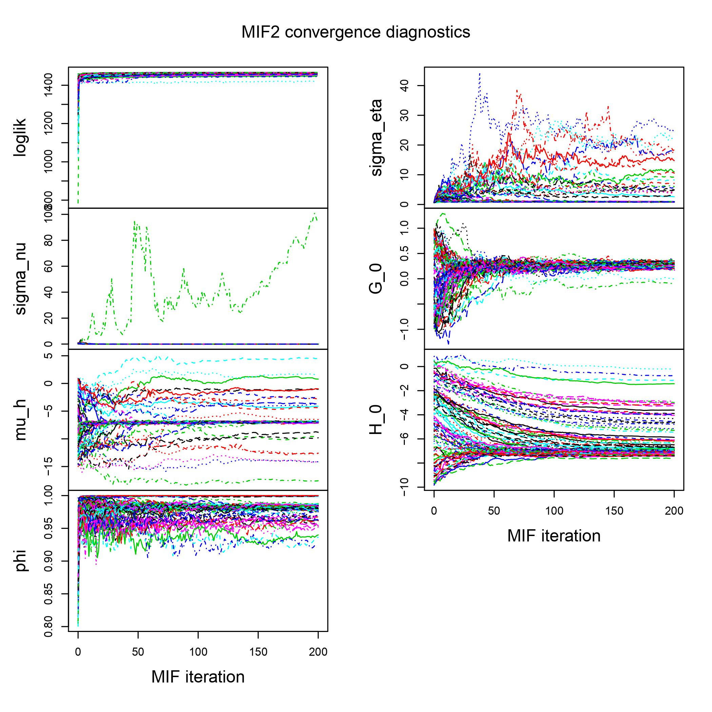

---
title:
  <center> <h1> POMP Model Analysis with CSI 300 Stock Index </h1> </center> 

author: 
date: <center>April 28th, 2020</center> 

output:
  html_document:
    theme: flatly
    toc: true
csl: ecology.csl
---
```{r setup, include=FALSE, warning = FALSE}
# packages
library(pomp)
library(fGarch)
library(forecast)
library(tseries)
library(knitr)
library(kableExtra)
library(ggplot2)
```

```{r echo=FALSE}
# functions
aic_table <- function(data,P,Q)
{
  table <- matrix(NA,(P+1),(Q+1))
  for(p in 0:P) 
  {
    for(q in 0:Q) 
    {
      table[p+1,q+1] <- arima(data,order=c(p,0,q))$aic
    }
  }
  dimnames(table) <- list(paste("AR",0:P, sep=""),paste("MA",0:Q,sep=""))
  table
}

mse = function(x, y) 
{ 
  mean((x - y)^2)
}

```


---------------------

# 1. Introduction

### 1.1 Background

The CSI 300 stock market index (CSI 300), compiled by the China Securities Index Company since April 8, 2005, which is intended to replicate the performance of the top 300 stocks traded on the Shanghai Stock Exchange and the Shenzhen Stock Exchange. It is considered to be a blue-chip index for China stock exchanges, and one of the most representative and typical indices in the world for emerging markets.

### 1.2 Objective

This project is interested in the financial volatility and implementation of the POMP model for the CSI 300 index. The benchmark model, $ARMA(p_a,q_a)-GARCH(p_g,q_g)$, selected by diagnostic tests and plots, will be compared to the POMP model and the results will be discussed. 

### 1.3 Data exploration

Since the preference of log-return in financial data analysis, the weekly close prices will be transformed into log-return to eliminate the trends in data and achieve stationary (hopefully). The daily close price is abandoned because it contains too much noise and it will increase the sample size largely. Notice this is not the adjusted close price, which also takes splits and dividends into account. 

```{r,echo=FALSE,fig.align="center", fig.width = 10}
# import data and convert to log return
dat <- read.table("CSI300w.csv",sep=",",header=TRUE)
names(dat)[1] = "Date"

ret = diff(log(rev(dat$Close)))

N = length(ret)

date_train = as.Date(rev(dat$Date))[2:(N-39)]
date_test = as.Date(rev(dat$Date))[(N-39):(N+1)]
data_train = ret[1:(N-40)]
data_test = ret[(N-40):N]
avgtrain = mean(data_train)
CSI300.ret.demeaned = data_train - avgtrain

data_train = data_train - avgtrain
data_test = data_test - avgtrain


par(mfrow=c(1,2))
plot(as.Date(dat$Date)[41:N-1], data_train,
     type="l",xlab="Date",ylab="Weekly Close Price",
     main="Log Returns of CSI 300 Index")
abline(h=mean(diff(log(dat$Close))),col="red")

plot(as.Date(dat$Date)[41:N-1], CSI300.ret.demeaned,
     type="l",xlab="Date",ylab="Weekly Close Price", 
     main="Demeaned Log Returns of CSI 300 Index")
abline(h=mean(CSI300.ret.demeaned),col="red")

#save(CSI300.ret.demeaned, file = "CSI500w.rda")
#load("CSI500w.rda")
```


# 2.Benchmark models

### 2.1 ARMA-GARCH Formulation

Here we simply take $ARMA(p_a,q_a)-GARCH(p_g,q_g)$ as our benchmark model. This model will capture both the ARMA type trend and local volatility dependence. The $ARMA(p_a,q_a)-GARCH(p_g,q_g)$ model can be expressed by:

$$
\phi(B)X_n = \psi(B)\epsilon_n
$$
Where $\phi(B) = 1-\phi_1B-\phi_2B^2 - \dots - \phi_{p_a}B^{p_a}$, $\psi(B) = 1+ \psi_1B + \phi_2B^2 + \dots + \psi_{q_a}B^{q_a}$ and
$$
\epsilon_n = \sigma_n\delta_n.
$$
Where $\sigma^2_n = \alpha_0 + \sum_{i=1}^{p_g} \alpha_i\epsilon_{n-i}^2 + \sum_{j=1}^{q_g} \beta_j\sigma^2_{n-j}$. The $\delta_n$ is the IID white noise this time. And this project will both cover the Gaussian noise $\delta_n \sim \text{i.i.d. }N(0,2)$ and t-distributed white noise $\delta_n \sim \text{i.i.d. }TDIST(\nu,0,\sigma^2)$ for our ARMA-GARCH model.

### 2.2 ARMA-GARCH Fitting

In general, there are two ways to fit the ARMA-GARCH model. The first way is to fit ARMA first and then use residuals to fit the GARCH model. The second way is to fit the ARMA part and GARCH part together. The second way is usually preferred since it's more reasonable. However, it will cost more time and the first way will provide a more robust model. Thus, we use the first method to fit our ARMA-GARCH model for simplicity. Let's check the AIC Table below first.

```{r echo=FALSE}
aic_table(data_train,3,3) %>% kable(align='cccccc') %>% 
  kable_styling(bootstrap_options = c("striped", "hover"))
```

As we can see, the AIC criteria would prefer the $ARMA(1,1)$ model. And there are not many violations and convergence problems in the AIC table here. Thus, we would pick $ARMA(1,1)$ as our ARMA part.

For the GARCH part, a similar process can be applied. But there is a fashion that the GARCH part will not go beyond $GARCH(1,1)$. So we simply choose $GARCH(1,1)$ as our GARCH part. Then, the t-distributed white noise and Gaussian white noise are discussed as the table shows below. As we can see, the t-distributed white noise is much better than Gaussian white noise no matter from log-likelihood, AIC or BIC. So our benchmark model would be the $ARMA(1,1)-GARCH(1,1)$ with t-distributed white noise. And the parameter set would be $(\mu, \phi_1, \psi_1, \omega,\alpha_1,\beta_1,\nu)=(0.00014,-0.82740^*,0.78740^*,0.00002,0.09694^*,0.89620^*, 8.15800^*)$.

```{r echo=FALSE}
result_1 = data.frame("Diagnosis" = c("T-test for mu", "T-test for ar1", 
                                      "T-test for ma1", "T-test for omega",
                                      "T-test for alpha1", "T-test for beta1",
                                      "T-test for shape",
                                      "Jarque-Bera", "Shapiro-Wilk",
                                      "Ljung-Box-R", "Ljung-Box-R^2",
                                      "LM Arch", "Log Likelihood",
                                      "AIC", "BIC"),
                      "ARMA_GARCH_norm" = c("\u2715", "\u2713", 
                                      "\u2713", "\u2713",
                                      "\u2713", "\u2713",
                                      "NA", 
                                      "\u2715", "\u2715",
                                      "\u2713", "\u2713",
                                      "\u2713", "1458.998",
                                      "-3.9323", "-3.8949"), 
                      "ARMA_GARCH_t" = c("\u2715", "\u2713", 
                                      "\u2713", "\u2715",
                                      "\u2713", "\u2713",
                                      "\u2713", 
                                      "\u2713", "\u2713",
                                      "\u2713", "\u2713",
                                      "\u2713", "1469.034",
                                      "-3.9568", "-3.9132"))

result_1 %>% kable(align='cccccc') %>% kable_styling(bootstrap_options = c("striped", "hover"))

```


# 3 POMP Model

### 3.1 POMP Model Formulation

Here, we will use the same model from Breto (2014) as the lecture slides shows. The model states that $R_n$ is a random walk on a transformed scale:
$$
R_n=\frac{exp{\{2G_n\}}-1}{exp{\{2G_n\}}+1}
$$
Where $\{G_n\}$ is the Gaussian random walk. And the model should follows the formula in lecture:
$$
\begin{align}
Y_n &= \exp{\{H_n/2\}}\epsilon_n \\ 
H_n &= \mu_h(1-\phi) + \phi H_{n-1} + \beta_{n-1}R_n\exp{\{-H_{n-1}/2\}} + \omega_n \\ 
G_n &= G_{n-1}+\nu_n
\end{align}
$$
Where $\beta_n = Y_n \sigma_\eta \sqrt{1-\phi^2}$, $\epsilon_n \overset{iid}\sim N(0,1)$, $\nu_n \overset{iid}\sim N(0,\sigma^2_\nu)$, and $\omega_n \overset{iid}\sim N(0,\sigma^2_\omega)$. Here, $H_n$ is the log volatility. Moreover, we use the state variable $X_n=(G_n,H_n,Y_n)$ and the filter particle $j$ at time $n-1$ is denoted as: 
$$
X_{n-1,j}^F=(G_{n-1,j}^F,H_{n-1,j}^F,y_{n-1})
$$
And the prediction particles at time $n$ follows:
$$
(G_{n,j}^P,H_{n,j}^P)\sim f_{G_n,H_n|G_{n-1},H_{n-1},Y_{n-1}}(g_n|G_{n-1,j}^F,H_{n-1,j}^F,y_{n-1})
$$
with corresponding weight $w_{n,j}=f_{Y_n|G_n,H_n}(y_n|G_{n,j}^P,H_{n,j}^P)$.

### 3.2 POMP Model Results and Diagnoses

The codes and simulations are done on the Great Lakes. And the results can be reproduced by using *finalp.r*, *finalp.sbat* and *CSI500w.rda*, which may cost some time. The diagnostic plots provided by IF2 Algorithm are shown below:

<center> 

{width=6in}


{width=6in}


{width=6in}

</center>

The diagnostic plots provided by global likelihood maximization are as follow:

<center>
{width=6in}


{width=6in}


{width=6in}

</center>
 

As we can see from those plots, the log-likelihood, $\sigma_\nu$, $\phi$, $G_0$ shows the convergence behavior, but there are some problems with the convergence of $\sigma_\eta$, $\mu_h$ and $H_0$. In general, I would consider the there are some problems with this POMP model itself and it may be improved using different POMP models. The log-likelihood value may suggest the same results and the log-Likelihood table is given below. Moreover, by extracting the parameters found by global likelihood maximization, we have our parameter set for POMP model: $(\sigma_\nu,\mu_h,\phi,\sigma_\eta,G_0,H_0)=(0.0000155, -6.959008, 0.9831476, 0.9128984, 0.2697264, -7.109635)$ corresponding to Log-likelihood 1467 with standard error 0.06871633.  

```{r echo=FALSE}
result_2 = data.frame("Methods" = c("IF2 Algorithm", "Global Maximization"),
                      "Min"=c("1429","1442"),
                      "1st Quantile"=c("1438","1462"), 
                      "Median"=c("1443","1466"), 
                      "Mean"=c("1443","1463"),
                      "3rd Quantile"=c("1449","1466"), 
                      "Max"=c("1459","1467"))

result_2 %>% kable(align='cccccc') %>% kable_styling(bootstrap_options = c("striped", "hover"))
```

Based on the new parameter sets, we can give the simulated values outputted by our model. Here we simply provide 8 simulation paths.

```{r echo=FALSE}
load(file="CSI500w.rda")
CSI300_statenames <- c("H","G","Y_state")
CSI300_rp_names <- c("sigma_nu","mu_h","phi","sigma_eta")
CSI300_ivp_names <- c("G_0","H_0")
CSI300_paramnames <- c(CSI300_rp_names, CSI300_ivp_names)

rproc1 <- "
  double beta,omega,nu;
  omega = rnorm(0,sigma_eta * sqrt( 1- phi*phi ) *
  sqrt(1-tanh(G)*tanh(G)));
  nu = rnorm(0, sigma_nu);
  G += nu;
  beta = Y_state * sigma_eta * sqrt( 1- phi*phi );
  H = mu_h*(1 - phi) + phi*H + beta * tanh( G )
  * exp(-H/2) + omega;
"
rproc2.sim <- "
  Y_state = rnorm( 0,exp(H/2) );
"
rproc2.filt <- "
  Y_state = covaryt;
"
CSI300_rproc.sim <- paste(rproc1,rproc2.sim)
CSI300_rproc.filt <- paste(rproc1,rproc2.filt)

CSI300_rinit <- "
  G = G_0;
  H = H_0;
  Y_state = rnorm( 0,exp(H/2) );
"
CSI300_rmeasure <- "
  y=Y_state;
"
CSI300_dmeasure <- "
  lik=dnorm(y,0,exp(H/2),give_log);
"

CSI300_partrans <- parameter_trans(
  log=c("sigma_eta","sigma_nu"),
  logit="phi"
)

CSI300.filt <- pomp(data=data.frame(
  y=CSI300.ret.demeaned,time=1:length(CSI300.ret.demeaned)),
  statenames=CSI300_statenames,
  paramnames=CSI300_paramnames,
  times="time",
  t0=0,
  covar=covariate_table(
    time=0:length(CSI300.ret.demeaned),
    covaryt=c(0,CSI300.ret.demeaned),
    times="time"),
  rmeasure=Csnippet(CSI300_rmeasure),
  dmeasure=Csnippet(CSI300_dmeasure),
  rprocess=discrete_time(step.fun=Csnippet(CSI300_rproc.filt),
                         delta.t=1),
  rinit=Csnippet(CSI300_rinit),
  partrans=CSI300_partrans
)
```

```{r echo=FALSE}
params_test <- c(
  sigma_nu = 0.0000155,
  mu_h = -6.959008,
  phi = 0.9831476,
  sigma_eta = 0.9128984,
  G_0 = 0.2697264,
  H_0 = -7.109635
)
```

```{r echo=FALSE}
sim1.sim <- pomp(CSI300.filt,
                 statenames=CSI300_statenames,
                 paramnames=CSI300_paramnames,
                 rprocess=discrete_time(step.fun=Csnippet(CSI300_rproc.sim),delta.t=1))
sim1.sim <- simulate(sim1.sim, seed=1,params=params_test,nsim = 8,format= "data.frame")
```

```{r,echo=FALSE,fig.align="center", fig.width = 10}
ggplot(data=sim1.sim,aes(x=time,y=Y_state,group=.id,color=(.id=="data"))) +
geom_line()+guides(color=FALSE)+
facet_wrap(~.id,ncol=2)
```


# 4 Discussion


* Based on log-likelihood and AIC value, we can see that there is not much difference between the benchmark model and the POMP model. The log-likelihoods of two models are similar and since the similar parameter number, the AIC values are also similar to each other (With ARMA_GARCH -2924 and POMP -2922). In practice, it may suggest that they are both good models or bad models.

* There are still some ways to improve ARMA_GARCH. For example, we can implement the ARMA_APGARCH since the left tail and right tail of the residuals seem to be not similar. And the different distribution of residuals can also be used like general error distribution. In summary, All those model give their explanation for self-exciting and local volatility dependence nature of financial data in different ways.

* For the POMP model, except for some convergence problem with the parameters, I think there is still some future value prediction problems since, for different random seeds, the simulated paths would be different. But it does provide some novel ideas about volatility and financial data modeling. As we can see from the final simulation, the volatility does cluster, which is very similar to the financial data in the real world. To improve the fit, I think we can also try some other POMP models to fit this data. 


---------------------

# 5 Reference

### 5.1 Data

[1] CSI stock market index data. Retrieved from https://www.investing.com/indices/csi300-historical-data.


### 5.2 Materials

[1] CSI 300 Index. Retrieved from https://en.wikipedia.org/wiki/CSI_300_Index

[2] Ionides, E. L(2020). Case study: POMP modeling to investigate financial volatility. Retrieved from https://ionides.github.io/531w20/.

[3] Ionides, E. L(2020). Extending the ARMA model: Seasonality and trend. Retrieved from https://ionides.github.io/531w20/.

[4] Breto, C. (2014). On idiosyncratic stochasticity of financial leverage effects, Statistics & Probability Letters 91: 20-26.

[5] Ionides, E. L., Nguyen, D., Atchad´e, Y., Stoev, S. and King, A. A. (2015). Inference for dynamic and latent variable models via iterated, perturbed Bayes maps, Proceedings of the National Academy of Sciences of the U.S.A. 112(3): 719-724.


---------------------