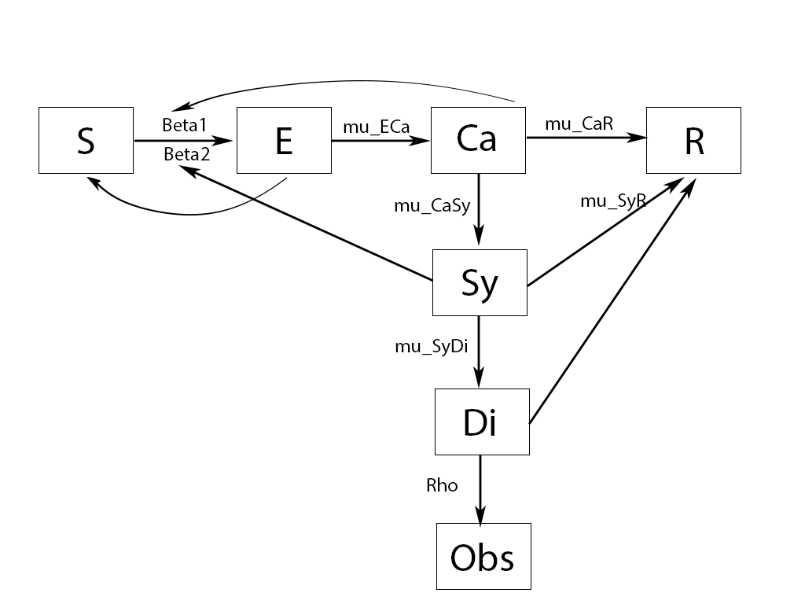

```{r,echo=FALSE}
suppressMessages(library("pomp"))
suppressMessages(library("doParallel"))
cores=60
registerDoParallel(cores)
mcopts=list(set.seed=TRUE)
suppressMessages(library("doRNG"))
suppressMessages(library(ggplot2))
```

# Introduction:  

## Overview:  

  Ever since the first suspected case of the novel coronavirus, also known as COVID-19, been identified in Wuhan, China on 17th November, this virus have spread to 177 countries caused 202,668 deaths and 2,893,729 people being sick globally by April 25th. Not only is this virus deadly, it also caused the slowdown of the global economy due to quarantine and boarder restriction. WHO declared this virus outbreak as Public Health Emergency of International Concern (PHEIC), and this event have already affected nearly every human being in this planet$^{[1]}$. Considering the severity and its widespread, this virus outbreak is unprecedented in human history, therefore it poses great challenges to the management and resolution of this global crisis. In theory, if government impliment fully social distancing policy, means no physical interaction is allowed between people, this crisis should be controled really fast. But generally it's not feasible to carry out these kind of policies due to ethical and economical concerns. If the policy makers can have more knowledge about the spread patterns of this virus, and plan responses according to these patterns, then the extreme policies can be avoided in reaching a similar result.  
  
  In this study, I focused on finding out the basic spread patterns of COVID-19 using compartment models. Firstly, I designed a compartment model, which I call "SECSDR", based on some of the founded properties of the virus. Then I fitted this model using the japanese confirmed cases data, and did diagnostic analysis on the model performance. After I made sure the model is adequately fitted, I calculated several indexes of the spread patterns based on the fitted model and provided interpretation. Finally, I concluded this study with some advises for the policy makers and a prediction on the future trend.  
  
## Data resources and explanatory analysis:  

I fitted the designed compartment model with japanese confirmed cases data.  

The reasons for why I choose japan as my target of analysis:  
1, Japan have enough of confirmed cases.  
2, Japan is a relatively isolated island, therefore the virus spreading pattern is less complicated.  
3, Japan is a single race country, so the race effect on the virus spread is minimized.  
4, Japanese government didn't use much policies to control the virus, therefore the policy effect on the virus spread is minimized.  


The reason for why I choose to model confirmed cases rather than death cases:  
1, The death cases are actually from the former confirmed cases, so it has more noises.  
2, Confirmed cases are observations of a compartment in the middle of the compartment model. Then it's connected to both side of the model.  

The data I used are collected by the Johns Hopkins University (JHU), and I downloaded it from JHU's github site$^{[2]}$. The data contains the cumulative confirmed cases from Jan 22ed to April 22ed, totally 92 days. I firstly transformed the cumulative confirmed cases to net increase per day. And plotted the data.  

```{r,echo=FALSE}
data=read.csv("time_series_covid19_confirmed_global.csv")
data=colSums(data[which(data$Country.Region=="Japan"),5:ncol(data)])
B=data[2:92]-data[1:91]
day=1:91
daily_inc=cbind(B,day)
daily_inc=as.data.frame(daily_inc)
plot(day,B,xlab="day",ylab="net increase",main="Japan confirmed cases net increase plot",ty="l")
summary(B)
```

From plot we can see an clear increasing pattern of the net increase of confirmed cases. And I noticed that for several days the net increase is actually zero, which is out of the trend of the data. I think one possible explaination for these unusual points are the reporting error, where some patients are actually diagnosed but didn't get reported or didn't get collected by JHU. And it is also possible the unreported patients be counted as the increase of the following day. In my model, I redesigned the measurement based on this finding.

## Question of interest:  

In this study I am interested in finding the spreading properties of COVID-19:  

1, The average number of people the carriers (non-symptomed patients) or the symptomed patients indanger per day.  
2, The average probability of indangered population actually get infected.  
3, The average number of days for carriers to show symptom or recover.  
4, The average probability of carriers die or recover (lose infectiousness).  
5, The average number of days for symptomed patients to be diagnosed or recovered.  
6, The average probability of symptomed patients die or recover (lose infectiousness).  

Besides these basic spreading properties of COVID-19, $R_0$ is also a very useful value for public decision making. But the definition of $R_0$ is not rigorous and this value is not directly observable, so researchers developed different models with different assumptions in its calculate. The compartment model I designed is also feasible for the $R_0$ calculation, and I implimented the definition from Dietz “the number of secondary cases one case would produce in a completely susceptible population”$^{[3]}$ in my calculation.  

# Compartment model:  

## Model building and assumptions:  

  
The "SECSDR" model I designed are shown in the above pictures. There are 6 compartment and 1 measurement:  

The S compartment stands for the susceptible population.  
The E compartment stands for the exposed population.  
The Ca compartment stands for the virus carriers, which means they have already been infected, but there is no symptom yet.  
The Sy compartment stands for the symptomed patients.  
The Di compartment stands for the Diagnosed patients for one specific day.  
The R compartment, as in the SEIR model, stands for the recovered population containing both dead and recovered patients (generally the patients who losed infectiousness).  
The Obs stands for observation.  

To build this model I made the following assumptions:  

1, Since no people are found naturally immune to COVID-19 and no recovered patients are found getting secondly infected, I make the assumption that the initial number of S compartment equalls to the whole population of japan, which is 126,558,031, and the recovered patients won't be added back to the S compartment. Also in this study the demographical feature of japanese population are assumed to be the same.  
2, Only the people in carriers and symptomed compartment may get the virus spreaded to the susceptible population each with different exposing rate, Beta1 and Beta2. The people in the diagnosed compartment will be automatically quarantined and will not spread the virus.  
3, The transmission rate from exposed to carrier is the same, mu_ECa, no matter the patient is exposed by carriers or symptomed patients.  
4, The exposed population who didn't get infected will go back to the susceptible population.  
5, There are carriers and symptomed patients who can heal themselves or die without being noticed as caused by COVID-19. The rate of this event is mu_CaR and mu_SyR for carriers and symptomed patients.  
6, Every infected people have a carrier status before they show symptoms. And this transmission rate is mu_CaSy.  
7, We can only diagnose the symptomed patients, and can never diagnose the carriers directly. This diagnosing rate is mu_SyDi.  
8, The diagnosed patients will either die or be treated, then they go to the R compartment with probability 1.  
9. Assume the reporting error exist as discussed in introduction, and I measured this reporting error using a normal distribution with mean equal to the diagnosed patients and variance equal to mean*rho.  

The counting process defining this model:  

$$S(t)=S(0)-N_{SE}(t)+N_{SE}(t-dt)-N_{ECa}(t)$$  
$$E(t)=N_{SE}(t)-N_{SE}(t-dt)$$  
$$Ca(t)=Ca(0)+N_{ECa}(t)-N_{CaSy}(t)-N_{CaR}(t)$$  
$$Sy(t)=Sy(0)+N_{CaSy}(t)-N_{SyDi}(t)-N_{SyR}(t)$$  
$$Di(t)=N_{SyDi}(t)-N_{SyDi}(t-dt)$$  
$$R(t)=R(0)+N_{CaR}(t)+N_{SyR}(t)+N_{SyDi}(t-dt)$$  
$$\frac{dN_{SE}(t)}{dt}=(\beta_1Ca(t)+\beta_2Sy(t))S(t)$$  
$$\frac{dN_{ECa}(t)}{dt}=\mu_{ECa}E(t)$$  
$$\frac{dN_{CaR}(t)}{dt}=\mu_{CaR}Ca(t)$$  
$$\frac{dN_{CaSy}(t)}{dt}=\mu_{CaSy}(Ca(t)-\frac{dN_{CaR}}{dt})$$  
$$\frac{dN_{SyR}(t)}{dt}=\mu_{SyR}Sy(t)$$  

$$\frac{dN_{SyDi}(t)}{dt}=\mu_{SyDi}(Sy(t)-\frac{dN_{SyR}}{dt})$$  

The above differential equations are approximated by Euler's methods, and the result is shown below:  

$$dN_{SE}(t)=Binomial(S(t),1-exp((-\beta_1Ca(t)-\beta_2Sy(t) )dt))$$  
$$dN_{ECa}(t)=Binomial(dN_{SE}(t),1-exp(-\mu_{ECa}dt))$$  
$$dN_{CaR}(t)=Binomial(Ca(t),1-exp(-\mu_{CaR}\times dt))$$  
$$dN_{CaSy}(t)=Binomial(Ca(t)-dN_{CaR}(t),1-exp(-\mu_{CaSy}\times dt))$$  
$$dN_{SyR}(t)=Binomial(Sy(t),1-exp(-\mu_{SyR}\times dt))$$  
$$dN_{SyDi}(t)=Binomial(Sy(t)-dN_{SyR}(t),1-exp(-\mu_{SyDi}\times dt))$$  
$$S(t+dt)=S(t)-dN_{ECa}(t)$$  
$$Ca(t+dt)=Ca(t)+dN_{ECa}(t)-dN_{CaSy}(t)-dN_{CaR}(t)$$  
$$Sy(t+dt)=Sy(t)+dN_{CaSy}(t)-dN_{SyDi}(t)-dN_{SyR}(t)$$  
$$Di(t+dt)=dN_{SyDi}(t)$$  
$$R(t+dt)=R(t)+dN_{CaR}(t)+dN_{SyR}(t)+dN_{SyDi}(t-dt)$$  
As shown above, actually when fitting the model we can ignore E compartment (we don't need this compartment in interpretation), and can use $dN_{SE}$ instead.  
Also I defined the measurement model as following:  
$$Obs(t)\sim Norm(Di(t),Di(t)\rho)$$

## Model fitting and diagnostic analysis:  

Then I carried out the iterated filtering algorithm (IF2) for the maximum likelihood estimation (global search). I set the number of particles to 20000, number of iteration for if2 to 100, and number of evaluation to 10. I did many experiment on the initial value box, and finally got a good start point. Then I used 50 initial values uniformly drawn from the initial value box and maximized them. The following showed the optimized parameters of the top 5 log likelihood models among the total 50 models.  


```{r, echo=FALSE}
bsflu_rprocess <- "
  double dN_SE = rbinom(S,1-exp((-Beta1*Ca-Beta2*Sy)*dt));
  double dN_ECa = rbinom(dN_SE,1-exp(-dt*mu_ECa));
  double dN_CaR = rbinom(Ca,1-exp(-dt*mu_CaR));
  double dN_CaSy = rbinom(Ca-dN_CaR,1-exp(-dt*mu_CaSy));
  double dN_SyR = rbinom(Sy,1-exp(-dt*mu_SyR));
  double dN_SyDi = rbinom(Sy-dN_SyR,1-exp(-dt*mu_SyDi));
  S -= dN_ECa;
  Ca += dN_ECa - dN_CaSy - dN_CaR;
  Sy += dN_CaSy - dN_SyR-dN_SyDi;
  R += dN_CaR+dN_SyR+dN_SyDi;
  Di = dN_SyDi;
"

bsflu_dmeasure <- "
  lik = dnorm(B,Di,rho*Di+1e-10,give_log);
"
bsflu_rmeasure <- "
  B = rnorm(Di,rho*Di+1e-10);
"
bsflu_rinit <- "
 S=126558031;
 Ca=26;
 Sy=20;
 Di=2;
 R=0;
"

bsflu_statenames <- c("S","Ca","Sy","R","Di")
bsflu_paramnames <- c("Beta1","Beta2","mu_ECa","mu_CaSy","mu_CaR","mu_SyR","mu_SyDi","rho")

bsflu2 <- pomp(
  data=subset(daily_inc,select=c(B,day)),
  times="day",
  t0=0,
  rprocess=euler(
    step.fun=Csnippet(bsflu_rprocess),
    delta.t=1/12),
  rmeasure=Csnippet(bsflu_rmeasure),
  dmeasure=Csnippet(bsflu_dmeasure),
  partrans=parameter_trans(
    log=c("Beta1","Beta2","mu_ECa","mu_CaSy","mu_CaR","mu_SyR","mu_SyDi","rho")),
  statenames=bsflu_statenames,
  paramnames=bsflu_paramnames,
  rinit=Csnippet(bsflu_rinit)
)

run_level <- 2 
switch(run_level, {
  bsflu_Np=100; bsflu_Nmif=10; bsflu_Neval=10; bsflu_Nglobal=10},{
  bsflu_Np=20000; bsflu_Nmif=100; bsflu_Neval=10; bsflu_Nglobal=50
},{
  bsflu_Np=60000; bsflu_Nmif=300; bsflu_Neval=10; bsflu_Nglobal=100}

)


#global

bsflu_box <- rbind(
  Beta1=c(10^(-9),10^(-8)),
  Beta2=c(10^(-10),10^(-9)),
  mu_ECa=c(2.5,3.5),
  mu_CaSy=c(0.2,0.5),
  mu_CaR=c(0.2,0.3),
  mu_SyR=c(1,2),
  mu_SyDi = c(0.1,0.5),
  rho = c(0.5,1)
)

bsflu_cooling.fraction.50=0.5
bsflu_rw.sd=0.02

stew(file=sprintf("box_eval_COVID19_j.3.2.1.rda",run_level),{ t_global <- system.time({
  mifs_global <- foreach(i=1:bsflu_Nglobal,.combine=c,.options.multicore=mcopts) %dopar% { mif2(
    bsflu2,
    params=c(
      apply(bsflu_box,1,function(x)runif(1,x[1],x[2]))),
    Np=bsflu_Np,
    Nmif=bsflu_Nmif,
    cooling.fraction.50=bsflu_cooling.fraction.50,
    rw.sd=rw.sd(Beta1=bsflu_rw.sd,Beta2=bsflu_rw.sd,mu_ECa=bsflu_rw.sd,mu_CaSy=bsflu_rw.sd,mu_CaR=bsflu_rw.sd,mu_SyR=bsflu_rw.sd,mu_SyDi=bsflu_rw.sd,rho=bsflu_rw.sd)
 )}
}) },seed=1270401374,kind="L'Ecuyer")

stew(file=sprintf("lik_global_eval_j.3.2.1.rda",run_level),{ t_global_eval <- system.time({
  liks_global <- foreach(i=1:bsflu_Nglobal, .combine=rbind) %dopar% {
    evals <- replicate(bsflu_Neval,
                       logLik(pfilter(bsflu2,
                                      params=coef(mifs_global[[i]]),Np=bsflu_Np)))
    logmeanexp(evals, se=TRUE)
  } })
},seed=442141592,kind="L'Ecuyer")

results_global <- data.frame(
  logLik=liks_global[,1],
  logLik_se=liks_global[,2],t(sapply(mifs_global,coef)))

para=coef(mifs_global[order(liks_global[,1],decreasing = T)[2]])
cat("The top five log likelihood:")
sort(liks_global[,1],decreasing = T)[1:5]

cat("The corresponding optimized parameters:")
coef(mifs_global[order(liks_global[,1],decreasing = T)[1:5]])
```

As the result showed above, the top 5 log likelihood are really close to each other, but the model with the largest log likelihood have parameters lying outside of the other 4 set of parameters (rho for the largest log likelihood model is around 21, but for the other 4 models rho are all below 1). This caught my attention, and I checked on the diagnostic analysis result.  

```{r,echo=FALSE}
plot(mifs_global,ylim=10)
```

From the second plot we see clearly that the largest log likelihood model(black dashed line) indeed is an outlyer of the general convergence for parameter rho. Furthermore, looking into more detail about the first diagnostic plots, I find that for most of the initial values the particle filtering results agrees perfectly except for the largest log likelihood model (black dashed line). This model on several points have less effective sample size but have higher corresponding log likelihood, this is an abnormal situation, and may indicate something went wrong for the filtering process, and we shouldn't trust this model. As a result I chose the second large likelihood model parameters as my final parameters.  

Based on the second plot. Log likelihood and number of failed particles converged to the right place perfectly, and for most of the parameters their convergence is pretty good given that I only used 20000 particles. Parameter mu_CaSy and mu_CaR might have some convergence problem. But generally the model fitting is good enough to carry out interpretations.


The two plots below are plots of two specific simulation result from this model.  

```{r,echo=FALSE}

sims <- simulate(bsflu2,params=para,
                 nsim=1,format="data.frame",include=TRUE,seed = 13336333)

ggplot(sims,mapping=aes(x=day,y=B,group=.id,color=.id=="data"))+
  geom_line()+scale_color_hue("",breaks=c("FALSE","TRUE"),labels=c("estimated","observed"))+labs(x="day",y="infected populations",title ="One specific simulation from the model")

sims <- simulate(bsflu2,params=para,
                 nsim=1,format="data.frame",include=TRUE,seed = 13332333)

ggplot(sims,mapping=aes(x=day,y=B,group=.id,color=.id=="data"))+
  geom_line()+scale_color_hue("",breaks=c("FALSE","TRUE"),labels=c("estimated","observed"))+labs(x="day",y="infected populations",title ="One specific simulation from the model")
```

Based on these two simulation results, we can see the first simulation fits the data really well but the second one doesn't do as well. The reason behind this is that one specific simulation based on the compartment model doesn't guarantee a perfect model fit, but a right compartment model will have the largest chance to get a good simulation result. Which is the case here, I didn't try much of simulation until I find this really good one. So this also proves the model we built and the parameters we found fits the data really well.  

The following plot is the result of 10 simulation from the model built above.  

```{r,echo=FALSE}
sims <- simulate(bsflu2,params=para,
                 nsim=10,format="data.frame",include=TRUE,seed = 13332223)
ggplot(sims,mapping=aes(x=day,y=B,group=.id,color=.id=="data"))+
  geom_line()+scale_color_hue("",breaks=c("FALSE","TRUE"),labels=c("estimated","observed"))+labs(x="day",y="infected populations",title = "10 simulation results")
```

Generally the simulation result is good.  

The following plot is the average of 100 simulation results.  

```{r,echo=FALSE}
sims <- simulate(bsflu2,params=para,
                 nsim=100,format="data.frame",include=TRUE,seed = 13333333)
sim2=sims[92:nrow(sims),]
msim=c()
for (i in 1:91){
  msim[i]=mean(sim2$B[which(sim2$day==i)])
}
plot(1:91,sims$B[1:91],ty='l',col="red",xlab="day",ylab="Infected populations",main="Mean result of 100 simulations")
lines(1:91,msim,col="blue")
legend(5,1500,legend =c("observed","estimated"),col = c("red","blue"),lty=1,lwd=1)
```

The averaging process reduced the variation of the simulation results. But from the mean we can still see our model fits the data adequately.  

## Model result and interpretation:  

In this part, I used the estimated parameters to calculate the COVID-19 spreading properties we are interested in.  

```{r,echo=FALSE}
para
```

1, The average number of people the carriers (non-symptomed patients) or the symptomed patients indanger per day (assuming the susceptible population didn't change much):  

When x is small: $1-exp((-x))\approx x$  

$$E_{Ca}=population\times \beta_1=126558031\times1.160835e-08=1.47$$  

$$E_{Sy}=population\times \beta_2=126558031\times4.102672e-10=0.052$$  

So on average 1 carrier indangers 1.47 person per day, and 1 symptomed patient indangers 0.052 person per day. This result make sense, because the one without symptom have larger chances to contact people and they are less likely to use protecting equipments.  

2, The average probability of indangered population actually get infected:  

$$P_{ECa}=1-exp(-\mu_{ECa})=1-exp(-7.871744e+00)=0.9996$$  
So this chance is very high, once the susceptible people get exoposed, very likely (Probability 0.9996) he will get infected, this result is consistent with the fact that COVID-19 have really high infectiousness.  

3, The average number of days before carriers to show symptom or recover:  

$$\begin{aligned}
P_{stays\ in\ Ca}&=1- P_{CaR}-(1-P_{CaR})*P_{CaSy}\\
&=1-(1-exp(-\mu_{CaR}))-(1-exp(-\mu_{CaSy}))+(1-exp(-\mu_{CaR}))*(1-exp(-\mu_{CaSy}))\\
&=1-0.1883421-0.3644723+0.1883421*0.3644723\\
&=0.5158311
\end{aligned}$$  

$$Days_{Ca}=mean(NegBin(1,P_{stays\ in\ Ca}))=\frac{P_{stays\ in\ Ca}}{1-P_{stays\ in\ Ca}}=1.065$$  

This number is inconsistent with the reported 20 days incubation period of COVID-19, but the reported 20 days might be biased because they only counted the person who developed symptom.  

4, The average probability of carriers die or recover (lose infectiousness) each day:  

$$P_{CaR}=1-exp(-\mu_{CaR})=0.188$$  

This result means the self recovery rate is pretty high for carriers, nearly 1/5 of carriers may lose infectiousness each day.  

5, The average number of days before symptomed patients to be diagnosed or recovered.  
$$\begin{aligned}
P_{stays\ in\ Sy}&=1- P_{SyR}-(1-P_{SyR})*P_{SyDi}\\
&=1-(1-exp(-\mu_{SyR}))-(1-exp(-\mu_{SyDi}))+(1-exp(-\mu_{SyR}))*(1-exp(-\mu_{SyDi}))\\
&=1-0.3632615-0.9608033+0.3632615*0.9608033\\
&=0.02495805
\end{aligned}$$  

$$Days_{Sy}=mean(NegBin(1,P_{stays\ in\ Sy}))=\frac{P_{stays\ in\ Sy}}{1-P_{stays\ in\ Sy}}=0.0256$$  

This result means the  Japanese government did a pretty good job in identifying symptomed patients. In an average of 0.0256 day they would target the newly symptomed patients.  

6, The average probability of symptomed patients die or recover (lose infectiousness) each day:  

$$P_{SyR}=1-exp(-\mu_{SyR})=0.363$$  

Also this means that the recovery rate of symptomed patients are pretty high, even higher than the carriers.  

7, $R_0$:  

$$R_0=E_{Ca}Days_{Ca}P_{ECa}+P_{CaSy}E_{Sy}Days_{Sy}P_{ECa}=1.47*1.065*0.9996+0.364*0.052*0.026*0.9996=1.565$$  

The estimated $R_0$ from my model is 1.565>1, means this COVID-19 virus will continue to spread and the carriers made the most contribution to this $R_0$.  

# Conclusion:  

In Conclusion, the model "SECSDR" I designed based on several known properties of COVID-19 fits adequately to the Japanese confirmed cases data. And the simulation result also meets my expectation of a good compartment model. Then I calculated some indexes of the COVID-19 virus spreading properties based on the parameters estimated, and I interpreted the results. From the indexes, we can see coronavirus is a virus with really high infectiousness ,$P_{ECa}=0.9996$, this means if the susceptible people are exposed they are very likely to be infected. But the patients also loses infectiousness really fast either due to death or recovery($Days_{Ca}=1.065,\ Days_{Sy}=0.026,\ P_{CaR}=0.188,\ P_{SyR}=0.363$). Another very important feature of this virus spread is that the carriers caused most of the infections, and it is relatively easy to quickly diagnose and quarantine the symptomed patients like the Japanese government did. Then to control the virus spread, government should focus more on restricting the carriers. Since on average, infected people will either show symptom or loses infectiousness after 1.065 day, government can suggest all population to strictly self quarantine for a week, if in this period no symptom are shown, then they can get back to work and contact others who are also self quarantined for a week.  

Because the $R_0=1.565>1$ means now in japan one case of infection can cause more than one secondary infection, so the situation is not optimistic, and Japanese government should impliment more strict restriction policies, like suggested above, to control the infections from carriers

# References:  
[1], COVID-19 important event timeline.(https://www.thinkglobalhealth.org/article/updated-timeline-coronavirus)  
[2], COVID-19 Global confirmed data.(https://coronavirus.jhu.edu/map.html)  
[3], Paul L. Delamater, Complexity of the Basic Reproduction Number (R0)  
[4], Stats531 Lecturenotes.  
[5], Discussed this project in group chatting. And got many great ideas from peers.  
