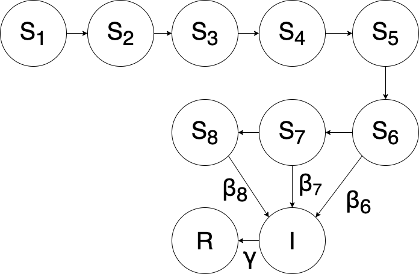

{width=100%}

# 1. Introduction

Aurora Borealis, or the Northern Lights, are a natural light show that is mesmerising to witness. They are caused by interactions of the earth's magnetosphere with charged particles travelling through space, mostly from solar wind. The intensity of these magnetic storms on earth is closely linked to the solar magnetic activity, [1] and sunspots serve as a measure of solar activity. In this project, I explore the connection between seeing an auroral display and the sunspot number.

## 1.1 Motivation for using a POMP model

Coronal Mass Ejections (CMEs) originate from magnetically active regions around sunspot groups. These travel through space and reach the earth to cause the scintillating displays. Thus, the geomagnetic activity is proportional to the number of sunspots in a favorable orientation with respect to the earth, which is a fraction of the total sunspot number. 

To estimate this fraction of "active" sunspots, I consider the sunspots as belonging to three compartments: Susceptible, Infected and Removed.

* Susceptible sunspots are those which are "born" at the edge of the sun's disk and will slowly rotate to the centre, arriving in a favorable orientation.
* Infected sunspots are those which are at the meridian and cause CMEs that affect the earth.
* Removed sunspots are those that have transited the meridian, and will have no further effect.

It is understandable that if there are more susceptible sunspots now, there will be more infected sunspots at a later stage, and similarly for the transition from infected to removed. Also, the Sun exhibits differential rotation at different latitudes[2], where the equator rotates faster than the poles. This is similar to how, in epidemiology, different subjects have different incubation times. A sunspot that is farther from the equator will take longer to get infected.

Moreover, not all CMEs have the same strength, so the same number of infected sunspots can cause differing effects on the earth, which will serve as the measurement model with stochastic error.

It is my hypothesis that such an SIR model is appropriate to estimate the geomagnetic activity given the total sunspot number.

```{r library, message=F, error=F, echo = F}
set.seed(594709947L)
library(ggplot2)
theme_set(theme_bw())
library(plyr)
library(reshape2)
library(foreach)
#library(doMC)
library(pomp)
require(kableExtra)
require(knitr)
stopifnot(packageVersion("pomp")>="2.0")
```

```{r setup,echo=F,results=F,cache=F}
myround<- function (x, digits = 1) {
  # taken from the broman package
  if (digits < 1) 
    stop("This is intended for the case digits >= 1.")
  if (length(digits) > 1) {
    digits <- digits[1]
    warning("Using only digits[1]")
  }
  tmp <- sprintf(paste("%.", digits, "f", sep = ""), x)
  zero <- paste0("0.", paste(rep("0", digits), collapse = ""))
  tmp[tmp == paste0("-", zero)] <- zero
  tmp
}

set.seed(2050320976)

options(
  keep.source=TRUE,
  encoding="UTF-8"
)

```


# 2. Data

Data have been downloaded from the NOAA website that has historical data about geomagnetic activity dating back to 1932[3]. For this project, the period of July-December 2004 is chosen, which was one of the most active periods in recent times. There are $\sim$ 180 observations, i.e. one observation daily. The columns are Date, Magnetic indices like Kp, Kp_max, Ap, C9 and SFU, Wolf Sunspot number (Rz), day and del_Rz.
`day` is the Date converted to Julian Day so that it can be used as a number by the `pomp` package. `del_Rz` is the first difference of `Rz`.

For this project, I will use `day` as times, `Kp_max` as the observed variable, and `Rz` and `del_Rz` as covariates standing for population and birhs/deaths respectively. The magnetic index Kp is measured on a scale of 0-9, in increments of one-thirds. A value of Kp > 5 indicates a geomagnetic storm. [4]


```{r read in data, echo=F,  cache=F}
sunspot_data <- read.csv("2004.csv")
sunspot_data$Date <- as.Date(sunspot_data$Date)
sunspot_data$day <- julian(sunspot_data$Date)
sunspot_data <- within(sunspot_data, rm(X))
sunspot_data <- sunspot_data[183:365,]
sunspot_data$del_Rz[1] <- 0
sunspot_data$del_Rz[-1] <- diff(sunspot_data$Rz)
head(sunspot_data, n=5)
```

*Note: Why are the tabulated values of Kp larger than Kp_max, as well as off the scale of 0-9?*

*The data source tabulates Kp as the sum of 8 individual observations on a day, so its range is actually 0-72. Kp_max is the maximum of these 8 observations.*

## 2.1 Visualising the data

First, we plot Kp_max and Rz against time to study their variation.

```{r data, echo=F, fig.align='center', fig.width=10, fig.cap="Figure 1. Time series of observation and covariates"}
plot(sunspot_data$Date, sunspot_data$Kp_max, type = "l",
     xlab = "Date", ylab = bquote(K[paste(p, ",", max)]),
     main = "Day to day variation of "~K[p]~" index")
par(mfrow = c(1,2))
plot(sunspot_data$Date, sunspot_data$Rz, type = 'l',
      xlab = "Date", ylab = bquote(R[z]),
     main = "Daily sunspot number "~R[z]~"")
plot(sunspot_data$Date, sunspot_data$del_Rz, type = 'l',
      xlab = "Date", ylab = bquote(paste(Delta,  R[z])),
     main = "Change in daily sunspot number")
```

There is a big bump in `Rz` in mid-July, and one just before November. There are corresponding spikes in `Kp_max` as well, but they are slightly delayed and not as wide. The time series for `del_Rz` appears similar to that of `Kp_max` in amplitude and cycle-time. This supports the hypothesis that a large birth event will lead to a large geomagnetic storm offset by some time.  


## 2.2 Exploratory analysis

Now, we plot the correlations amongst `Rz` and `Kp_max`.
```{r correlation plots1, echo=F, cache=T, fig.align='center', fig.width=8, fig.height=6, fig.cap="Figure 2. Correlation plots"}
acf(sunspot_data$Rz, main = bquote("Auto-correlation of sunspot number"~R[z]~""),
    xlab = "Lag", ylab = "ACF")
```

The mean rotation period of the sun is about 27 days [2]. It is about 24 days at the equator and up to 30 days at the poles. So it takes sunspots roughly 13-14 days to cross the disk of the sun, and 7 days to travel from the edge of the disk to the meridian.  
This is reflected in the ACF plot for `Rz`. It has strong autocorrelation in the first few days, and drops off around lag 12-14.  

```{r correlation plots2, echo=F, cache=T, fig.align='center', fig.width=8, fig.height=6, fig.cap="Figure 2. Correlation plots"}
acf(sunspot_data$Kp_max, main = bquote("Auto-correlation of"~K[p]~"-index"),
    xlab = "Lag", ylab = "ACF")
```

The ACF plot for `Kp_max` shows that active sunspots remain active for no longer than 2 days.  

```{r correlation plots3, echo=F, cache=T, fig.align='center', fig.width=8, fig.height=6, fig.cap="Figure 2. Correlation plots"}
ccf(sunspot_data$Rz, sunspot_data$Kp_max, main = bquote("Cross-correlation between "~R[z]~" and "~K[paste(p, ",", max)]~""),
    xlab = "Lag", ylab = "CCF")
```

The cross-correlation function peaks at lag -8, so $R_{z}(t-8)$ positively correlates with $K_{p,\text{ max}}(t)$, i.e. an increase in sunspot number 8 days ago will lead to higher Kp_max values today.[5]

With the data strongly supporting the hypothesis, we now define the POMP model.


# 3. Design of POMP model

## 3.1 Sunspot flow diagram

We implement an SIR model with delay.  

<br></br>
<center>

{align=center,width="40%"}

</center>

<br></br>

All sunspots start off in $S_{1}$, and proceed sequentially to $S_{2}, S_{3}\ldots$ upto $S_{8}$, one step every day. Sunspots in $S_{6}, S_{7} \text{ and } S_{8}$ can also move to $I$, these sunspots get "infected" as and when they reach the meridian. Since we do not have data about the latitude of the sunspots, we will model that a fraction of the sunspots are at central latitudes, and become active early, moving from $S_{6}$ to $I$, those at middle latitudes will move from $S_{7}$ to $I$, and the polar sunspots will move from $S_{8}$ to $I$.  
Once in $I$, the movement from $I$ to $R$ is not distinguished by latitude, since the difference in rotation is not large enough to add up to a day.


## 3.2 Mathematical representation

For all $S$ states, there is a simple delay operation

$$S_{i, t+1} = S_{i-1, t}$$
For $S_{7}$ and $S_{8}$, there is an additional term to account for the migration from $S$ to $I$.
$$S_{i, t+1} = S_{i-1, t} - dN_{S{i-1, t}\to I}$$
where $dN_{S{i-1, t}\to I} \sim Bin\left(S_{i-1, t}, 1 - \exp(-\beta_{i-1}t)\right)$  
Here, although $\beta_{i}$ has been setup as a rate parameter, it does not reflect the true rate since $S_{i}$ includes all sunspots at day $i$ in the cycle, but only the migrating sunspots at the specific latitude are physically contributing to $dN_{S{i, t}\to I}$. Thus, $\beta_{i}$ incorporates both the fraction of sunspots at different latitudes and the transition probability.

For $I$ and $R$
$$I_{t+1} = I_{t} + \sum_{i = 6}^{8} dN_{S{i-1, t}\to I} - dN_{I\to R}$$
where $dN_{I\to R} \sim Bin\left(I, 1 - \exp(-\gamma t)\right)$, and $\gamma$ is a true rate parameter now, since we do not distinguish amongst latitudes.

$$R_{t+1} = R_{t} + dN_{I\to R}$$

## 3.3 Measurement model

Since the Kp-index takes discrete steps of 1/3 from 0-9, we model it as a binomial random variable

$$K_{p, \text{max}} \sim 1/3\times Bin\left(27, 1 - \exp(-b-\rho I)\right)$$
$b$ represents a basal magnetic activity, and $\rho$ represents the change in this activity due to number of sunspots. The expression for probability is an approximation of the logistic transform.

\begin{align*}
  \log\left(\frac{p}{1-p}\right) &= b + \rho I \\
  \frac{p}{1-p} &= \exp\left(b + \rho I\right) \\
  p &= \frac{1}{1+\exp\left(-b - \rho I\right)} \\
   &\approx 1 - \exp(-b-\rho I)
\end{align*}


# 4. Implementing the POMP model in R

## 4.1 Constructing the POMP object

```{r statenames}
sunspot_statenames <- c("S1", "S2", "S3", "S4", "S5", "S6", "S7", "S8", "I","R")
sunspot_obsnames <- "Kp_max"
sunspot_t0 <- sunspot_data$day[1]
```

```{r covariates}
sunspot_covar <- covariate_table(
  t=sunspot_data$day,
  B=sunspot_data$del_Rz,
  P=sunspot_data$Rz,
  times="t"
)
```

``` {r parameter defn}
sunspot_rp_names <- c("Beta_6","Beta_7","Beta_8","gamma","base","rho")

sunspot_ivp_names <- c("init1","init2", "init3","init4", "init5","init6", "init7",
                       "init8","initI")

sunspot_fp_names <- c("Rz_0")

sunspot_paramnames <- c(sunspot_rp_names,sunspot_ivp_names, sunspot_fp_names)

```

*Notice that, in addition to the parameters mentioned in the structure of the model, we have parameters to define the initial values of the state variables.*

```{r rinit}
sunspot_rinit <- Csnippet("
  S1 = round(init1*Rz_0);
  S2 = round(init2*Rz_0);
  S3 = round(init3*Rz_0);
  S4 = round(init4*Rz_0);
  S5 = round(init5*Rz_0);
  S6 = round(init6*Rz_0);
  S7 = round(init7*Rz_0);
  S8 = round(init8*Rz_0);
  I = round(initI*Rz_0);
  R = fmax(Rz_0 - (S1 + S2 + S3 + S4 + S5 + S6 + S7 + S8 + I), 0);
")
```

```{r rproc2}
sunspot_rprocess <- Csnippet("
  double p6 = exp(-Beta_6*dt);
  double p7 = exp(-Beta_7*dt);
  double p8 = exp(-Beta_8*dt);
  double dN_S6I = rbinom(S6, 1-p6);
  double dN_S7I = rbinom(S7, 1-p7);
  double dN_S8I = rbinom(S8, 1-p8);
  double dN_IR = rbinom(I,1-exp(-gamma*dt));
  R += dN_IR;
  I += (dN_S6I + dN_S7I + dN_S8I) - dN_IR;
  S8 = S7 - dN_S7I;
  S7 = S6 - dN_S6I;
  S6 = S5;
  S5 = S4;
  S4 = S3;
  S3 = S2;
  S2 = S1;
  S1 = round(fmax(B, 0));
")
```

``` {r meas-model}
sunspot_dmeas <- Csnippet("lik = dbinom(3*Kp_max,27,1-exp(-base-rho*I),give_log);")
sunspot_rmeas <- Csnippet("Kp_max = rbinom(27,1-exp(-base-rho*I))/3;")
```

```{r transformations}
sunspot_partrans <- parameter_trans(
  log=c("Beta_6","Beta_7","Beta_8","gamma","base", "rho"),
  logit=c("init1","init2", "init3", "init4", "init5", "init6", "init7", "init8",
           "initI")
)
```

```{r pomp}
sunspot_pomp <- pomp(
  data = subset(sunspot_data,
                select=c("Kp_max","day", "Date")),
  times = "day",
  t0 = sunspot_t0,
  rinit = sunspot_rinit,
  rprocess = euler(step.fun = sunspot_rprocess, delta.t=1),
  rmeasure = sunspot_rmeas,
  dmeasure = sunspot_dmeas,
  covar = sunspot_covar,
  obsnames = sunspot_obsnames,
  statenames = sunspot_statenames,
  paramnames = sunspot_paramnames,
  partrans = sunspot_partrans
)
  
```

## 4.2 Local maximization 

First we find a guess for the parameters. These values can be determined from domain knowledge about the spread of parameters, but they are chosen here if they give a reasonable graph when simulated. Then we perform iterated filtering with these values as the starting point to explore the local likelihood profile.

### 4.2.1 Starting value 

The starting value chosen is:

```{r, echo=T}
## ---start parameter----------------------
sunspot_params_guess <- c(Beta_6=0.14, Beta_7=0.14, Beta_8=0.4, gamma=0.16, rho=0.02,
                         base=0.2, Rz_0=sunspot_data$Rz[1], init1=0.1, init2=0.1, 
                         init3=0.1, init4=0.1, init5=0.1, init6=0.1, init7=0.1,
                         init8=0.1, initI=0.1)
```


The corresponding simulated graph is as follows:

```{r, echo=F, fig.cap="Figure 4. Simulated data (red) vs actual data (blue)",warning=F,fig.align="center"}
## --- Plot ----
sims <- simulate(sunspot_pomp,params=sunspot_params_guess,
                 nsim=5,format="data.frame",include=TRUE)
ggplot(sims,mapping=aes(x=day,y=Kp_max,group=.id,color=.id=="data"))+
  geom_line()+guides(color=FALSE)
```
This initial guess captures the spikes and valleys well enough, but the amplitude is lesser than expected. We compute the likelihood for this guess as a benchmark.


The corresponding 20 simulated liklihood (through `pfilter`, 2000 particles)  is as follows:
```{r,echo=F, cache=T,warning=F}
## --- Try to see Liklihood of starting value ---
stew(file=sprintf("pf1-%d.rda",2),{
  t1 <- system.time(
    pf1 <- foreach(i=1:20,.packages='pomp') %dopar% pfilter(
      sunspot_pomp,Np=2000)
  )
},seed=493536993,kind="L'Ecuyer")
L1 <- sapply(pf1,logLik)
L1
logmeanexp(L1,se=TRUE)
```

There are no simulations that give wildly different results.

### 4.2.2 Run level set up

Ideally, the iterated filtering should be done at run level 3 to claim that a thorough search has been conducted, but we shall see that convergence is achieved even at run level 2. Due to lack of time and computing power available, all further analysis deals with computations done at run level 2.


```{r, echo=T,warning=F}
## --- Run level ------------------------
run_level <- 2
sunspot_Np <-          switch(run_level,100, 2e3, 5e3)
sunspot_Nmif <-        switch(run_level, 20, 60, 200)
sunspot_Nreps_eval <-  switch(run_level,  2,  10,  20)
sunspot_Nreps_local <- switch(run_level, 10,  20,  40)
sunspot_Nreps_global <-switch(run_level, 10,  20, 100)
sunspot_Nsim <-        switch(run_level, 50, 100, 500) 
```


```{r rwsd, message=F, echo=F}
sunspot_rw.sd_rp <- 0.02
sunspot_rw.sd_ivp <- 0.2
sunspot_cooling.fraction.50 <- 0.5
sunspot_rw.sd <- rw.sd(
  Beta_6=sunspot_rw.sd_rp, Beta_7=sunspot_rw.sd_rp,
  Beta_8=sunspot_rw.sd_rp, gamma=sunspot_rw.sd_rp,
  rho=sunspot_rw.sd_rp, base=sunspot_rw.sd_rp,
  init1=ivp(sunspot_rw.sd_ivp), init2=ivp(sunspot_rw.sd_ivp),
  init3=ivp(sunspot_rw.sd_ivp), init4=ivp(sunspot_rw.sd_ivp),
  init5=ivp(sunspot_rw.sd_ivp), init6=ivp(sunspot_rw.sd_ivp),
  init7=ivp(sunspot_rw.sd_ivp), init8=ivp(sunspot_rw.sd_ivp),
  initI=ivp(sunspot_rw.sd_ivp)
)

```

```{r parallel-setup,cache=FALSE, message=F, echo=F}
library(doParallel)
registerDoParallel()
library(doRNG)
registerDoRNG(3899882)
```

### 4.2.3 Local MLE

Before global MLE Search & Eval, we need to provide an interval for each parameter. Such interval needs to contain the optimal parameter value (MLE) but not too wide at the same time. Therefore, we will carry out a local search with the starting value defined in section 4.2. The purpose of the local search is for a better and more efficient global search. 

```{r mif, echo=F,warning=F}
stew(sprintf("mif-%d.rda",run_level),{
  t2 <- system.time({
    m2 <- foreach(i=1:sunspot_Nreps_local,
      .packages='pomp', .combine=c) %dopar% mif2(sunspot_pomp,
           Np=sunspot_Np,
           Nmif=sunspot_Nmif,
           cooling.fraction.50=sunspot_cooling.fraction.50,
           rw.sd=sunspot_rw.sd)	
    lik_m2 <- foreach(i=1:sunspot_Nreps_local,
      .packages='pomp', .combine=rbind) %dopar% logmeanexp(
        replicate(sunspot_Nreps_eval,logLik(
	  pfilter(sunspot_pomp,params=coef(m2[[i]]),Np=sunspot_Np))),
        se=TRUE)
  })
},seed=318817883,kind="L'Ecuyer")

```


```{r search-save, echo = F, message=F, warning=F}
r2 <- data.frame(logLik=lik_m2[,1],logLik_se=lik_m2[,2],
  t(sapply(m2,coef)))
if (run_level>1) 
  write.table(r2,file="sunspot_params.csv",append=TRUE,
  col.names=TRUE,row.names=TRUE )
summary(r2$logLik,digits=5)
```
We can see that the iterated filtering algorithm has improved the log-likelihood from -640 to -530

```{r diagnostics 1, echo=F, warning=F, message=F, fig.align='center', fig.width=10, fig.height=8, fig.cap="Figure 5. Diagnostic plot of local MLE search & eval"}
plot(m2)
```

There are two things to focus on here.  
1. With the exception of `initI`, which is involved immediately in the computations, the initial value parameters do not converge to any specific value, and actually appear to diverge as more iterations are done. The likelihood profile for these parameters is flat, and changes in the initial values do not affect the model by much.  
2. The random parameters convege to some value pretty quickly, within 30 filtering iterations, except `gamma` and `base`, which remain restricted to a band, but do not converge to a single value.


Here is part of the parameters' pairplot. There is no significant correlation between parameters 

``` {r pairs, echo=F,fig.cap="Figure 6. Local MLE pairplot of some selected parameters",fig.align="center",fig.width=8,fig.height=8}
pairs(~logLik+Beta_6+Beta_7+Beta_8+gamma+rho+base,
  data=subset(r2,logLik>max(logLik)-20))
```


## 4.3 Global maximization 

### 4.3.1 Defining the search space

The box for the global search is defined to include values slightly outside the bounds found in the local search process, and starting values for the global search are chosen by uniform drawing from this box.

From our experience with the local search, optimising the initial value parameters is not really necessary, and they can actually be converted to fixed value parameters based on our initial guess. Nevertheless, we persist with these in the model.

```{r,echo=T, warning=F, message=F}
## ---- Determine the box for global search -------
sunspot_box <- rbind(
  Beta_6=c(0.01,0.3), Beta_7=c(0.01,0.3),
  Beta_8=c(0.01,0.1), gamma=c(0.1,1.5),
  base=c(0.001,0.5), rho=c(0.001,0.5),
  init1=c(0,0.2), init2=c(0,0.2),
  init3=c(0,0.2), init4=c(0,0.2),
  init5=c(0,0.2), init6=c(0,0.2),
  init7=c(0,0.2), init8=c(0,0.2),
  initI=c(0,0.2)
)
# determined by local pariplot 
```


```{r box_eval, echo=F, warning=F}
stew(file=sprintf("box_eval-%d.rda",run_level),{
  t3 <- system.time({
    m3 <- foreach(i=1:sunspot_Nreps_global,.packages='pomp',
      .combine=c) %dopar% mif2(
        m2[[1]],
        params=c(apply(sunspot_box,1,function(x)runif(1,x[1],x[2])),
                 Rz_0=sunspot_data$Rz[1])
      )
    lik_m3 <- foreach(i=1:sunspot_Nreps_global,.packages='pomp',
      .combine=rbind) %dopar% logmeanexp(
        replicate(sunspot_Nreps_eval,
        logLik(pfilter(sunspot_pomp,
	  params=coef(m3[[i]]),Np=sunspot_Np))), 
        se=TRUE)
  })
},seed=290860873,kind="L'Ecuyer")
```


``` {r save-global-results, echo = F, warning=F, message=F}
r3 <- data.frame(logLik=lik_m3[,1],logLik_se=lik_m3[,2],t(sapply(m3,coef)))
if(run_level>1) write.table(r3,file="sunspot_params.csv",append=TRUE,col.names=TRUE,row.names=TRUE)
```

### 4.3.2 Results 

```{r, echo=T}
summary(r3$logLik,digits=5)
```
The log-likelihood of this global search is only slightly better than the local search. As we will see from the diagnostic plots, even searches that began outside the neighborhood of the local search performed earlier have all converged to the same value.

Following are the values of parameters estimated by the most successful search.
```{r, echo=F}
signif(subset(r3,logLik==max(logLik)),3)
```


### 4.3.3 Diagnostic of convergence

```{r,echo=F, fig.height=8,fig.width=10,fig.align="center",fig.cap="Figure 7. Diagnostic plot of global MLE search & eval"}
plot(m3)
```

Similar to that for the local search, we see that the all initial value parameters have a mostly flat lielihood profile.  

The earlier issue that existed for `gamma` and `base` is probably resolved, initial guesses from all over the box approach the one band, and stay there, so the value chosen by the algorithm is close to the true value, and the spread is just large.

One simulation however, converged to `gamma` = 0, or thereabouts, which seems unphysical.

There is one freak occurence near $t=12725$ that cannot be explained by any of the runs, the effective no. of particles is zero at that point. The aim of this modelling was specifically to predict such periods of very high activity, and improve aurora forecasts. So this should be investigated.

------

------

# 5. Simulation

We choose the 5 sets of parameters with the best log-likelihood, and simulate some runs with the given data to see how they perform.

```{r, echo=F, cache=T}
best_num <- 5
best_params <- r3[order(r3$logLik,decreasing=T)[1:best_num],]
signif(best_params[c(1,3:8)], 4)
```


We saw earlier that this model captures the ebbs and flows of the overall trend pretty well. It was the amplitude that we wanted to fit better. Therefore we look at two different metrics,

1. Number of days with Kp_max > 5. This indicates a geomagnetic storm is in progress. For values of Kp > 5, aurorae can be seen from north Michigan.[6]

2. Number of days with Kp_max < 2. Such low values mean very low levels of geomagnetic activity, and it is difficult to see aurorae even from Anchorage, Alaska.[6]

For each set of parameters, we run 100 simulations, and tabulate the mean number of days with the above metrics.

```{r simulatios, echo=F, cache=T}
simnum <- 100
max_5 <- rep(NA, best_num)
min_2 <- rep(NA, best_num)

for (i in (1:best_num)){
  sims <- simulate(sunspot_pomp,params=best_params[i,],
                 nsim=simnum,format="data.frame",include=TRUE)
  max_5_inner <- rep(NA, simnum)
  min_2_inner <- rep(NA, simnum)
  for (j in (1:simnum)){
    max_5_inner[j] <- nrow(subset(sims, (Kp_max > 5) & (.id == j)))
    min_2_inner[j] <- nrow(subset(sims, (Kp_max < 2) & (.id == j)))
  }
  
  max_5[i] <- mean(max_5_inner)
  min_2[i] <- mean(min_2_inner)
}

high_activity <- c(nrow(subset(sunspot_data, Kp_max>5)), max_5)
low_activity <- c(nrow(subset(sunspot_data, Kp_max< 2)), min_2)
names <- c("data", "sim_1", "sim_2", "sim_3", "sim_4", "sim_5")

results <- data.frame(names, high_activity, low_activity, stringsAsFactors = F)
colnames(results) <- c("data", "High magnetic activity days", "Low magnetic activity days")
#sapply(Filter(is.numeric, best_params), mean)
results
```
The model is adequately predicting the number of calm days, but overestimates the number of highly active days.


# 6. Conclusions

## 6.1 Discussion of Results

* The values of $\beta_{6}, \beta_{7}$ and $\beta_{8}$ are in order $\beta_{7} > \beta_{8} > \beta_{6}$, which point to a majority of sunspots occuring at mid-latitudes, and very few sunspots at the equator.
* Mean value of $\gamma$ in the best set of parameters is $0.3639$, which gives a mean life of $1/0.3639 = 2.74$ days. This is slightly on the higher side, but consistent with the data that sunspots transition from $I$ to $R$ over two days.

## 6.2 Future Improvements

* Model fitting should be carried out on data for different years with varying magnetic activity. This analysis was done for one of the most active years in recent times. It is possible that the model parameters depend on the overall magnetic activity of the sun, which is known to have an 11-year cycle.[7]
* Once sunspots enter the $R$ compartment, they are no longer considered important. However, these sunspots will still cross to the edge of the disk and then "die". This behavior has not been taken into consideration. Using compartments like $R_{1}, R_{2}\ldots$ with the same stepped lag may give better results.
* The issue of overpredicting active days needs to be looked into. Some sunspots may be weak enough that they do not cause CMEs at all. These can be modelled as "asymptomatic".


# 7. References

[1]: http://geo.phys.uit.no/articl/theaurora.html

[2]: https://www.nasa.gov/mission_pages/sunearth/science/solar-rotation.html

[3]: ftp://ftp.ngdc.noaa.gov/STP/GEOMAGNETIC_DATA/INDICES/KP_AP

[4]: https://www.swpc.noaa.gov/products/planetary-k-index

[5]: https://online.stat.psu.edu/stat510/lesson/8/8.2

[6]: https://www.swpc.noaa.gov/sites/default/files/images/u2/Aurora_Kp_MapNorthAm.png

[7]: https://spaceplace.nasa.gov/solar-cycles/en/

* http://geo.phys.uit.no/articl/theaurora.html

* https://www.nasa.gov/mission_pages/sunearth/science/solar-rotation.html

* ftp://ftp.ngdc.noaa.gov/STP/GEOMAGNETIC_DATA/INDICES/KP_AP

* https://www.swpc.noaa.gov/products/planetary-k-index

* https://online.stat.psu.edu/stat510/lesson/8/8.2

* https://www.swpc.noaa.gov/sites/default/files/images/u2/Aurora_Kp_MapNorthAm.png

* https://spaceplace.nasa.gov/solar-cycles/en/

Code was largely borrowed from 

* https://github.com/ionides/531w20/blob/master/13/notes13.R

* https://ionides.github.io/531w18/final_project/15/final.html

<br></br>


