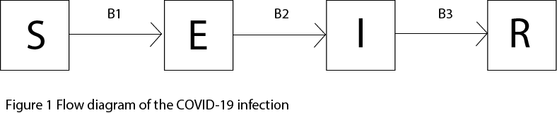
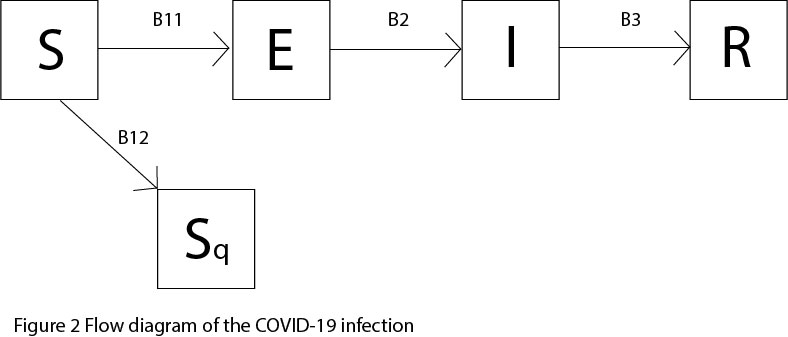
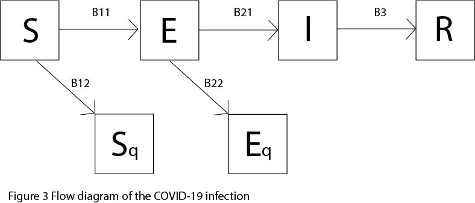

# STATS 531 Final Project Case study on the United States COVID-19 data based on the SEIR model.

## Introduction
The World Health Organization declared the coronavirus disease 2019 (COVID-19) a pandemic on March 11 as the disease infiltrated countries all over the globe. COVID-19 is an extremely contagious disease and has a higher mortality rate than the flu. Different research groups came up with varying estimates of $R_0$. A recent scientific paper gave an estimate of $R_0$ up to 5.7[1]. This means that on average a person who has the disease will transmit it to an average of 5.7 other people. If $R_0$ is more than 1, each existing infection causes more than one new infection. The disease will be transmitted between people, and there may be an outbreak or epidemic[2]. Under the influence of this pandemic, hundreds of thousands have lost their lives and millions have been infected. In this report, I want to model the spread of the coronavirus among the population in the United States. And based on these results I would like to analyze some possible methods that could help reduce the total influence of the pandemic. I will mainly use several kinds of SEIR model to simulate this process and show the results.

This dataset was downloaded from the Internet[3], including 97 data of the total cases and total deaths of COVID-19 from 2020-01-21 to 2020-04-26 in the United States.

```{r setup, include=FALSE}
knitr::opts_chunk$set(echo  = FALSE, message = FALSE)
library(readr)
library(dplyr)
library(tidyverse)
library(pomp)
```

```{r parallel_setup, include=FALSE}
library(doParallel)

cluster_cores <- as.numeric(Sys.getenv('SLURM_NTASKS_PER_NODE'))
CLUSTER <- !is.na(cluster_cores)
if(CLUSTER) registerDoParallel(cluster_cores) else registerDoParallel()

library(doRNG)
registerDoRNG(1929384)
```

## Exploratory Data Analysis
In this dataset, the first COVID-19 case was reported at 2020-01-21. In the next 50 days, the total number of confirmed cases was less than 1,000.  However, in just 10 days from March 11th to March 21st, the total cases diagnosed as COVID-19 went from about 1,000 to 20,000. From March 21st to now, the total number of cases have reached one million.

These two plots show how the total cases and total deaths change with time. From this plot, we can see that until April 26th, the total cases of COVID-19 is still increasing.

```{r}
COV19_US <- read_csv("COV19_US.csv")
COV19_US %>% ggplot(aes(x = date, y = total_cases)) + geom_line() + ggtitle("Total Cases") + theme_bw() 
COV19_US %>% ggplot(aes(x = date, y = total_deaths)) + geom_line()+ ggtitle("Total Deaths") + theme_bw() 
names(COV19_US) = c("date","C","D","day")
```

In the next section, I'll show  how to use the SEIR model to simulate the spread of coronavirus in the population.

##  Model

### Basic SEIR model

Susceptible-infected-recovered (SIR) is a fundamental class of models for disease transmission dynamics[4]. We have learnt the basic concepts of the susceptible-infected-recovered (SIR) model in Lecture 11. Here I am going to bulid a SEIR model to include the latency. A SEIR model contain four compartments, susceptible individuals, exposed individuals(infected people with no symptom), infected individuals with symptoms, and recovered individuals.

The flow of this SEIR looks like this:



The corresponding individuals flows between compartments are described as follows:

1. B1 : the number of susceptible individuals who become newly infected(S->E)

2. B2 : the number of infected individual with symptoms(E->I)

3. B3 : the number of individual recovered from infected and infectious individuals(I->R)

Given the transition of an individual from one state to the next state can be considered as a stochastic process, this discrete-time stochastic compartment model for COVID-19 infection can be consturcted as 


$$S(t+dt) = S(t) - B1(t)$$
$$E(t+dt) = E(t) + B1(t) - B2(t)$$
$$I(t+dt) = I(t) + B2(t) - B3(t)$$
$$R(t+dt) = R(t) + B3(t)$$

where

$$B1 \sim Binomal(S, P1)  \qquad P1 = 1 - exp(-\beta*I/N*dt)$$
$$B2 \sim Binomal(E, P2)  \qquad P2 = 1 - exp(-\mu_{EI}*dt)$$
$$B3 \sim Binomal(I, P3)  \qquad P3 = 1 - exp(-\mu_{IR}*dt)$$

In the above expressions, $P_i$ represents the probability that individuals leave the current state in the time interval dt. As we know from the exponential distribution, the larger the parameter, the higher the probability.

Based on these assumption, I built the first SEIR model. When tuning this model, I set the total number of N = 300000000 to approximate the total population of America.

This plot shows the results of my first SEIR model. 

Here I set $\beta = 0.11$, $\mu_{EI} = 0.16$ and $\mu_{IR} = 0.004$. 

```{r}
registerDoRNG(1929384)
step <- Csnippet( "
  double B1 = rbinom(S, 1-exp(-Beta*I/N*dt));
  double B2 = rbinom(E, 1-exp(-mu_EI*dt));
  double B3 = rbinom(I, 1-exp(-mu_IR*dt));

  S -= B1;
  E += B1 - B2;
  I += B2 - B3;
  R += B3;")


rinit <- Csnippet("
 S = N - 2030;
 E = 2000;
 I = 30;
 R = 0;
")
obsnames <- "C"
dmeas <- Csnippet("lik = dbinom(C,I,rho, give_log);")
rmeas <- Csnippet("C = rbinom(I, rho);")


pomp(subset(COV19_US,select=c(day,C)),
     time="day",t0=0,
     rprocess=euler(step,delta.t=1/12),
     rinit=rinit, 
     statenames=c("S", "E", "I","R"),
     obsnames = obsnames,
    paramnames=c("Beta","mu_EI","mu_IR","rho","N"),
     rmeasure=rmeas,
     dmeasure=dmeas,
    partrans=parameter_trans(
    log=c("Beta","mu_EI","mu_IR"),
    logit="rho")) -> covid


covids <- simulate(covid,params=c(Beta = 0.11, mu_EI = 0.16, mu_IR = 0.004, rho = 0.9, N=300000000 ),nsim=10,format="data.frame",include=TRUE)
ggplot(covids,mapping=aes(x=day,y=C,group=.id,color=.id=="data"))+geom_line()+guides(color=FALSE)+ theme_bw() 
```

As we could see from the simulated red curved, our SEIR model reproduced the increase of the total cases after day 50. And from day 60 to day 90, the model gives a lower estimate than the truth cases. So based on these observation, I found that this simple SEIR model doesn't quite reproduce the spread of the COVID-19 virus among population.

### S(Sq)EIR Model

By refering to one previous 2018 project[3] and a recent paper on modeling the COVID-19, I decided to build a S(Sq)EIR model based on my first SEIR model.

First, I added another compartment to include the number of quarantined susceptible individuals. These people could be students who got started to take online courses or employees who began to work from home. I used another parameter q to represent the proportion of people in this compartment.

The flow of the new S(Sq)EIR model looks like this:



The corresponding mathematical formulas can be written as followed:

$$S(t+dt) = S(t) - B11(t) - B12(t)$$
$$Sq(t+dt) = Sq(t) + B12(t)$$
$$E(t+dt) = E(t) + B11(t) - B2(t)$$
$$I(t+dt) = I(t) + B2(t) - B3(t)$$
$$R(t+dt) = R(t) + B3(t)$$
where
$$B11 \sim Binomal(S, P11)  \qquad P11 = 1 - exp(-\beta*I/N*dt)$$
$$B12 \sim Binomal(S, P12)  \qquad P12 = 1 - exp(-q(1-\beta)*I/N*dt)$$
$$B2 \sim Binomal(E, P2)  \qquad P2 = 1 - exp(-\mu_{EI}*dt)$$
$$B3 \sim Binomal(I, P3)  \qquad P3 = 1 - exp(-\mu_{IR}*dt)$$

From this plot we can see that using the same parameters from the previous model, only increasing the q , we can control the increasing rate of total number of cases. A lower total number of cases was achieved. This shows that in the early days of the outbreak, stay in home can be used to control the spread of the epidemic to a certain extent.

```{r}
registerDoRNG(1929384)
step2 <- Csnippet( "
  double B11 = rbinom(S, 1-exp(-Beta*I/N*dt));
  double B12 = rbinom(S, 1-exp(-q*(1-Beta)*I/N*dt));
  double B2 = rbinom(E, 1-exp(-mu_EI*dt));
  double B3 = rbinom(I, 1-exp(-mu_IR*dt));

  S += -B11-B12;
  Sq += B12;
  E += B11 - B2;
  I += B2 - B3;
  R += B3;")


rinit2 <- Csnippet("
 S = N - 2030 - 1000000;
 Sq = 1000000;
 E = 2000;
 I = 30;
 R = 0;
 
")
obsnames2 <- "C"
dmeas2 <- Csnippet("lik = dbinom(C,I,rho, give_log);")
rmeas2 <- Csnippet("C = rbinom(I, rho);")


pomp(subset(COV19_US,select=c(day,C)),
     time="day",t0=0,
     rprocess=euler(step2,delta.t=1/12),
     rinit=rinit2, 
     statenames=c("S","Sq", "E", "I","R"),
     obsnames = obsnames2,
    paramnames=c("Beta","mu_EI","mu_IR","rho","N","q"),
     rmeasure=rmeas2,
     dmeasure=dmeas2,
    partrans=parameter_trans(
    log=c("Beta","mu_EI","mu_IR"),
    logit="rho")) -> covid2


covids2 <- simulate(covid2,params=c(Beta = 0.11, mu_EI = 0.16, mu_IR = 0.003, rho = 0.9, N=300000000,q = 10 ),nsim=10,format="data.frame",include=TRUE)
ggplot(covids2,mapping=aes(x=day,y=C,group=.id,color=.id=="data"))+geom_line()+guides(color=FALSE)+ theme_bw() 
```


By tuning the parameter, I can get the simulated curved very close the true curve.
Here $\beta = 0.12$, $\mu_{EI} = 0.162$, $\mu_{IR} = 0.003$ and $q = 14$. 

```{r}
registerDoRNG(1929384)
step2 <- Csnippet( "
  double B11 = rbinom(S, 1-exp(-Beta*I/N*dt));
  double B12 = rbinom(S, 1-exp(-q*(1-Beta)*I/N*dt));
  double B2 = rbinom(E, 1-exp(-mu_EI*dt));
  double B3 = rbinom(I, 1-exp(-mu_IR*dt));

  S += -B11-B12;
  Sq += B12;
  E += B11 - B2;
  I += B2 - B3;
  R += B3;")


rinit2 <- Csnippet("
 S = N - 2030 - 1000000;
 Sq = 1000000;
 E = 2000;
 I = 30;
 R = 0;
 
")
obsnames2 <- "C"
dmeas2 <- Csnippet("lik = dbinom(C,I,rho, give_log);")
rmeas2 <- Csnippet("C = rbinom(I, rho);")


pomp(subset(COV19_US,select=c(day,C)),
     time="day",t0=0,
     rprocess=euler(step2,delta.t=1/12),
     rinit=rinit2, 
     statenames=c("S","Sq", "E", "I","R"),
     obsnames = obsnames2,
    paramnames=c("Beta","mu_EI","mu_IR","rho","N","q"),
     rmeasure=rmeas2,
     dmeasure=dmeas2,
    partrans=parameter_trans(
    log=c("Beta","mu_EI","mu_IR"),
    logit="rho")) -> covid2


covids2 <- simulate(covid2,params=c(Beta = 0.12, mu_EI = 0.162, mu_IR = 0.003, rho = 0.9, N=300000000,q = 14 ),nsim=20,format="data.frame",include=TRUE)
ggplot(covids2,mapping=aes(x=day,y=C,group=.id,color=.id=="data"))+geom_line()+guides(color=FALSE)+ theme_bw() 
```


### S(Sq)E(Eq)IR Model

I want to add another compartment to this model to see whether I can get a better result. As we know that some of the exposed individuals don't have symptoms. They can heal themselves after self-isolation at home. So now I will add another compartment call Eq which includes the exposed indivduals who are quarantined.




The corresponding equations could be modified as follows.

$$S(t+dt) = S(t) - B11(t) - B12(t)$$
$$Sq(t+dt) = Sq(t) + B12(t)$$
$$E(t+dt) = E(t) + B11(t) - B21(t) - B22(t)$$
$$Eq(t+dt) = Eq(t) + B22(t)$$
$$I(t+dt) = I(t) + B21(t) - B3(t)$$
$$R(t+dt) = R(t) + B3(t)$$
where
$$B11 \sim Binomal(S, P11)  \qquad P11 = 1 - exp(-\beta*I/N*dt)$$
$$B12 \sim Binomal(S, P12)  \qquad P12 = 1 - exp(-(1-q*\beta)*I/N*dt)$$
$$B21 \sim Binomal(E, P2)  \qquad P21 = 1 - exp(-\mu_{EI}*dt)$$
$$B22 \sim Binomal(E, P22)  \qquad P2 = 1 - exp(-q2*(1-\mu_{EI})*dt)$$
$$B3 \sim Binomal(I, P3)  \qquad P3 = 1 - exp(-\mu_{IR}*dt)$$

As we can see from this plot, there is still a certain deviation between the model and the real situation. Considering that the transmission of disease is a very complex dynamical problem, the model I built ignored many processes in the real life. For example, some self-quarantined indivduals can be the susceptible individuals again. When they come back into the S compartment, they will again have changes to be infected.

```{r}
registerDoRNG(1929384)
step2 <- Csnippet( "
  double B11 = rbinom(S, 1-exp(-Beta*I/N*dt));
  double B12 = rbinom(S, 1-exp(-q*(1-Beta)*I/N*dt));
  double B21 = rbinom(E, 1-exp(-mu_EI*dt));
  double B22 = rbinom(E, 1-exp(-q2*dt));
  double B3 = rbinom(I, 1-exp(-mu_IR*dt));

  S += -B11-B12;
  Sq += B12;
  E += B11 - B21-B22;
  Eq += B22;
  I += B21 - B3;
  R += B3;")


rinit2 <- Csnippet("
 S = N - 2050 - 1000000;
 Sq = 1000000;
 E = 2000;
 Eq = 20;
 I = 30;
 R = 0;
 
")
obsnames2 <- "C"
dmeas2 <- Csnippet("lik = dbinom(C,I,rho, give_log);")
rmeas2 <- Csnippet("C = rbinom(I, rho);")


pomp(subset(COV19_US,select=c(day,C)),
     time="day",t0=0,
     rprocess=euler(step2,delta.t=1/12),
     rinit=rinit2, 
     statenames=c("S","Sq", "E","Eq", "I","R"),
     obsnames = obsnames2,
    paramnames=c("Beta","mu_EI","mu_IR","rho","N","q","q2"),
     rmeasure=rmeas2,
     dmeasure=dmeas2,
    partrans=parameter_trans(
    log=c("Beta","mu_EI","mu_IR"),
    logit="rho")) -> covid2


covids2 <- simulate(covid2,params=c(Beta = 0.13, mu_EI = 0.155, mu_IR = 0.009, rho = 0.9, N=300000000,q = 13, q2 = 0.003 ),nsim=50,format="data.frame",include=TRUE)
ggplot(covids2,mapping=aes(x=day,y=C,group=.id,color=.id=="data"))+geom_line()+guides(color=FALSE)+ theme_bw()
```

```{r eval=FALSE ,include=FALSE}
registerDoRNG(1929384)
step2 <- Csnippet( "
  double B11 = rbinom(S, 1-exp(-Beta*I/N*dt));
  double B12 = rbinom(S, 1-exp(-q*(1-Beta)*I/N*dt));
  double B21 = rbinom(E, 1-exp(-mu_EI*dt));
  double B22 = rbinom(E, 1-exp(-q2*dt));
  double B31 = rbinom(I, 1-exp(-mu_IR*dt));
  double B32 = rbinom(I, 1-exp(-mu_IH*dt));

  S += -B11-B12;
  Sq += B12;
  E += B11 - B21-B22;
  Eq += B22;
  I += B21 - B31 -B32;
  H += B32;
  R += B31;")


rinit2 <- Csnippet("
 S = N - 2100 - 1000000;
 Sq = 1000000;
 E = 2000;
 Eq = 20;
 I = 30;
 R = 0;
 H = 2;
 
")
obsnames2 <- "C"
dmeas2 <- Csnippet("lik = dbinom(C,H,rho, give_log);")
rmeas2 <- Csnippet("C = rbinom(H, rho);")


pomp(subset(COV19_US,select=c(day,C)),
     time="day",t0=0,
     rprocess=euler(step2,delta.t=1/12),
     rinit=rinit2, 
     statenames=c("S","Sq","E","Eq", "I","R","H"),
     obsnames = obsnames2,
    paramnames=c("Beta","mu_EI","mu_IR","mu_IH","rho","N","q","q2"),
     rmeasure=rmeas2,
     dmeasure=dmeas2,
    partrans=parameter_trans(
    log=c("Beta","mu_EI","mu_IR","mu_IH"),
    logit="rho")) -> covid2


covids2 <- simulate(covid2,params=c(Beta = 0.11, mu_EI = 0.25, mu_IR = 0.0001, rho = 0.9, N=300000000,q = 7, q2 = 0.0001,mu_IH = 0.1 ),nsim=50,format="data.frame",include=TRUE)
ggplot(covids2,mapping=aes(x=day,y=C,group=.id,color=.id=="data"))+geom_line()+guides(color=FALSE)+ theme_bw()
```


```{r eval=FALSE, include=FALSE}
run_level <- 2
covid_Np <-      switch(run_level, 100, 20000, 60000)
covid_Nmif <-    switch(run_level,  10,   100,   300)
covid_Neval <-   switch(run_level,  10,    10,    10)
covid_Nglobal <- switch(run_level,  10,    10,   100)
covid_Nlocal <-  switch(run_level,  10,    10,    20)

#covid_fixed_params = c(N = 3000000)
```

```{r eval=FALSE, include=FALSE}
covid_params = c(Beta = 0.13, mu_EI = 0.155, mu_IR = 0.009, rho = 0.9, N=300000000,q = 13, q2 = 0.003 )

stew(file = sprintf("pf22-%d.rda", run_level),{
  t_pf <- system.time(
  pf <- foreach(i = 1:20, .packages = 'pomp') %dopar%
    try(pfilter(covid2, params = covid_params, Np = covid_Np)))
  },
  seed = 345876340, kind = "L'Ecuyer")

(lik.pf <- logmeanexp(sapply(pf, logLik), se = TRUE))

```


```{r eval=FALSE, include=FALSE}
covid_box <- rbind(
  Beta=c(0.01,0.3),
  mu_EI=c(0.10,0.4),
  mu_IR=c(0.01,0.10),
  rho = c(0.5,1)
)


covid_rw.sd <- 0.02
covid_cooling.fraction.50 <- 0.5
stew(file=sprintf("box_eval-%d.rda",run_level),{
  t_global <- system.time({
    mifs_global <- foreach(i=1:covid_Nglobal,
      .packages='pomp', .combine=c) %dopar% mif2(     
        covid,
        params=c(apply(covid_box,1,function(x)runif(1,x[1],x[2]))
	  ),
        Np=covid_Np,
        Nmif=covid_Nmif,
        cooling.fraction.50=covid_cooling.fraction.50,
        rw.sd=rw.sd(
          Beta=covid_rw.sd,
          mu_EI=covid_rw.sd,
          mu_IR=covid_rw.sd,
          rho=covid_rw.sd
        )
      )
    })
})

stew(file=sprintf("lik_global_eval-%d.rda",run_level),{
  t_global_eval <- system.time({
    liks_global <- foreach(i=1:covid_Nglobal,
      .packages='pomp',.combine=rbind) %dopar% {
        evals <- replicate(covid_Neval,
	  logLik(pfilter(covid,params=coef(mifs_global[[i]]),Np=covid_Np)))
          logmeanexp(evals, se=TRUE)
    }
  })
})


results_global <- data.frame(logLik=liks_global[,1],
  logLik_se=liks_global[,2],t(sapply(mifs_global,coef)))
summary(results_global$logLik,digits=5)
t_global
plot(mifs_global)
```

## Conclusion

In this project, I tried to simulated the disease spread process using the SEIR and variations of SEIR model. In the model fitting process, I found the $\beta$ and $\mu_{IR}$ have great influences on the changes of the growth curve. $\beta$ represents the probability of transmission. The higher the $\beta$, the faster the virus spreads through the population. In other words, the shorter the time to infect everyone in a country if not taking any action. $\mu_{IR}$ represents the recovery rate of symptomatic infected individuals. The larger $\mu_{IR}$ is, the earlier the peak of the total cases will come. If the health system can function efficiently, it can also prove effective in controlling the epidemic. In addition, in our S(Sq)E(Eq)IR model, I introduced additional parameters $q$  to represent people who have blocked virus transmission through quarantine The results show that quarantine can also effectively control the spread of the epidemic, which is an effective means.

##  Reference

1.Sanche S, Lin YT, Xu C, Romero-Severson E, Hengartner N, Ke R. High contagiousness and rapid spread of severe acute respiratory syndrome coronavirus 2. Emerg Infect Dis. 2020 Jul. https://doi.org/10.3201/eid2607.200282

2.https://www.healthline.com/health/r-nought-reproduction-number

3.Data source: https://ourworldindata.org/coronavirus-source-data

4. Lecture Note 11 P3

5. STATS 531 Final Project 2018 The Ebola Epidemic of 2014-2016: Sierra Leone


