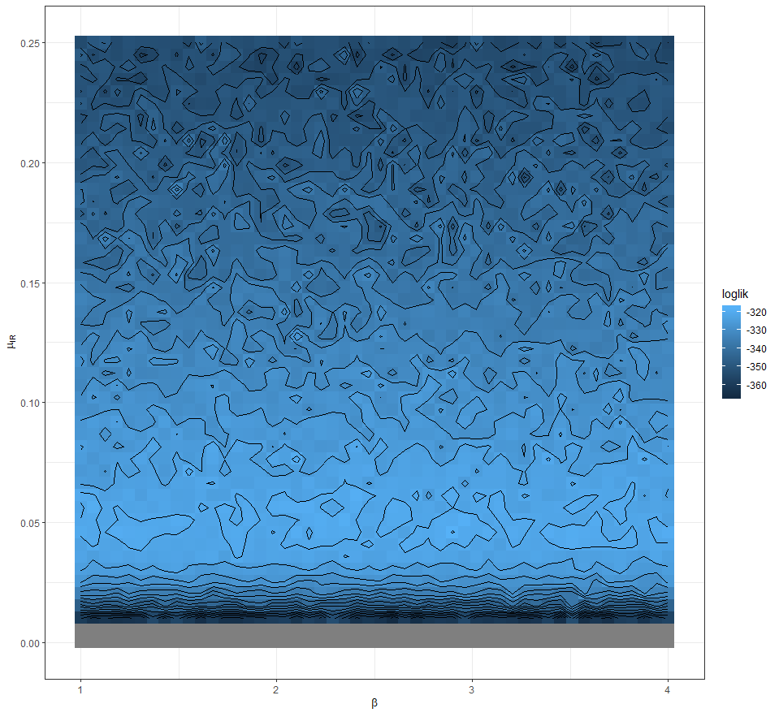
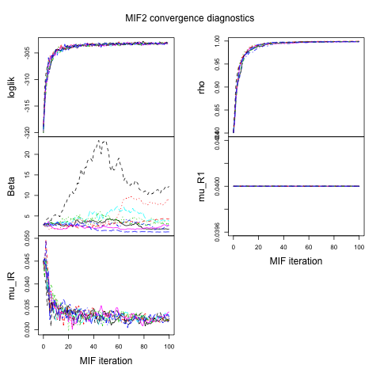
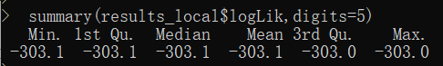
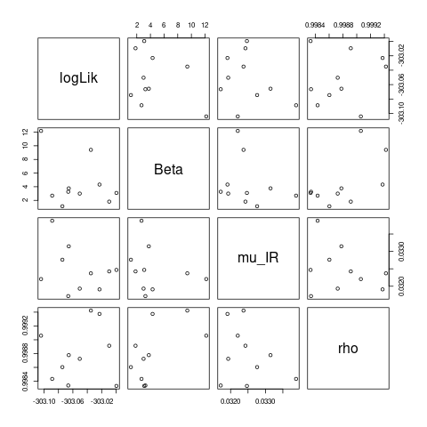
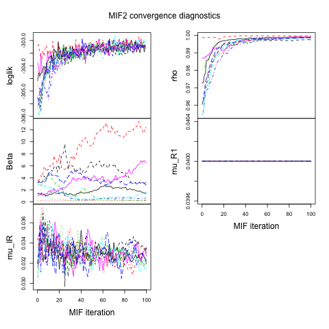
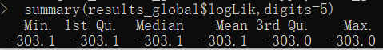
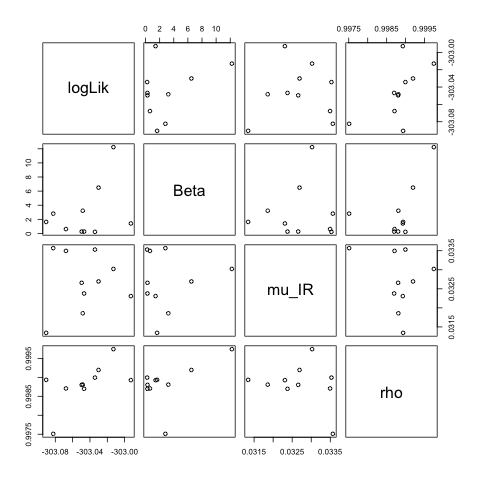

Note: I run my code on the Great Lakes Cluster. If the code is run on Windows, it can show up some error. Moreover, some of the images cannot be properly shown in R Markdown. If you cannot see the image, please refer to my submission zip file.

```{r setup, include=FALSE}
knitr::opts_chunk$set(echo = TRUE, error=TRUE)
```

### Introduction
Online Social Networks(OSN), such as Google and Facebook, plays a significant role in spreading information in nowadays world. In this project, we are applying SIR model to Google query search data to study the pattern of spreading of public event interest.


### Data
The data we used for this project is retrieved from the publicly available historical Google query search data https://trends.google.com/trends/?geo=US. We are interested in finding a dataset related to a public event which consists of approximately 100 data points. Considering the Super Bowl opening date is Feb 2, the search query data for football can be a fairly appropriate dataset. For this project, I collected the search index of the term "football" from Jan 27 to April 24, which reflects the search popularity relative to the highest point on the chart for the given region of time. The time plot of the search index data is as follows:
```{r error=TRUE, warning=FALSE, message=FALSE, results='hide'}
set.seed(594709947L)
library(ggplot2)
theme_set(theme_bw())
library(plyr)
library(reshape2)
library(foreach)
#library(doMC)
library(pomp)
stopifnot(packageVersion("pomp")>="2.0")
mat<-as.matrix(read.csv("multiTimeline.csv",header=TRUE))
trend <- ts(na.omit(as.numeric(mat[,2])))
football_data <- data.frame(day=1:89,trend=trend)
plot(trend)
```

As shown by the plot, the search index peaks at the date Feb 2, and then fluctuates around 60, and is finally contained within 20. This seems reasonable, since as the opening data of the Super Bowl enent approaches, an increasing number of people would search the term "football" and the search index will peak at the opening date and be maintained within a high level during the event.

### Model

I would use a variant of the $SIR$ model discussed in the lectures, which is $SIR_1R_2$ model. I would divide the population into four compartments as follows:

$S$: the population that are susceptible to searching the term "football"

$I$: the population that are infected by the desire to search the term "football"

$R_1$: the population that are partly recovered by the "football infection" since they already searched the term "football", but may still search the term in the near future

$R_2$: the population that are fully recovered by the "football infection" and they will not search the term "football" within the considered range of time

We denote the compartment transfer rates to be $\mu_{SI}$, $\mu_{IR_1}$, $\mu_{R_1R_2}$, respectively. We denote the cumulative counts of the individuals who transitioned among compartments at time $t$ to be $N_{SI}(t)$, $N_{IR_1}(t)$, $N_{R_1R_2}(t)$, respectively. For simplicity, we will ignore demography, i.e. we set $\mu_{\cdot S}=\mu_{S\cdot}=\mu_{I\cdot}=\mu_{R_1\cdot}=\mu_{R_2\cdot}=0$.

We model the compartment transition process as follows:
\begin{equation*}
\frac{dN_{SI}(t)}{dt}=\mu_{SI}(t)S(t)=\beta I(t)S(t)
\\
\frac{dN_{IR_1}(t)}{dt}=\mu_{IR_1}(t)I(t)
\\
\frac{dN_{R_1R_2}(t)}{dt}=\mu_{R_1R_2}(t)R_1(t)
\end{equation*}

I will use a binomial approximation in the model as follows:
\begin{equation*}
\Delta N_{SI}(t)\sim Binomial(S,1-e^{-\beta\Delta t})
\\
\Delta N_{IR_1}(t)\sim Binomial(I,1-e^{-\mu_{IR_1}\Delta t})
\\
\Delta N_{R_1R_2}(t)\sim Binomial(R_1,1-e^{-\mu_{R_1R_2}\Delta t})
\end{equation*}

I model the data, $B(t)$, as follows:
\begin{equation*}
B(t)\sim Possion(\rho R_1(t))
\end{equation*}

Note that the search index data does not directly reflect the counts of individuals, but we view the two as the same for simplicity. As for the choice of total population size, by exploiting the final-size equation
\begin{equation*}
\mathcal{R}_0=-\frac{\log(1-f)}{f}
\end{equation*}
and setting \mathcal{R}_0=1.5 and $R(\infty)=100$ we get an estimate of the total population size $N=150$.

### Model Computation
Our goal is to infer the latent parameters in the model stated above. We want to first get an overview of the desired parameter swarms. For sake of computational resources and time, we want to first fix some of the parameters and conduct a grid likelihood search for the other parameters. Mimicking the SIR model discussed in the lecture, we fix the parameter $\rho=0.8$ and estimate the parameter $\mu_{R_1R_2}$ by $\mu_{R_1R_2}\approx\frac{1}{sum(B)/length(B)}\approx 0.04$. We conduct a grid over the range $\beta\in[1,4]$ and $\mu_{IR_1}\in[0,0.25]$.

```{r error=TRUE, warning=FALSE, message=FALSE, results='hide'}
expand.grid(Beta=seq(from=1,to=4,length=50),
            mu_IR=seq(from=0,to=0.25,length=50),
            rho=0.8,
            mu_R1=0.04) -> p

foreach (theta=iter(p,"row"),.combine=rbind,.packages='pomp',
         .inorder=FALSE) %dopar% {
           pfilter(football,params=unlist(theta),Np=2000) -> pf
           theta$loglik <- logLik(pf)
           theta
         } -> p

pp <- mutate(p,loglik=ifelse(loglik>max(loglik)-50,loglik,NA))
ggplot(data=pp,mapping=aes(x=Beta,y=mu_IR,z=loglik,fill=loglik))+
  geom_tile(color=NA)+
  scale_fill_gradient()+
  geom_contour(color='black',binwidth=3)+
  labs(x=expression(beta),y=expression(mu[IR]))
```

The grid likelihood search result is as follows.



It shows that the desired parameters may be $(\beta,\mu_{IR_1},\rho,\mu_{R_1R_2})=(0.29,0.045,0.8,0.04)$.

Next, we want to do a local likelihood search starting from point $(\beta,\mu_{IR_1},\rho,\mu_{R_1R_2})=(0.29,0.045,0.8,0.04)$.

```{r error=TRUE, warning=FALSE, message=TRUE, results='hide'}
run_level <- 2
switch(run_level, {
  football_Np=100; football_Nmif=10; football_Neval=10;
  football_Nglobal=10; football_Nlocal=10
},{
  football_Np=20000; football_Nmif=100; football_Neval=10;
  football_Nglobal=10; football_Nlocal=10
},{
  football_Np=60000; football_Nmif=300; football_Neval=10;
  football_Nglobal=100; football_Nlocal=20}
)


football_params <- data.matrix(
  read.csv("params.csv",
             row.names=NULL,header=TRUE))
football_mle <- football_params[1,][football_paramnames]


football_rw.sd <- 0.02; football_cooling.fraction.50 <- 0.5
stew(file=sprintf("final/football_local_search-%d.rda",run_level),{
  t_local <- system.time({
    mifs_local <- foreach(i=1:football_Nlocal,
                          .packages='pomp', .combine=c) %dopar% {
                            mif2(football,
                                 params=football_mle,
                                 Np=football_Np,
                                 Nmif=football_Nmif,
                                 cooling.fraction.50=football_cooling.fraction.50,
                                 rw.sd=rw.sd(
                                   Beta=football_rw.sd,
                                   mu_IR=football_rw.sd,
                                   rho=football_rw.sd)
                            )
                          }
  })
},seed=900242057,kind="L'Ecuyer")


logLik(pfilter(football,params=coef(mifs_local[[1]]),Np=2000))

 stew(file=sprintf("final/football_lik_local-%d.rda",run_level),{
   t_local_eval <- system.time({
     liks_local <- foreach(i=1:football_Nlocal,
                           .combine=rbind,.packages='pomp')%dopar% {
                             evals <- replicate(football_Neval, logLik(
                               pfilter(football,params=coef(mifs_local[[i]]),Np=football_Np)))
                             logmeanexp(evals, se=TRUE)
                           }
   })
 },seed=900242057,kind="L'Ecuyer")

 results_local <- data.frame(logLik=liks_local[,1],
                             logLik_se=liks_local[,2],t(sapply(mifs_local,coef)))


 summary(results_local$logLik,digits=5)

 png("football_local.png")
 plot(mifs_local)
 dev.off()
 
 png("pairs_plot.png")
 pairs(~logLik+Beta+mu_IR+rho,
       data=subset(results_local,logLik>max(logLik)-5))
 dev.off()
```

The MIF2 convergence plot is as follows:




It can be seen from the plot that all the parameters other than $\beta$ converges well. There seems to be multiple convergence points for the parameter $\beta$.

The summary of the likelihood is as follows:



The pair plot is as follows:



Next, we are going to conduct a global likelihood search for a parameter box which contains $(\beta,\mu_{IR_1},\rho,\mu_{R_1R_2})=(0.29,0.045,0.8,0.04)$. It can be seen from the Grid Search plot that such a box can be $\beta\in[0,5],\mu_{IR_1}\in[0.03,0.035], \rho\in[0.95,1.0]$.

```{r error=TRUE, warning=FALSE, message=FALSE, results='hide'}
football_box <- rbind(
   Beta=c(0,5),
   mu_IR=c(0.03,0.035),
   rho = c(0.95,1.0)
 )
 
 football_fixed_params <- c(mu_R1=0.04)
 
 stew(file=sprintf("final/box_eval-%d.rda",run_level),{
   t_global <- system.time({
     mifs_global <- foreach(i=1:football_Nglobal,
                            .combine=c,.packages='pomp') %dopar% {
                              mif2(
                                mifs_local[[1]],
                                params=c(
                                  apply(football_box,1,function(x)runif(1,x[1],x[2])),
                                  football_fixed_params)
                              )}
   })
 },seed=1270401374,kind="L'Ecuyer")
 
 stew(file=sprintf("final/lik_global_eval-%d.rda",run_level),{
   t_global_eval <- system.time({
     liks_global <- foreach(i=1:football_Nglobal,
                            .combine=rbind, .packages='pomp') %dopar% {
                              evals <- replicate(football_Neval,
                                                 logLik(pfilter(football,
                                                                params=coef(mifs_global[[i]]),Np=football_Np)))
                              logmeanexp(evals, se=TRUE)
                            }
   })
 },seed=442141592,kind="L'Ecuyer")
 
 results_global <- data.frame(
   logLik=liks_global[,1],
   logLik_se=liks_global[,2],t(sapply(mifs_global,coef)))
 summary(results_global$logLik,digits=5)
 
 png("pair_plot_global.png")
 pairs(~logLik+Beta+mu_IR+rho,
       data=subset(results_global,logLik>max(logLik)-5))
 dev.off()
 
 png("football_global.png")
 plot(mifs_global)
 dev.off()
```


The MIF2 global converge plot is as follows.



All the parameters other than $\beta$ converge well. There exists multiple convergence for the parameter $\beta$.

The summary of the likelihood is as follows:



Note that the likelihood results for both local search and global search are almost the same, which means we have got a good estimate of the parameters.

The pair plot is as follows:



### Conclusion and Discussion

The final estimate for the parameters can be read from the MIF2 convergence plot. However, there are numtiple convergence for the parameter $\beta$. This should not be an issue, since these multiple $\beta$ convergence values does not affect the likelihood much, hence they are all acceptable for future inference.

### References

[1] https://ionides.github.io/531w20/12/notes12.pdf
[2] https://ionides.github.io/531w18/final_project/13/final.html
[3] Social Resilience in Online Communities: The Autospy of Friendster. David Garcia, Pavlin Mavrodiev, Frank Schweitzer.