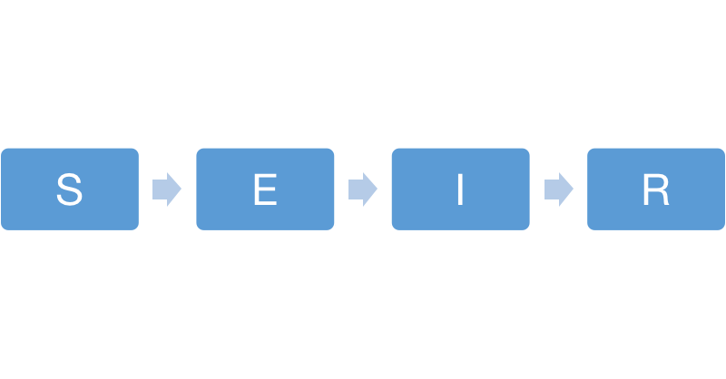

```{r setup, include=FALSE}
knitr::opts_chunk$set(echo = TRUE)
```

------

## 1 Introduction

Varicella is a highly contagious disease caused by the varicella zoster virus (VZV). There are an estimated 60 million cases of chickenpox worldwide each year, 90 percent of which occur in children of all ages. It is most common in children under 12 years of age, but the symptoms are usually more severe in adults than in children. Varicella can be spread by droplets or air, or by direct or indirect contact with vesicular fluid or mucous secretions of the pathogen in patients with chickenpox or herpes zoster. Varicella is a global disease that humans have been battling since the 17th century. Before governments mandated chickenpox vaccination for newborns, the number of new cases per year was nearly the same as the number of births that year. Fortunately, after the popularization of chickenpox vaccine, chickenpox cases decreased significantly. In the United States, before the introduction of the chickenpox vaccine in 1995, 4 million patients were diagnosed each year, and the incidence of chickenpox dropped by 83-93 percent after 1995.

In South Korea, in January 2005, varicella was selected as a national immunization target, and in July it was designated as a category ii statutory infectious disease. In this report, I collected the data of monthly varicella cases in South Korea from 2005 to 2018. In order to obtain the transmission dynamics of varicella infection in South Korea, we will try two models, the SEIR model and the extended SIR model with covariates. We can get the propagated dynamic simulation data through parameter estimation and feedback whether the model is applicable to this data set.

## 2 Explore the data

```{r, include=FALSE}
set.seed(594709947L)
library(ggplot2)
theme_set(theme_bw())
library(tidyverse)
require(dplyr)
library(plyr)
library(reshape2)
library(foreach)
library(magrittr)
#library(doMC)
library(pomp)
stopifnot(packageVersion("pomp")>="2.0")

require(doParallel)
cores <- 20  # The number of cores on this machine 
registerDoParallel(cores)
mcopts <- list(set.seed=TRUE)
```

The data set contains monthly cases from July 2005 to December 2018 with 162 observations. In the same time, we add two covariates: live birth by month(B), and the annual population of south Korean children under the age of 14(P). Since varicella is most common in children, we focus on the transmission in children group. 

```{r, echo=FALSE}
data <- read.csv("Reported_cases_of_Infectious_Disease_by_Month.csv")
data[7:11,]
summary((data$cases[7:168]))
```

We can see that the average number of cases in South Korea these 14 years is 3262. And the following plot is the time plots of these three features which shows the trends of our data.

```{r, echo=FALSE}
dat <- data[7:168,]
```

```{r, echo=FALSE}
data %>%
  gather(variable,value,-time) %>%
  ggplot(aes(x=time,y=value))+
  geom_line()+
  facet_wrap(~variable,ncol=1,scales='free_y',strip.position = "left")+
  theme_bw()+
  theme(
    strip.background=element_rect(fill=NA,color=NA),
    strip.placement="outside"
  )+
  labs(x="",y="")
```

We find that the varicella cases in South Korea has seasonal variation, which has peaks from May to June and from November to Juanary every year. Also, South Korea's fertility rate has been falling in recent years, so has the number of children under 14.

Now, we try some models to fit our varicella cases data. Generally, SIR, SEIR and their extended models are very common in infectious disease models. A suitable infectious disease model can study the transmission speed, spatial range, transmission route and kinetic mechanism of infectious diseases, so as to guide the effective prevention and control of infectious diseases.

## 3 Partially Observed Markov Process Models Analysis

### SEIR model

First, we try SEIR model. The SEIR model is applicable if the infectious disease under study has a certain incubation period, and a healthy person who has been in contact with the patient does not immediately fall ill, but becomes a carrier of the pathogen. The following figure is the representation of the SEIR model compartments.

```{r, out.width = '50%', echo=FALSE}

```

**Susceptible(S)**: it's not infected, but it's susceptible to infection because it's susceptible to infection after contact with an infected person.

**Exposed(E)**: a person who has come into contact with an infected person but is temporarily unable to infect others.

**Infectious(I)**: a person infected with an infectious disease, which can be transmitted to a member of class S and become a member of class E or class I.

**Recovered(R)**: a person who has recovered from quarantine or illness and is now immune. People with chickenpox are immunized for life, so these people will not be transmitted to a member of class S.

At the same time, there are some parameters in this model to represent the characteristics of the spread of the infectious diseases:

$\beta$: contact rate (or transmission rate)

$\sigma$: infectious rate, here we note it as mu_EI in the model

$\gamma$: recovery rate, here we note it as mu_IR in the model

$\rho$: reporting rate

```{r}
varicella_statenames <- c("S","E","I","R")
varicella_paramnames <- c("Beta","mu_EI","mu_IR","rho")
varicella_t0 <- 2005+6/12

varicella_rprocess <- "
  double dN_SE = rbinom(S,1-exp(-Beta*I*dt));
  double dN_EI = rbinom(E,1-exp(-dt*mu_EI));
  double dN_IR = rbinom(I,1-exp(-dt*mu_IR));
  S -= dN_SE;
  E += dN_SE - dN_EI;
  I += dN_EI - dN_IR;
  R += dN_IR;
  "
  
varicella_dmeasure <- "
  lik = dpois(cases,rho*I+1e-10,give_log);
"

varicella_rmeasure <- "
  cases = rpois(rho*I+1e-10);
"

varicella_rinit <- "
 S=47000000;
 E=100;
 I=20;
 R=10;
"

vari_pomp <- pomp(
  data=subset(dat,select=c(time,cases)),
  times="time",
  t0= 2005+6/12,
  rprocess=euler(
    step.fun=Csnippet(varicella_rprocess),
    delta.t=1/12),
  rmeasure=Csnippet(varicella_rmeasure),
  dmeasure=Csnippet(varicella_dmeasure),
  partrans=parameter_trans(
    log=c("Beta","mu_EI","mu_IR"),
    logit="rho"),
  statenames=varicella_statenames,
  paramnames=varicella_paramnames,
  rinit=Csnippet(varicella_rinit)
)
```

#### parameter estimation

Here we estimate parameters using global search.

```{r}
run_level <- 3
switch(run_level,
       {vari_Np=200; vari_Nmif=10; vari_Neval=10; vari_Nglobal=10; vari_Nlocal=10},
       {vari_Np=2000; vari_Nmif=100; vari_Neval=10; vari_Nglobal=10; vari_Nlocal=10},
       {vari_Np=50000; vari_Nmif=200; vari_Neval=10; vari_Nglobal=100; vari_Nlocal=20}
)

vari_rw.sd <- 0.02
vari_cooling.fraction.50 <- 0.5

varicella_box <- rbind(
  Beta=c(0.001,0.01),
  mu_EI=c(0.01,2),
  mu_IR=c(0.01,2),
  rho = c(0.5,1)
)

stew(file=sprintf("varibox_eval-%d.rda",run_level),{
  t_global <- system.time({
    mifs_global <- foreach(i=1:vari_Nglobal,.combine=c, .options.multicore=mcopts) %dopar% {
      mif2(
        vari_pomp,
        params=c(
          apply(varicella_box,1,function(x)runif(1,x[1],x[2]))),
        Np=vari_Np,
        Nmif=vari_Nmif,
        cooling.fraction.50=vari_cooling.fraction.50,
        rw.sd=rw.sd(
          Beta=vari_rw.sd,
          mu_EI=vari_rw.sd,
          mu_IR=vari_rw.sd,
          rho=vari_rw.sd)
      )}
  })
},seed=1270401374,kind="L'Ecuyer")

stew(file=sprintf("varilik_global_eval-%d.rda",run_level),{
  t_global_eval <- system.time({
    liks_global <- foreach(i=1:vari_Nglobal, .combine=rbind, .options.multicore=mcopts) %dopar% {
        evals <- replicate(vari_Neval,
          logLik(pfilter(vari_pomp,
	    params=coef(mifs_global[[i]]),Np=vari_Np)))
        logmeanexp(evals, se=TRUE)
    }
  })
},seed=442141592,kind="L'Ecuyer")

```

```{r}
results_global <- data.frame(
  logLik=liks_global[,1],
  logLik_se=liks_global[,2],t(sapply(mifs_global[1:10,],coef)))
mle1 = which.max(results_global$logLik)
vari_mle1 = unlist(results_global[mle1,])
vari_mle1
```

#### Diagnostics

First, we get the maximum likelihood from global search is -6268, which performs not much well. Then in the filter diagnostics the likelihood dosen’t converge even though we have large iteration times (50000). Also, mu_EI and Beta are not converge. All of these show that the SEIR model is not suitable for the varicella data. 
 
```{r,echo=FALSE}

summary(results_global$logLik,digits=5)
```


```{r, warning=FALSE}
plot(mifs_global)
```

### Extended SIR model with covariates

Since the outbreak and infection rate of varicella among young children is very high, I think the birth rate and the number of children are closely related to the transmission dynamics of varicella. And considering that varicella has a low fatality rate, so we didn't include monthly deaths. Therefore, we choose these two data as covariates to consider. Before adding the covariates into model, we need to smooth population because it was collected annually.

```{r}
P=predict(smooth.spline(x = 2005:2018, y=data$pop_under_14[seq(12,14*12,by=12)]),x=data$time)$y
plot(P ~ data$time, type = "l", col = "red", ylab = "Population under 14")
points(pop_under_14 ~ time, data = data[seq(1,169,by =12),])
```

Here, we use the compartment model of Martinez-Bakker et al.(2015).

```{r}
v_statenames <- c("SB1","SB2","SB3","SB4","SB5","SB6", "IB","SO","IO")
v_obsnames <- "cases"
v_t0 <- 2005+6/12

v_K <- 6
v_covar <- covariate_table(
  t=data$time,
  B=data$birth,
  P=predict(smooth.spline(x = 2005:2018, y=data$pop_under_14[seq(12,14*12,by=12)]),x=data$time)$y,
  periodic.bspline.basis(t,nbasis=v_K, degree=3,period=1,names="xi%d"),
  times="t"
)

v_rp_names <- c("b1","b2","b3","b4","b5","b6",
                    "psi","rho","tau","sigma_dem","sigma_env")

v_ivp_names <- c("SO_0","IO_0")
v_paramnames <- c(v_rp_names,v_ivp_names)

v_fp_names <- c("delta","K",
                    "SB1_0","SB2_0","SB3_0","SB4_0","SB5_0","SB6_0")
v_paramnames <- c(v_rp_names,
                      v_ivp_names,v_fp_names)
covar_index_t0 <- which(abs(v_covar@times-v_t0)<0.01)
v_initial_births <- v_covar@table["B",covar_index_t0-0:5]
names(v_initial_births) <- c("SB1_0","SB2_0",
                                 "SB3_0","SB4_0","SB5_0","SB6_0") 
v_fixed_params <- c(delta=1/60000,K=v_K, v_initial_births)

v_params_guess <- c(b1=3,b2=1,b3=1.5,b4=4,b5=5,b6=3,
                        psi=0.002,rho=0.01,tau=0.001,sigma_dem=0.04,sigma_env=0.5,
                        SO_0=0.1,IO_0=0.001,v_fixed_params)
```

```{r}
v_rprocess <- Csnippet("
  double beta = exp(dot_product( (int) K, &xi1, &b1));
  double lambda = (beta * (IO+IB) / P + psi);
  double var_epsilon = pow(sigma_dem,2)/ lambda +  
    pow(sigma_env,2);
  lambda *= (var_epsilon < 1.0e-6) ? 1 : 
    rgamma(1/var_epsilon,var_epsilon);
  double p = exp(- (delta+lambda)/12);
  double q = (1-p)*lambda/(delta+lambda);
  SB1 = B;
  SB2= SB1*p;
  SB3=SB2*p;
  SB4=SB3*p;
  SB5=SB4*p;
  SB6=SB5*p;
  SO= (SB6+SO)*p;
  IB=(SB1+SB2+SB3+SB4+SB5+SB6)*q;
  IO=SO*q;
")

v_dmeasure <- Csnippet("
  double tol = 1.0e-25;
  double mean_cases = rho*IO;
  double sd_cases = sqrt(pow(tau*IO,2) + mean_cases);
  if(cases > 0.0){
    lik = pnorm(cases+0.5,mean_cases,sd_cases,1,0)
      - pnorm(cases-0.5,mean_cases,sd_cases,1,0) + tol; 
  } else{
    lik = pnorm(cases+0.5,mean_cases,sd_cases,1,0) + tol;
  }
  if (give_log) lik = log(lik);
")

v_rmeasure <- Csnippet("
  cases = rnorm(rho*IO, sqrt( pow(tau*IO,2) + rho*IO ) );
  if (cases > 0.0) {
    cases = nearbyint(cases);
  } else {
    cases = 0.0;
  }
")

v_rinit <- Csnippet("
  SB1 = SB1_0;
  SB2 = SB2_0;
  SB3 = SB3_0;
  SB4 = SB4_0;
  SB5 = SB5_0;
  SB6 = SB6_0;
  IB = 0;
  IO = IO_0 * P;
  SO = SO_0 * P;
")

v_partrans <- parameter_trans(
  log=c("psi","rho","tau","sigma_dem","sigma_env"),
  logit=c("SO_0","IO_0")
)

vari_pomp2 <- pomp(
  data=subset(data, 
              (time > v_t0 + 0.01),
              select=c("cases","time")),
  times="time",
  t0=v_t0,
  params=v_params_guess,
  rprocess = euler(step.fun = v_rprocess, delta.t=1/12),
  rmeasure= v_rmeasure,
  dmeasure = v_dmeasure,
  covar=v_covar,
  obsnames = v_obsnames,
  statenames = v_statenames,
  paramnames = v_paramnames,
  rinit=v_rinit,
  partrans=v_partrans
)
```

```{r}
mle_simulation <- simulate(vari_pomp2,seed=127)
plot(mle_simulation)
```

#### parameter estimation

```{r, echo=FALSE}
v_rw.sd_rp <- 0.02
v_rw.sd_ivp <- 0.2
v_cooling.fraction.50 <- 0.5
v_rw.sd <- rw.sd(
  b1=v_rw.sd_rp, b2=v_rw.sd_rp,
  b3=v_rw.sd_rp, b4=v_rw.sd_rp,
  b5=v_rw.sd_rp, b6=v_rw.sd_rp,
  psi=v_rw.sd_rp, rho=v_rw.sd_rp,
  tau=v_rw.sd_rp, sigma_dem=v_rw.sd_rp,
  sigma_env=v_rw.sd_rp,
  IO_0=ivp(v_rw.sd_ivp), SO_0=ivp(v_rw.sd_ivp)
)

v_box <- rbind(
  b1=c(-2,8), b2=c(-2,8),
  b3=c(-2,8), b4=c(-2,8),
  b5=c(-2,8), b6=c(-2,8),
  psi=c(0,0.1), rho=c(0,0.1), tau=c(0,0.1),
  sigma_dem=c(0,0.5), sigma_env=c(0,1),
  SO_0=c(0,1), IO_0=c(0,0.01)
)

run_level <- 3
switch(run_level,
       {vari_Np=200; vari_Nmif=10; vari_Neval=10; vari_Nglobal=10; vari_Nlocal=10},
       {vari_Np=2000; vari_Nmif=100; vari_Neval=10; vari_Nglobal=10; vari_Nlocal=10},
       {vari_Np=20000; vari_Nmif=200; vari_Neval=10; vari_Nglobal=100; vari_Nlocal=20}
)
```

```{r, echo=FALSE}
stew(sprintf("mif-%d.rda",run_level),{
  t2 <- system.time({
    m2 <- foreach(i=1:vari_Nlocal,
                  .packages='pomp', .combine=c, .options.multicore=mcopts) %dopar% mif2(vari_pomp2,
                                                             Np=vari_Np,
                                                             Nmif=vari_Nmif,
                                                             cooling.fraction.50=v_cooling.fraction.50,
                                                             rw.sd=v_rw.sd)	
    lik_m2 <- foreach(i=1:vari_Nlocal,
                      .packages='pomp', .combine=rbind, .options.multicore=mcopts) %dopar% logmeanexp(
                        replicate(vari_Neval,logLik(
                          pfilter(vari_pomp2,params=coef(m2[[i]]),Np=vari_Np))),se=TRUE)
  })
},seed=318817883,kind="L'Ecuyer")

```

```{r,echo=FALSE}
r2 <- data.frame(logLik=lik_m2[,1],logLik_se=lik_m2[,2],
  t(sapply(m2,coef)))
summary(r2$logLik,digits=5)
```

This maximum likelihood of this model is -1241, which is much larger than that of SEIR model.

```{r}
pairs(~logLik+psi+rho+tau+sigma_dem+sigma_env, data = subset(r2, logLik>max(logLik)-50))
```

#### Diagnostics

Below the filter diagnostics shows a good result. And all the parameters converge well except tau (after removing some outliers). We can see the estimation result of the parameters.

```{r}
plot(m2[r2$logLik>max(r2$logLik)-10])
```

```{r, echo=FALSE}
mle2 = which.max(r2$logLik)
vari_mle2 = unlist(r2[mle2,])
vari_mle2
```

#### Simulation

Finally, we use the estimated parameters to do the simulation and compare the results with original data.

```{r}
simulate(vari_pomp2,param=vari_mle2,
         nsim=8,format="data.frame",include.data=TRUE) -> sims

ggplot(data=sims,mapping=aes(x=time,y=cases))+geom_line()+facet_wrap(~.id)
```

The simulation values can capture the trends and fluctuations of some of the original data sets, so the model fits the data to a good extent. However, there still exists some problems that the model cannot catch the situation of the peaks of our data. So maybe to do some adjustment for the parameters is needed.

## 4 Conclusion

Overall, compared with SEIR model and extended SIR model, the extended SIR model with covariates works better on the varicella data in South Korea. Because it has a larger maximum likelihood, the parameters converge better, and the simulation looks more like the original data. 

However, this extended SIR model also has problems. Although this model can fit the data set well, it is not satisfactory in model interpretation. The construction of the model is not consistent with the pathological manifestations of varicella, and we cannot explain the practical significance of each parameter well.

In the future work, we try to use SEIR model with covariates, which should be more suitable for varicella data theoretically. And also we need to try several times to adjust the initial parameters in order to find the best estimation of parameters.

## Reference

1. Varicella health information：https://www.chp.gov.hk/sc/healthtopics/content/24/15.html
2. Data sources：https://countrymeters.info/cn/Republic_of_Korea
3. Data sources：https://kosis.kr/eng/index/index.do
4. Modelling the transmission and control strategies of varicella among school children in Shenzhen, China： https://journals.plos.org/plosone/article?id=10.1371/journal.pone.0177514
5. Project 2018: Shigellosis Transmission in South Korea from 2001 to 2016： https://ionides.github.io/531w18/final_project/37/final.html
6. E. Ionides. Time Series Analysis Courses notes.


