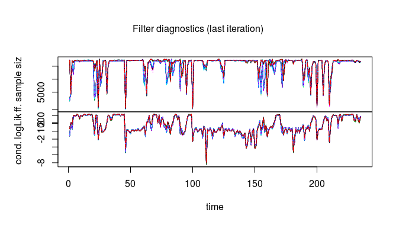
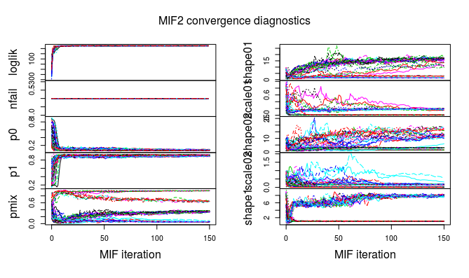
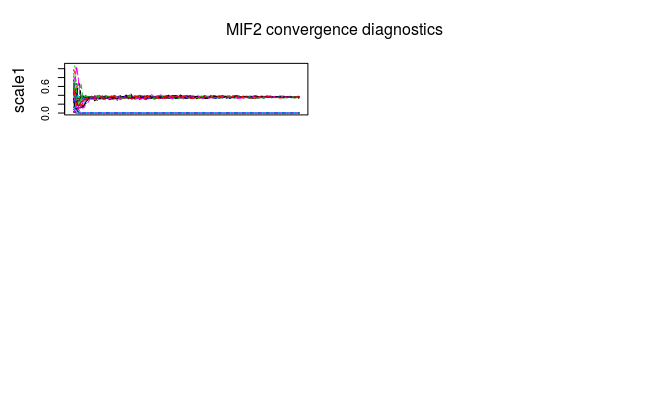
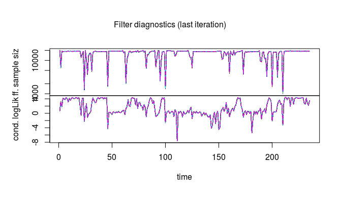
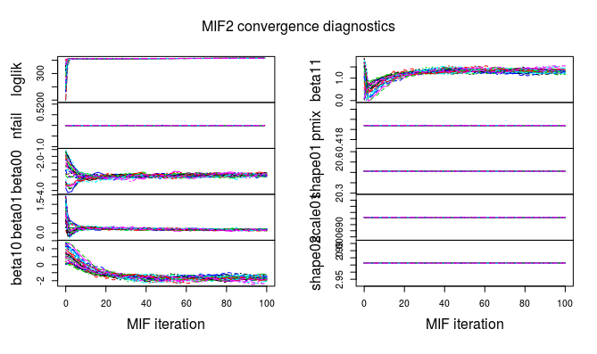

```{r setup, include=FALSE}
knitr::opts_chunk$set(echo = FALSE)
library(pomp)
library(knitr)
library(ggplot2)
library(fitdistrplus)
library(doParallel)
library(reshape2)
setwd(getwd())
```

# Introduction

This final project is a replication of a previous research paper which took advantage of hidden markov models. The article's title is "Analysis of animal accelerometer data using hidden Markov Models"[2]. Using accelerometer to capture animals' motion is a prevalent way to keep track of animal behaviour. The measured data, usually called minimum specific acceleration(MSA), can directly indicate the instant activeness of the animal[2]. The larger the MSA is, the probable that the animal is in an active state[2]. I am going to use one of the dataset from this research article to experiment hidden Markov models and sketch out the activeness of an Verreaux eagle throughout a day.

# Data and Model Background

According to the article, an Verreaux eagle(simplified as "eagle" below) was tracked for 9 days from 04/16 to 04/24 [1][2]. On each day data were collected from about 8am to 8pm, with a time interval of about one and a half minutes between two adjacent timepoints. Therefore each time series from different days were independent of each other[2].

According to the article, the authors presumed that there are two hidden states (active and inactive)[2]. Within the active state, the MSA follows a gamma distribution. Within the inactive state, the MSA follows a mixture of two gamma distributions[2]. Gamma distribution is a simple and ideal disribution to describe a set of points that are mostly small with a handful of extremely large points. The authors decided to use a mixture of gamma distributions for the inactive state because the eagle could be either gliding at a low speed or it could be roosting[2].

Since there are only two states, the state transition can be represented by a 2 by 2 probability matrix. In the dataset the authors also collected the wind speed and temperature for each time point. They believed that the transitional probability can be fitted by a logistic regression with wind speed, temperature and their interaction[2].

# Analysis Scheme

## Model Assumption
Because of the time constraint, I decide to carry out analysis only on data points collect on a single day. Since there are the most number of data points on 04/21 (235). My plan is to fit seven POMP models, compare their likelihood, then interpret the one with the best fit.

First I plan to just fit a gamma distribution on the 235 data points.

The second model I want to fit is the simplest POMP model. It has a transitional probability matrix which is a constant.
$$
\begin{bmatrix}
1-p_{0} & 1-p_{1}\\
p_{0} & p_{1}
\end{bmatrix}
$$
$p_{0}$ represents the probability of the eagle changing from inactive state to active state $p_{1}$ represents the probability of the eagle staying in the active state. Within each state the MSA follows its own gamma distribution
$$
\begin{aligned}
\text{MSA} \stackrel{\text{inactive}}{\sim} Gamma(\text{shape0}, \text{scale0})\\
\text{MSA} \stackrel{\text{active}}{\sim} Gamma(\text{shape1}, \text{scale1})
\end{aligned}
$$

The third model is similar, but differs from the second model in that the measurement distribution of the inactive state is a mixture of two gamma distributions

$$
\text{MSA} \stackrel{\text{inactive}}{\sim} p_{mix}\times Gamma(\text{shape01}, \text{scale01})+(1-p_{mix})\times Gamma(\text{shape02}, \text{scale02})
$$

The fourth model adds to the third model by making the transitional probability follow a logistic regression with wind speed as a covariate, namely

$$
\begin{aligned}
\text{logit}(p_{0})\sim \beta_{00}+\beta_{01}\text{wind}\\
\text{logit}(p_{1})\sim \beta_{10}+\beta_{11}\text{wind}
\end{aligned}
$$

The fifth model has the logistic regression based on temperature

$$
\begin{aligned}
\text{logit}(p_{0})\sim \beta_{00}+\beta_{02}\text{temperature}\\
\text{logit}(p_{1})\sim \beta_{10}+\beta_{12}\text{temperature}
\end{aligned}
$$

The sixth model has the logistic regression based on the main effects of both wind speed and temperature

$$
\begin{aligned}
\text{logit}(p_{0})\sim \beta_{00}+\beta_{01}\text{wind}+\beta_{02}\text{temperature}\\
\text{logit}(p_{1})\sim \beta_{10}+\beta_{11}\text{wind}+\beta_{12}\text{temperature}
\end{aligned}
$$

The seventh model is the full model with both covariates and their interaction term

$$
\begin{aligned}
\text{logit}(p_{0})\sim \beta_{00}+\beta_{01}\text{wind}+\beta_{02}\text{temperature}+\beta_{03}\text{temperature}\times \text{wind}\\
\text{logit}(p_{1})\sim \beta_{10}+\beta_{11}\text{wind}+\beta_{12}\text{temperature}+\beta_{13}\text{temperature}\times \text{wind}
\end{aligned}
$$

## Computation

The fitting of the POMP models are based on the pomp package for R[4][6]. Specifically I am using the iterated particle filtering algorithm to estimate the parameters[4][6]. Because of the limitation of time, after I fit the third model and get the parameters of the measurement model, I set them as constant when fitting further models. I take this approach because I am not particularly interested in the parameters of the gamma distributions. This approach can also increase the efficiency of the algorithm given that there are fewer parameters that it needs to optimize. 

# Results

## Exploratory Data Analysis

First I plot the raw data and its autocorrelation for different lags. 
```{r}
eagle_data = read.csv("eagle_421.csv")
ggplot(eagle_data, aes(x=timestamp, y=msa))+geom_line()+
  xlab("Time Point")+ylab("Minimum Specific Acceleration(MSA)")
```

```{r}
acf(eagle_data$msa, main="MSA")
```

There is significant autocorrelation at small lags, which indicates that a POMP model could fit the data well.

## Log Likelihood Results

I summarize the log likelihoods of all the models in the table below. 

```{r}

load("likelihoods.rda")
myliks <- c(model1lik,model2lik,model3lik,model4lik,
            model5lik,model6lik,model7lik)
param_num <- c(2, 6, 9, 11, 13, 15, 17)
paperliks <- c(NA, NA, 2000.2, 2001.9, 2010.4, 2011.6, 2017.0)

resulttable <- data.frame(cbind(param_num,myliks,  paperliks))

colnames(resulttable) <- c("Number of Parameters", "Log Likelihood", "Results from Article")
rownames(resulttable) <- paste0("Model ",seq(1,7))
kable(resulttable, digits=2)
```

It's worth noting that the log likelihood from the article is calculated based on the data from all nine days, therefore it's much larger than my log likelihood calculated from a single day. After comparing the log likelihoods, I conclude that model 4 is the optimal model. Model 4 assumes that the transitional probability between hidden states can be fitted by a logistic regression with wind speed as the only covariate.

## Model Diagnostics

To evaluate the model diagnostics, I decide to offer the convergence diagnostics plots for model 3 and model 4. Recall that I use model 3 to decide the parameters for the measurement model and I used model 4 to decide the rest of the parameters for the transitional probability matrix.

First I offer the diagnostics plots for model 3, which is the POMP model without covariates.





All the iterative filtering trials converge, yet they converge to several distinct parameter sets. Given the time constraint, I took a heuristic and decide to pick the parameter sets based on two standards. The first standard is that the mean of the gamma distribution corresponding to my presumed active state should be higher than the mean values of the gamma distributions corresponding to my presumed inactive states. The second standard is high log likelihood. Luckily after I investigate all the filtering trials, the one with the highest log likelihood meets both my standards. Therefore I go ahead with this set of parameters.

Next is the diagnostics plot for model 4, which is the optimal model that I select.




All the iterative filtering trials converge to a single set of parameters, indicating that the model is stable.

We can also visually checkout the goodness of fit by simulating several time series using the selected model.

```{r}
source("selected_model.R")
selected_params = read.csv("final_params.csv")

paramnames = selected_params$X
paramvalues = selected_params$x
names(paramvalues) = paramnames


set.seed(10)

sims <- simulate(eagle_2, params=paramvalues, 
                 nsim=4, format="data.frame", include=TRUE, t0=1)
ggplot(sims,mapping=aes(x=timestamp,y=msa,color=.id=="data"))+
  geom_line()+guides(color=FALSE)+facet_grid(rows=vars(.id))
```

Because of the unpredictability of the eagle's activity, the shape of my time series cannot match the eagle's exactly, but the overall trends are the same. Most of the time the acceleration is small, but occsasionally there are high peaks.

## Interpretation

The selected parameter is

```{r}
kable(selected_params)
```

This set of parameters tell us that
$$
\text{log odds}(p_{\text{inactive}\rightarrow \text{active}})=-2.87+0.14\times \text{wind}
$$

$$
\text{log odds}(p_{\text{active}\rightarrow \text{active}})=-1.73+1.32\times \text{wind}
$$

Within the active state, the MSA follows
$$
MSA\sim Gamma(\text{shape}=1.066, \text{scale}=0.356)
$$

Within the inactive state, the MSA follows a mixture of

$$
\begin{aligned}
MSA\sim Gamma(\text{shape}=20.51, \text{scale}=6.96\times 10^{-4})\\
MSA\sim Gamma(\text{shape}=2.972, \text{scale}=0.0091)
\end{aligned}
$$

It would be more illustrative with some plots. Inspired by the article, I plot the probability of the eagle staying in its original state against the wind speed.

```{r}
windspeed = seq(0, 6, 0.1)

stay0 = function(windspeed){
  loddsstay = -(paramvalues["beta00"]+paramvalues["beta01"]*windspeed)
  exp(loddsstay)/(1+exp(loddsstay))
}

stay1 = function(windspeed){
  loddsstay = (paramvalues["beta10"]+paramvalues["beta11"]*windspeed)
  exp(loddsstay)/(1+exp(loddsstay))
}

prob0 = stay0(windspeed)
prob1 = stay1(windspeed) 

tpm = data.frame(Probability = c(prob0, prob1),
                 State = rep(c("Inactive", "Active"), c(61,61)),
                 Windspeed = c(windspeed, windspeed))
```


```{r}
ggplot(tpm, aes(x=Windspeed, y=Probability))+geom_line(aes(color=State))+
  xlab("Wind Speed(m/s)")+ylab("Probability of staying in Original State")
```

We can see that as the wind speed increases, the probability of the eagle switching from inactive state to active state will gradually decrease from about 0.95. The eagle rarely stays in active state for a prolonged period of time, but the probability of staying in active state will drastically increase when the wind speed increases. It is encouraging to see that this plot is very similar to the one in the original article[2], which indicates that my model fitting is successful.

I can also calculate the stationary distribution of two states under wind speed. The algorithm can be found [7].

```{r}
stationary = function(windspeed){
  prob0 = stay0(windspeed)
  prob1 = stay1(windspeed) 
  tpm = matrix(c(prob0,  1-prob0, 1-prob1,prob1), nrow=2)
  eigenresult = eigen(tpm)
  eigenresult$vectors[,1,drop=FALSE]
}


set.seed(2020,kind="L'Ecuyer")
cores <-  as.numeric(Sys.getenv('SLURM_NTASKS_PER_NODE', unset='4'))
registerDoParallel(cores)
statprob = foreach(ws=windspeed, .combine=cbind) %dopar% {
  stationary(ws)
}

statprob = abs(t(statprob))

completeprob = cbind(as.data.frame(statprob), windspeed)
colnames(completeprob)[1:2] = c("Inactive", "Active")
completeprob = melt(completeprob, id="windspeed", value.name="Probability")
colnames(completeprob)[2]="State"

ggplot(completeprob, aes(x=windspeed, y=Probability))+
  geom_line(aes(color=State))+xlab("Wind Speed(m/s)")+ylab("Stationary Distribution")
```

It's not surprising that the eagle will mostly stay in inactive state when the wind speed is low and it will mostly stay in active state when the wind speed is high. This plot also resembles the one in the original article[2].


## Comparison with ARIMA model

Recall that we learnt about ARIMA model in the first half of class[4]. I quickly test the validity of this approach. First collect the AIC value of different ARIMA model with different number of autoregressive components and moving average components.
```{r}
aic_table <- function(data ,P, Q){
  table <- matrix(NA,(P+1),(Q+1))
  for(p in 0:P){
    for(q in 0:Q){
      table[p+1, q+1] <- arima(data,order=c(p,0,q))$aic
    }
  }
  dimnames(table) <- list(paste("AR",0:P, sep=""),paste("MA",0:Q,sep=""))
  table
}
# search for optimal parameter
eagle_aic <- aic_table(eagle_data$msa, 4,5)
knitr::kable(eagle_aic)
```


It looks like ARIMA(3,0,5) is the best. I fit the model and check out the log likelihood of the model.
```{r}
arima_model <- arima(eagle_data$msa, c(3,0,5))
arima_model$loglik
```

This is way smaller than the log likelihood of my POMP model. This shows that partial Markov Process is superior to ARIMA in this specific task.

# Discussion

In this project I am able to replicate the data analysis of a past ecological article using the `pomp` package in R. The algorithm is different from what the authors used, but I am able to achieve similar outcomes. Both my efforts and the article confirms that modelling an eagle's daily activity into active/inactive states is feasible. The eagle is mostly in an inactive state and might burst into active state for a short period once in a while. It's also noted that the probability of staying in /switching states varies with the wind speed of the eagle's environment. The higher the wind speed is, the more probable that the eagle might stay in the active state.

Because of time constraints, I am not able to carry out extra computations that I would like to do. In this project I only took advantage of the data collected in a day while there are in total nine days of data. The heuristics that I take are potentially controversial. A typical example is how I select and fix the parameters for the measurement model. Profile likelihood methods should be introduced where necessary.

# Side Notes

All the major computations are coded up in standalone R scripts and run on the greatlakes clusters offered by University of Michigan high performace computing service. The access to the cluster is provided by Dr Edward Ionides, the instructor of STATS 531 "Analysis of Time Series".

For the details of my code please refer to the [github repository](https://github.com/skybullbobby/Time-Series-Final-Project).

# Reference

[1]Dryad Digital Repository(how I access the data, [link](https://datadryad.org/))

[2] Leos‐Barajas, V., Photopoulou, T., Langrock, R., Patterson, T.A., Watanabe, Y.Y., Murgatroyd, M. and Papastamatiou, Y.P. (2017), Analysis of animal accelerometer data using hidden Markov models. Methods Ecol Evol, 8: 161-173. doi:10.1111/2041-210X.12657

[3] Wiley online library(how I access the article and its appendices, [link](https://besjournals.onlinelibrary.wiley.com/doi/full/10.1111/2041-210X.12657))

[4] STATS 531 WN2020 ( [link](https://ionides.github.io/531w20/))

[5] How to write R extensions from CRAN([link](https://cran.r-project.org/doc/manuals/r-release/R-exts.html#Distribution-functions))

[6] `pomp` package tutorial([link](https://cran.r-project.org/doc/manuals/r-release/R-exts.html#Distribution-functions))

[7] How to calculate stationary distribution from a transitional probability matrix([link](https://stephens999.github.io/fiveMinuteStats/stationary_distribution.html))

