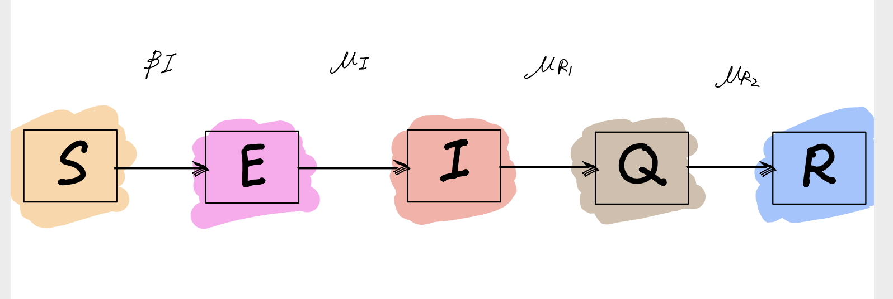

### Introduction
Coronavirus disease 2019, which is also known as COVID-19, has been categorized as a pandemic by WHO in March 2020. First identified in a seafood market in China, Decemeber 2019, COVID-19 began to spread out all over the world in a unprecedentedly rapid speed. Besides China, which has around 82000 cumulative comfirmed cases(April 24), other countries, such as Korean, Itaty, Spain and United States, also experience explosive increases in the number of infected people. Especially for United States, the number is more than 900000 now (April 24). The full control of this disease really needs to a long way to go. More detailed report cases: {https://www.who.int/emergencies/diseases/novel-coronavirus-2019/situation-reports/}

Thus, it is quite important to find a method/model to understand the spread of COVID-19 so that governments or other related departments can make more effective public health related decisions based on science.

In this project, I will analyse COVID-19 data of Zhejiang province in China from 01/22/2020 to 04/21/2020. Zhejiang province is considered as one of the most serious places beside Hubei province, where the first case of this disease is confirmed. I will try to capture some properties of this disease and describe the process of transmission by deriving and applying different models. The data set comes from Kaggle.

###### About COVID-19
In general, COVID-19 is an infectious disease, which has some similarities with SARS coronavirus (SARS-CoV)--virus identified in 2003. However, it has lower death rate than SARS-CoV does.This disease is mainly transmitted by respiratory droplets and common symptoms are fever, cough and shortness of breath. 
More detailed information related to disease and prevention: {https://en.wikipedia.org/wiki/Coronavirus_disease_2019} and {https://gmcc.alibabadoctor.com/prevention-manual?locale=en-us}


### Data and Exploration 
```{r, include=FALSE}
set.seed(594709947L)
library(ggplot2)
theme_set(theme_bw())
library(plyr)
library(reshape2)
library(foreach)
#library(doMC)
library(pomp)
stopifnot(packageVersion("pomp")>="2.0")
```
```{r}
n = read.csv("covid19data2.csv")
n2 = n[which(n$Province.State== "Zhejiang"), ]
head(n2,5)
```

The form of the data set is shown above. There are total 91 observations.

For simplicity and clearness, I choose to model the number of infected cases in these 91 days.
The form of data and the plot of whole data are shown below:

Note that  $Infected = Confirmed-Deaths-Recovered$.

```{r}
n1 = n2
n1$Infected = n1$Confirmed-n1$Deaths-n1$Recovered
n1$Day = c(1:dim(n1)[1])
n1=n1[,c(10,9)]
head(n1,5)
# the data set we will use is stored in variable n1
```
Plot infected data; the number of infected people reaches the max around day 17:

```{r,echo=FALSE}
ggplot(data=n1,aes(x=Day,y=Infected))+geom_line()+geom_point()
```


### Modeling


#### SIR
First we apply SIR model. Susceptible-Infected-Recovered (SIR) model is the most common model used in epidemiology for disease transmission: 


$S$ represents "susceptible"; 

$I$ represents "infected and infectious";

$R$ represents "recovered and/or removed".

The rate at which individuals transmit from S to I is parameter $\mu_{SI}(t)$, which is equal to $\beta*I(t)$. $\beta$ is the contact rate.

The rate at which individuals transmit from I to R is parameter $\mu_{IR}$, which can be also written as $\gamma$.

The probability of a case being reported/reporting rate is $\rho$.

Parameter $N$ is population size with N = S + I + R and we consider it as fixed.

According to the definition in lecture notes:

$S(t) = S(0) - N_{SI} (t)$;

$I(t) = I(0) + N_{SI} (t) - N_{IR}(t)$;

$R(t) = R(0) + N_{IR}(t)$; where $N_{AB}$ is a counting process, which stores the number of people moving from A to B by time t.

In the model I construct, the number of people moving from $S$ to $I$ in time $\Delta t$ is $\Delta N_{SI}$ ~ $Binomial(S, 1-exp(-\lambda* \Delta t)$, where $\lambda$ is $\mu_{SI}(t)$; the number of people moving from $I$ to $R$ in time $\Delta t$ is $\Delta N_{IR}$ ~ $Binomial(I, 1-exp(-\gamma* \Delta t)$.The reported data $Infected$ can be modeled by $Binomial(H(t)-H(t-1),\rho)$, where $H$ helps track the number of people moving from $I$ to $R$.


Constructing SIR model below:
```{r}
sir_step <- Csnippet("
                     double dN_SI = rbinom(S,1-exp(-Beta*I*dt));
                     double dN_IR = rbinom(I,1-exp(-gamma*dt));
                     S -= dN_SI;
                     I += dN_SI - dN_IR;
                     R += dN_IR;
                     H += dN_IR;
                     ")

sir_init <- Csnippet("
                     S = N-1;
                     I = 1;
                     R = 0;
                     H = 0;
                     ")

sir = pomp(n1,time="Day",t0=0,rprocess=euler(sir_step,delta.t=1/4),
           rinit=sir_init,paramnames=c("Beta","gamma","N"),statenames=c("S","I","R","H")) 


pomp(sir,accumvars="H") -> sir

dmeas <- Csnippet("lik = dbinom(Infected,H,rho,give_log);")
rmeas <- Csnippet("Infected = rbinom(H,rho);")
sir <- pomp(sir,rmeasure=rmeas,dmeasure=dmeas,
            statenames="H",paramnames="rho")
```

To roughly see how the model works, I do a model simulation. It seems that this model can capture certain degree of infection pattern. We will do a global search and check this model later.

```{r}
sims <- simulate(sir,params=c(Beta=0.00005,gamma=0.09,rho=0.7,N=20000),nsim=30,format="data.frame",include=TRUE)
ggplot(sims,mapping=aes(x=Day,y=Infected,group=.id,color=.id=="data"))+
  geom_line()+guides(color=FALSE)
```

 
 
##### Global Search

```{r}
#N=50000000
#Np=15000 and Nmif=800
#Starting parameters:
#bsflu_box <- rbind(
  #Beta=c(0.000000001,0.0000001),
  #gamma=c(0.5,5),
  #rho = c(0.3,0.6)
#)
```

Here I fix $N$ to be 50000000 since it is roughly close to the population size in Zhejiang province. Since $N$ is very large, I decide to choose the starting $\beta$ to be very small.

```{r, include=FALSE}
require(doParallel)
cores <- 20  # The number of cores on this machine 
registerDoParallel(cores)
mcopts <- list(set.seed=TRUE)
set.seed(396658101,kind="L'Ecuyer")
```

```{r, warning=FALSE, echo=FALSE}
obsnames <- colnames(n1)[2]

sir1 <- pomp(
  data=n1,
  times="Day",
  t0=0,
  rprocess=euler(sir_step,delta.t=1/4),
  rmeasure=rmeas,
  dmeasure=dmeas,
  accumvars="H",
  partrans=parameter_trans(
    log=c("Beta","gamma"),
    logit="rho"),
  obsnames = obsnames,
  statenames=c("S","I","R","H"),
  paramnames=c("Beta","gamma","rho","N"),
  rinit=sir_init
)
#pf <- pfilter(sir,params=c(Beta=0.00000001,gamma=0.5,rho=0.5,N=50000000),Np=50000)

run_level <- 2
switch(run_level,
       {bsflu_Np=800; bsflu_Nmif=100; bsflu_Neval=10; bsflu_Nglobal=10; bsflu_Nlocal=10},
       {bsflu_Np=15000; bsflu_Nmif=800; bsflu_Neval=10; bsflu_Nglobal=10; bsflu_Nlocal=10},
       {bsflu_Np=20000; bsflu_Nmif=300; bsflu_Neval=10; bsflu_Nglobal=10; bsflu_Nlocal=10})


fixed <- c(N=50000000)

bsflu_box <- rbind(
  Beta=c(0.000000001,0.0000001),
  gamma=c(0.5,5),
  rho = c(0.3,0.6)
)

bsflu_rw.sd <- 0.02
bsflu_cooling.fraction.50 <- 0.6
stew(file=sprintf("SIR1.rda",run_level),{
  
  t_global <- system.time({
    mifs_global <- foreach(i=1:bsflu_Nglobal,.packages='pomp', .combine=c, .options.multicore=mcopts) %dopar% 
      mif2(     
        sir1,
        params=c(apply(bsflu_box,1,function(x)runif(1,x[1],x[2])),fixed),
        Np=bsflu_Np,
        Nmif=bsflu_Nmif,
        cooling.fraction.50=bsflu_cooling.fraction.50,
        transform=TRUE,
        rw.sd=rw.sd(
          Beta=bsflu_rw.sd,
          gamma=bsflu_rw.sd,
          rho=bsflu_rw.sd
        )
      )
  })
},seed=1270401374,kind="L'Ecuyer")

plot(mifs_global)

#coef(mifs_global)
```

The upper plot shows that effective sample size is about 10000 and the maximization of log likelihood is relatively good. The lower plot shows that three parameters do not perfectly converge, especially for $\rho$. $\beta$ seems to be better since most of its values turns out to be close to each other in the end. 

However, convergence of parameters in global search may depend on many things, such as whether we apply a appropriate model and whether the starting values for the parameters are "good" enough. Since the starting parameters I choose do not directly base on the results of previous complex work from other scientists (just based on my experience), it is possible to get non-prefect answers. 

```{r,echo=FALSE}
stew(file=sprintf("SIR2.rda",run_level),{
  t_global_eval <- system.time({
    liks_global <- foreach(i=1:bsflu_Nglobal,
                           .combine=rbind,.options.multicore=mcopts) %dopar% {
                             evals <- replicate(bsflu_Neval,
                                                logLik(pfilter(sir1,
                                                               params=coef(mifs_global[[i]]),Np=bsflu_Np)))
                             logmeanexp(evals, se=TRUE)
                           }
  })
},seed=442141592,kind="L'Ecuyer")

results_global <- data.frame(
  logLik=liks_global[,1],
  logLik_se=liks_global[,2],t(sapply(mifs_global,coef)))
```
```{r}
# max loglik
results_global[which.max(results_global$logLik),]
```

The final value for $\gamma$, i.e. the recovery rate, computed by MLE seems to be unreasonably large. Maybe model should be modified or starting points should be adjusted. (We may call $\gamma$ the recovery rate here because from the data, the number of cumulative deaths is one and the number of cumulative recovered is relatively large.)

From the pair plot below, we can tell the relationship between log likelihood and parameters, and can roughly get a region of parameters which can make loglik larger: large log likelihood corresponds to a group of quite small $\beta$; but values of $\rho$ that make loglik large seem to be not that close to each other and larger $\rho$ leads to larger log likelihood before $\rho = 0.4$. When we try to adjust starting points, we may consult this plot.

```{r,}
pairs(~logLik+Beta+gamma+rho, data=subset(results_global,logLik>max(logLik)-50))
```


#### SEIQR
One important feature of COVID-19 is that it has a relatively long incubation period, which is the period between a person getting infected and showing symptoms. This period ranges from 2 to 14 days, but most people, according to wikipedia, becomes symptomatic within 11.5 days. During such long asymptomatic period, there exists a latent period, during which people are infected but not infectious. Therefore, we can add a compartment to decribe this feature.

Moreover, because of the strict actions Chinese government has taken, including lockdown of several cities and requirement that people should always stay at home, (most) people wil go through quarantine process after they are infected, so adding a quarantine compartment is reasonable.

SEIQR model: Susceptible-Exposed-Infectious-Quarantine-Removed and/or Recovered.

$S,I,R$ are defined like the above SIR model, $E$ refers to the state that individuals are infected but not infectious and $Q$ refers to quarantine state. I draw the plot below:



Most definitions of parameters are similar as before:

$\mu_{SI}(t)=\beta*I(t)$: transmiting rate from S to E, where $\beta$ is the contact rate.

$\mu_{I}$: transmiting rate from E to I.

$\mu_{R1}$: transmiting rate from I to Q.

$\mu_{R2}$: transmiting rate from Q to R.

$\rho$: reporting rate.

$N$ is population size with N = S + E + I + Q + R and we consider it is fixed.

$S(t) = S(0) - N_{SE} (t)$;

$E(t) = E(0) + N_{SE} (t) - N_{EI}(t)$;

$I(t) = I(0) + N_{EI} (t) - N_{IQ}(t)$;

$Q(t) = Q(0) + N_{IQ} (t) - N_{QR}(t)$

$R(t) = R(0) + N_{QR}(t)$; 
where $N_{AB}$ is defined as before.


Counting processes are also defined as before:
$\Delta N_{SE}$ ~ $Binomial(S, 1-exp(-\beta*I* \Delta t)$; 

$\Delta N_{EI}$ ~ $Binomial(E, 1-exp(-\mu_{I}* \Delta t)$; 

$\Delta N_{IQ}$ ~ $Binomial(I, 1-exp(-\mu_{R1}* \Delta t)$;

$\Delta N_{QR}$ ~ $Binomial(Q, 1-exp(-\mu_{R2}* \Delta t)$; 


I decide to use Possion distribution to build measurement model this time.
$Infected$ can be modeled by $Poisson(\rho Q)$


Constructing SEIQR model below:

```{r}
statenames1 <-c("S","E","I","Q","R")
paramnames1 <-c("Beta","rho","mu_I","mu_R1","mu_R2","N")
obsnames1 <- colnames(n1)[2]
dmeasure1 <- "
lik = dpois(Infected,rho*Q+1e-10,give_log);
"

rmeasure1 <- "
Infected= rpois(rho*Q+1e-10);

"

rprocess1 <- "
double t1 = rbinom(S,1-exp(-Beta*I*dt));
double t2 = rbinom(E,1-exp(-dt*mu_I));
double t3 = rbinom(I,1-exp(-dt*mu_R1));
double t4 = rbinom(Q,1-exp(-dt*mu_R2));
S -= t1;
E += t1 - t2;
I += t2 - t3;
Q += t3 - t4;
R += t4;
"

initializer1 <- "
S=N-2;
E=1;
I=1;
Q=0;
R=0;
"

n2pomp <- pomp(
  data=n1,
  times="Day",
  t0=0,
  rprocess=euler(
    step.fun=Csnippet(rprocess1),
    delta.t=1/4
  ),
  rmeasure=Csnippet(rmeasure1),
  dmeasure=Csnippet(dmeasure1),
  partrans=parameter_trans(
    log=c("Beta","mu_I","mu_R1","mu_R2","rho")),
  obsnames = obsnames1,
  statenames=statenames1,
  paramnames=paramnames1,
  rinit =Csnippet(initializer1)
)
```


##### Global Search

```{r}
#N=50000000
#Np=10000 and Nmif=500
#starting parameters:
#bsflu_box <- rbind(
  #Beta=c(0.00000001,0.0000001),
  #mu_I=c(0.5,2),
  #mu_R1=c(0.5,2),
  #rho = c(0.3,1),
  #mu_R2 =c(0.5,2)
#)
```

```{r,echo=FALSE,warning=FALSE}

#pf <- pfilter(n2pomp,params=c(Beta=0.00000001,mu_I=0.5,mu_R1=0.5,mu_R2=0.5,rho=0.7,N=50000000),Np=50000)
#logLik(pf)


run_level <- 2
switch(run_level,
       {bsflu_Np=800; bsflu_Nmif=100; bsflu_Neval=10; bsflu_Nglobal=10; bsflu_Nlocal=10},
       {bsflu_Np=10000; bsflu_Nmif=500; bsflu_Neval=10; bsflu_Nglobal=10; bsflu_Nlocal=10},
       {bsflu_Np=20000; bsflu_Nmif=300; bsflu_Neval=10; bsflu_Nglobal=10; bsflu_Nlocal=10}
       
)

require(doParallel)
cores <- 20  # The number of cores on this machine 
registerDoParallel(cores)
mcopts <- list(set.seed=TRUE)
set.seed(396658101,kind="L'Ecuyer")

fixed <- c(N=50000000)

bsflu_box <- rbind(
  Beta=c(0.00000001,0.0000001),
  mu_I=c(0.5,2),
  mu_R1=c(0.5,2),
  rho = c(0.3,1),
  mu_R2 =c(0.5,2)
)

bsflu_rw.sd <- 0.02
bsflu_cooling.fraction.50 <- 0.6
stew(file=sprintf("Q1c.rda",run_level),{
  
  t_global <- system.time({
    mifs_global <- foreach(i=1:bsflu_Nglobal,.packages='pomp', .combine=c, .options.multicore=mcopts) %dopar% 
      mif2(     
        n2pomp,
        params=c(apply(bsflu_box,1,function(x)runif(1,x[1],x[2])),fixed),
        Np=bsflu_Np,
        Nmif=bsflu_Nmif,
        cooling.type="geometric",
        cooling.fraction.50=bsflu_cooling.fraction.50,
        transform=TRUE,
        rw.sd=rw.sd(
          Beta=bsflu_rw.sd,
          mu_I = bsflu_rw.sd,
          mu_R1=bsflu_rw.sd,
          rho=bsflu_rw.sd,
          mu_R2=bsflu_rw.sd
        )
      )
  })
},kind="L'Ecuyer")

plot(mifs_global)

```
```{r, echo=FALSE}
#coef(mifs_global)


stew(file=sprintf("Qllh1c.rda",run_level),{
  t_global_eval <- system.time({
    liks_global <- foreach(i=1:bsflu_Nglobal,
                           .combine=rbind,.options.multicore=mcopts) %dopar% {
                             evals <- replicate(bsflu_Neval,
                                                logLik(pfilter(n2pomp,
                                                               params=coef(mifs_global[[i]]),Np=bsflu_Np)))
                             logmeanexp(evals, se=TRUE)
                           }
  })
},seed=442141592,kind="L'Ecuyer")

results_global <- data.frame(
  logLik=liks_global[,1],
  logLik_se=liks_global[,2],t(sapply(mifs_global,coef)))
```

```{r}
# max loglik
results_global[which.max(results_global$logLik),]
```

The filter diagnostics plot shows that effective sample size is around 10000 and the maximization of log liklihood is relatively good after time 40. From mif2 plot, we can see that $\mu_{I}$,$\mu_{R2}$ and $\rho$ converge. $\beta$ and $\mu_{R1}$ do not quite converge in the end, but most final values for $\beta$ are close to each other (they are around 7.0e-8~8.0e-8). It turns out that in terms of convergence, SEIQR model is better than SIR model.

Moreover, $\beta$ here is similar as $\beta$ in SIR model. Reporting rate $\rho$ in this model is larger than $\rho$ in SIR model. However, there still exit some strange values, such as unreasonably large transmiting rate from I to Q, $\mu_{R1}$, and low recovery rate $\mu_{R2}$ (from data, we can see overall death number is just one,so $\mu_{R2}$ can be called as recovery rate). This model still does not works well with this data, which indicates that we also need to try different models or try different boxes of starting parameters to find better results.


### Conclusion and Future Work

In general, SIR model is a good starting point to help us understand the spread of COVID-19. SEIQR model, with added latent state and quarantine state, seems to be better but still not enough. Both model has limitations and should be futher modified in order to fit the real situation.

Since the real situation, involving more and more actions Chinese government takes and more and more information about the virus scientists discover, is really complex, some other factors should be taken into consideration. For example, according to WHO stating that "There is currently no evidence that people who have recovered from COVID-19 and have antibodies are protected from a second infection."[NPR news; links below], it would be better to add a parameter to denote the rate of transmiting from Recovered to Susceptible; Moreover, reporting rate may depend on time since at the beginning of this outbreak, the government did not have enough testing tools. Thus, we can divide the data into different stages (based on the actions government took: whether they largely improve the ability of testing or not) and model them one by one.


## Reference
1. https://en.wikipedia.org/wiki/Coronavirus_disease_2019

2. Data set is from https://www.kaggle.com/sudalairajkumar/novel-corona-virus-2019-dataset#covid_19_data.csv

3. SIR model picture is from https://www.lewuathe.com/covid-19-dynamics-with-sir-model.html

4. https://www.npr.org/sections/coronavirus-live-updates/2020/04/25/844939777/no-evidence-that-recovered-covid-19-patients-are-immune-who-says

5. When developing SEIQR, I refer to SEICR model in this project  https://ionides.github.io/531w18/final_project/5/final.html

6. Constructing models is based on stats531 lecture notes, especially lecture11 and lecture12: https://ionides.github.io/531w20/

7. Stats531 homework, especially hw8: https://ionides.github.io/531w20/hw08/sol08.html
