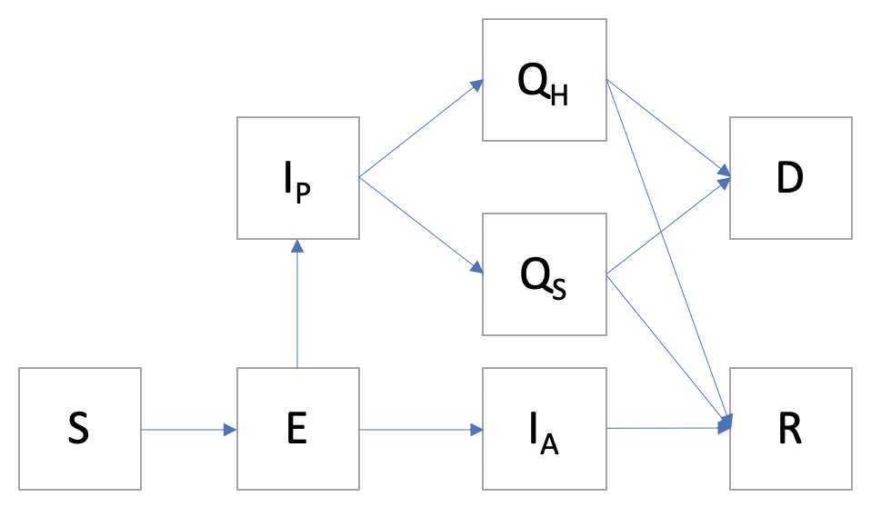
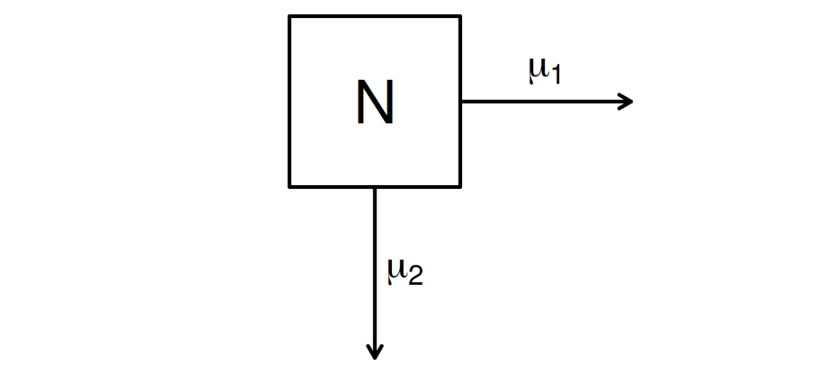

\newcommand\prob{\mathbb{P}}
\newcommand\E{\mathbb{E}}
\newcommand\var{\mathrm{Var}}
\newcommand\cov{\mathrm{Cov}}
\newcommand\ar{\phi}
\newcommand\ma{\psi}
\newcommand\loglik{\ell}
\newcommand\data[1]{#1^*}

```{r setup, include=FALSE}
knitr::opts_chunk$set(echo = TRUE)
library(ggplot2)
library(pomp)
require(plyr)
require(foreach)
require(doParallel)
```

```{r}
cluster_cores <- as.numeric(Sys.getenv('SLURM_NTASKS_PER_NODE'))
CLUSTER <- !is.na(cluster_cores)
if(CLUSTER) registerDoParallel(cluster_cores) else registerDoParallel()

library(doRNG)
```
```{r}
registerDoRNG(1929384)
```

# Background

## COVID-19 Epidemiology

The novel coronavirus, also named COVID-19, is a new strain of coronavirus that has not been previously identified in humans^[1]^. According to CDC, people with COVID-19 have had a wide range of symptoms reported – ranging from mild symptoms to severe illness. Common observed symptoms include fever, cough, shortness of breath, sore throat, and breathing difficulties. In more severe cases, infection can cause pneumonia or severe acute respiratory syndrome, particularly in those with other chronic underlying health conditions, and even death.

The coronavirus COVID-19 is affecting 210 countries and territories around the world and 2 international conveyances. The most recent report shows that by April 24, 2020, there are at least 2,818,176 confirmed cases and more than 200,000 deaths. 

## COVID-19 in China

Back to December 31 2019, China alerted the WHO to several cases of unusual pneumonia in Wuhan, a city of 11 million people. The virus was unknown. On Jan 11, first death due to COVID-19 has been recorded. Two weeks later, Wuhan is locked down by Chinese authorities in an attempt to halt the spread of the disease. Roads are severely restricted and rail and air services are suspended. Foreign governments begin to make plans to evacuate their citizens from the city, although this takes some time. Till the end of Feburary 2020, China said the death toll had risen to 2,118 while the total number of cases reached 74,576^[2]^. In April 2020, there are so few newly confirmed coronavirus cases in China that some days, authorities don't see any local transmission.

## Data

Specifically, we will be aiming to model COVID-19 transmission using data concerning confirmed cases in China. The dataset used in this project is provided by [Models of Infectious Disease Agent Study](https://midasnetwork.us/covid-19/). It's an online portal that provides information and resources for COVID-19 modeling research. After cleaning and combining data from different sources, the current dataset contains cumulative confirmed, death, recovered cases and newly diagnosed, death, recovered cases from 2020-1-15 to 2020-4-22.

```{r read data, echo=FALSE, warning=FALSE}
options(
  keep.source=TRUE,
  stringsAsFactors=FALSE,
  encoding="UTF-8"
  )
df <- read.table("covid-19-2.csv", header=TRUE, sep=",")
df$date <- as.Date(df$date, format='%Y/%m/%d')
ggplot(data = df, aes(y = newlyConfirmed, x=date)) + geom_path() + labs(y = "Newly Confirmed Cases")
ggplot(data = df, aes(y = newlyRecovered, x=date)) + geom_path() + labs(y = "Newly Recovered Cases")
ggplot(data = df, aes(y = newlyDeath, x=date)) + geom_path() + labs(y = "Newly Death Cases")
```

For the newly confirmed cases plot, it peaks at the date of Feburary 10th. We notice that there is no newly confirmed cases on Feb 9th, while on the next day, the value is abnormally high. This is because Wuhan hospitals changed their way of confirming cases. Previously, a case need to be lab-confirmed and sent to government. After that, the new data will be updated. However, from Feburary 10th, the procedure was simplified. That's why we can observe a very high peak on Feburary 10th. Very few cases can be observed after March. Therefore, from the outbreak to the mitigation of disease transition, it took around 2 months.

For the newly recovered cases plot peaks at around Feburary 25th, though we can observe a higher peak on Feburary 20th. If we look carefully, we can see that on Feburary 19th and Feburary 21st, the numbers of newly recovered cases are very low, so we can assume that part of data has been moved to Feburary 20th. After Feburary 25th, the plot is decreasing with some small fluctuations. Till April 10th, Nearly all patients had recovered from the disease.

For the newly death cases, the plot is increasing from the start to Feburary 15th, and then decreases. However, on April 15th, there is a record of more than 1,500 newly death cases. This might be due to the late update of the data.

# Model Description

According to [Coronavirus disease (COVID-2019) situation reports](https://www.who.int/docs/default-source/coronaviruse/situation-reports/20200402-sitrep-73-covid-19.pdf?sfvrsn=5ae25bc7_2) by WHO^[3]^, the transmission type of Wuhan has been identified as local transmission. WHO defines local transmission as indicates locations where the source of infection is within the reporting location, which justifies the use of building a compartment model. To define the structure of our compartment model, we need to investigate several phases of infection and also the routes of transmission from COVID-19 patients. According to WHO, the transmission of COVID-19 includes symptomatic transmission, pre-symptomatic transmission and asymptomatic transmission^[3]^. By way of definition, a symptomatic COVID-19 case is a case who has developed signs and symptoms compatible with
COVID-19 virus infection. Symptomatic transmission refers to transmission from a person while they are experiencing
symptoms. Pre-symptomatic refers to the incubation period for COVID-19, which is the time between exposure to the virus (becoming infected) and symptom onset, is on average 5-6 days, however can be up to 14 days. During this period, also known as the “presymptomatic” period, some infected persons can be contagious. Therefore, transmission from a pre-symptomatic case can occur before symptom onset. An asymptomatic laboratory-confirmed case is a person infected with COVID-19 who does not develop symptoms. Asymptomatic transmission refers to transmission of the virus from a person, who does not develop symptoms. When defining the states and transmission of our model, all of the three types of transmission need to be considered. 




The overall structure of our model is shown in the figure above. As you can see, the model is built on the SEIR model, in which S represents Suspectible and E represents Exposure. What we've done differently is that we add another branch after the E state. Specifically, after exposure to the disease, the patient can enter either pre-sympotomatic state or asymptomatic state, represented by I~P~ and I~A~ respectively. Since an asymptomatic case means the person does not have any symptoms, we assume all of these people will recover eventually. For pre-symptomatic cases, those who have severe symptons will be admitted to hospital and be quarantined, denoted by Q~H~. Other people who have mild symptons will receive medical treatment and self-quarantine at home, denoted by Q~S~. Both of the two situations will end up facing the situation of either recovering from the disease or death. Here, we assume the population size is fixed, as the infection only affects around 70,000 people compared to the population of 11 million in the city of Wuhan. Based on our model, although some individuals might die, we still doesn't exclude them from the overall population.

We code the state and parameter variables as
```{r statenames}
covid_statenames <- c("S","E","Ia","Ip","Qh","Qs","R","D","D_new","R_new","I_new")
covid_paranames <- c("Beta","N","alpha","gamma","lambda_a","lambda_p","lambda_s","lambda_h","mu","rho","delta","sigma")
```

Here, we define the change of states at each time step as:

```{r rprocess}
covid_step <- Csnippet("
  double dN_SE = rbinom(S, 1-exp(-Beta*(Ia+Ip+Qs+Qh)/N*dt));
  double rateE[2];
  double dN_EI[2];
  rateE[0] = alpha*gamma;
  rateE[1] = (1-alpha)*gamma;
  reulermultinom(2,E,rateE,dt,dN_EI);
  double dN_EIa = dN_EI[0];
  double dN_EIp = dN_EI[1];
  double dN_IaR = rbinom(Ia,1-exp(-lambda_a*dt));
  double rateIp[2];
  double dN_IpQ[2];
  rateIp[0] = mu*lambda_p;
  rateIp[1] = (1-mu)*lambda_p;
  reulermultinom(2,Ip,rateIp,dt,dN_IpQ);
  double dN_IpQs = dN_IpQ[0];
  double dN_IpQh = dN_IpQ[1];
  double rateQs[2];
  double dN_Qs[2];
  rateQs[0] = rho*lambda_s;
  rateQs[1] = (1-rho)*lambda_s;
  reulermultinom(2,Qs,rateQs,dt,dN_Qs);
  double dN_QsD = dN_Qs[0];
  double dN_QsR = dN_Qs[1];
  double rateQh[2];
  double dN_Qh[2];
  rateQh[0] = delta*lambda_h;
  rateQh[1] = (1-delta)*lambda_h;
  reulermultinom(2,Qh,rateQh,dt,dN_Qh);
  double dN_QhD = dN_Qh[0];
  double dN_QhR = dN_Qh[1];
  
  S -= dN_SE;
  E += dN_SE - dN_EIa - dN_EIp;
  Ia += dN_EIa - dN_IaR;
  Ip += dN_EIp - dN_IpQs - dN_IpQh;
  Qh += dN_IpQh - dN_QhD - dN_QhR;
  Qs += dN_IpQs - dN_QsD - dN_QsR;
  R += dN_IaR + dN_QsR + dN_QhR;
  D += dN_QhD + dN_QsD;
  D_new += dN_QhD + dN_QsD;
  I_new += dN_IpQh + dN_IpQs;
  R_new += dN_IaR + dN_QsR + dN_QhR;
")
```

Notice that, in our model, there exists the following structure. To include this in our rprocess, we need to use Eulermultinom distribution. In one of our specific cases, we define $(\Delta EIp,\Delta EIa) \sim\mathrm{Eulermultinom}(N,r,\Delta t)$, where $r = (\alpha\gamma,(1-\alpha)\gamma$. $r$ here is a vector in which each value specifies the rate of the current state to another possible state, and the length of $r$ is the number of all the possible states. The definition for this example is similar to our definition of Ip to (Qh, Qs), and Qh, Qs to (D,R)



```{r init}
covid_rinit <- Csnippet("
  S = N-100;
  E = 100;
  Ia = 0;
  Ip = 0;
  Qh = 0;
  Qs = 0;
  D = 0;
  R = 0;
  D_new = 0;
  I_new = 0;
  R_new = 0;
")
```


The observation on day n of the observed epidemic has three measurements: the number of confirmed cases, the number of death cases, and the number of recovered cases. To start simply, we will just take $Y_n=R_n$ with $R_n ~ Binomial(R_{new}(t),\sigma)$. $R_{new}$ can be calculated by telling the pomp model to set the corresponding parameter to zero following each observation. We do this by setting the accumvars argument and later passing it to our pomp model

```{r zero}
accum_names = c("D_new","I_new","R_new")
```

Now, to include the observations in the model, we must write both a dmeasure and an rmeasure component:
```{r measure}
dmeas <- Csnippet("lik = dbinom(newlyRecovered, R_new, sigma, give_log);")
rmeas <- Csnippet("newlyRecovered = rbinom(R_new,sigma);")
```

We fold these Csnippets, with the data, into a pomp object thus:

```{r build model}
  pomp(
    subset(df,select=c(day,newlyRecovered)),
    time = "day",
    t0 = 0,
    rprocess = euler(covid_step,delta.t=1/6),
    rinit = covid_rinit,
    paramnames = covid_paranames,
    statenames = covid_statenames,
    accumvars = accum_names,
    partrans=parameter_trans(
      log=c("Beta","gamma","lambda_a","lambda_p","lambda_s","lambda_h"),
      logit=c("sigma","mu","alpha","rho","delta")),
    rmeasure = rmeas,
    dmeasure = dmeas
  ) -> covid
```

We set different run levels as follows

```{r run level}
run_level <- 3
switch(run_level, {
  covid_Np=100; covid_Nmif=10; covid_Neval=10; 
  covid_Nglobal=10; covid_Nlocal=10 
  },{ 
  covid_Np=20000; covid_Nmif=100; covid_Neval=10; 
  covid_Nglobal=10; covid_Nlocal=10 
  },{ 
  covid_Np=40000; covid_Nmif=200; covid_Neval=10; 
  covid_Nglobal=100; covid_Nlocal=20}
)
```

# Simulation

We need some parameters as a starting point, so we can perform some simulations to check whether things are working. After playing around some choices of parameters, we can see that the simulated plot looks very similar to the real data, though it does not have the fluctuation as big as the real one.

```{r sim}
sims <- simulate(covid,params=c(Beta=0.8,gamma=0.5,alpha=0.3,
                              rho=0.2,N=1000000,lambda_a=0.6,
                              lambda_p=0.1,lambda_s=0.4,
                              lambda_h=0.7,mu=0.7,delta=0.5,sigma=0.08),nsim=20,format="data.frame",include=TRUE) 
ggplot(sims,mapping=aes(x=day,y=newlyRecovered,group=.id,color=.id=="data"))+ geom_line()+guides(color=FALSE)

```

# Likelihood Estimates

After setting up the model, the next step is to begin fitting it to the observed data. To do this, I began by running a few simulations to see what range of parameter values was appropriate for the data. Here is a summary of the likelihood estimates that this procedure produced:

```{r}
covid.params <- c(Beta=0.8,gamma=0.5,alpha=0.3,
               rho=0.2,N=1000000,lambda_a=0.9,
               lambda_p=0.1,lambda_s=0.4,
               lambda_h=0.7,mu=0.7,delta=0.5,sigma=0.08)


set.seed(3467542, kind = "L'Ecuyer")

stew(file = sprintf("pf-%d.rda", run_level),{
  t_pf <- system.time(
  pf <- foreach(i = 1:20, .packages = 'pomp') %dopar%
    try(pfilter(covid, params = covid.params, Np = covid_Np)))
  },
  seed = 345876340, kind = "L'Ecuyer")

(lik.pf <- logmeanexp(sapply(pf, logLik), se = TRUE))
```


we obtain an unbiased likelihood estimate of -2398.78 with a Monte Carlo standard error of 0.6272.

# Local Search


```{r local search}

covid_rw.sd <- 0.01; covid_cooling.fraction.50 <- 0.5
stew(file=sprintf("local_search-%d.rda",run_level),{
  t_local <- system.time({
  mifs_local <- foreach(i=1:covid_Nlocal,
    .packages='pomp', .combine=c) %dopar%  {
      mif2(covid,
        params=covid.params,
        Np=covid_Np,
        Nmif=covid_Nmif,
        cooling.fraction.50=covid_cooling.fraction.50,
        rw.sd=rw.sd(
          Beta=covid_rw.sd,
          gamma=covid_rw.sd,
          alpha=covid_rw.sd,
          rho=covid_rw.sd,
          lambda_a=covid_rw.sd,
          lambda_p=covid_rw.sd,
          lambda_s=covid_rw.sd,
          lambda_h=covid_rw.sd,
          mu=covid_rw.sd,
          delta=covid_rw.sd,
          sigma=covid_rw.sd
          )
      )
    }
  })
},seed=900242057,kind="L'Ecuyer")
```

```{r}
stew(file=sprintf("lik_local-%d.rda",run_level),{
  t_local_eval <- system.time({
  liks_local <- foreach(i=1:covid_Nlocal,
    .combine=rbind,.packages='pomp')%dopar% {
    evals <- replicate(covid_Neval, logLik(
      pfilter(covid,params=coef(mifs_local[[i]]),Np=covid_Np)))
    logmeanexp(evals, se=TRUE)
    }
  })
},seed=900242057,kind="L'Ecuyer")

results_local <- data.frame(logLik=liks_local[,1],
  logLik_se=liks_local[,2],t(sapply(mifs_local,coef)))
```

```{r}
summary(results_local$logLik,digits=5)
```

The summary of the local search shows that the maximum likelihood is -2265.

## Pairs Plot

```{r}
pairs(~logLik+Beta+alpha+rho+delta+mu+sigma+gamma+lambda_p+lambda_a+lambda_h+lambda_s, data=subset(results_local))
```

From the pairs plot of local search, we can see that some of the parameters has some relationships. For example, $\beta$ and $\lambda_a$ are negatively associated and $\beta$ and $\sigma$ are positively associated.

# Global Search

Next, we'll conduct global search. A parameter box containing reasonable parameters values might be

```{r}
covid_box <- rbind(
  Beta=c(0.1,200),
  alpha=c(0.01,1),
  mu = c(0.01,1),
  rho = c(0.01,1),
  delta = c(0.01,1),
  sigma = c(0.05,0.5),
  gamma = c(0.5,10),
  lambda_a = c(0.01,5),
  lambda_p = c(0.01,5),
  lambda_s = c(0.01,5),
  lambda_h = c(0,5)
)
covid_fixed_params <- c(N=1000000)
```

```{r}
stew(file=sprintf("box_eval-%d.rda",run_level),{
  t_global <- system.time({
    mifs_global <- foreach(i=1:covid_Nglobal,
      .combine=c,.packages='pomp') %dopar% {
      mif2(
        mifs_local[[1]],
        params=c(
          apply(covid_box,1,function(x)runif(1,x[1],x[2])),covid_fixed_params)
      )}
  })
},seed=1270401374,kind="L'Ecuyer")
```

```{r warning=FALSE}
stew(file=sprintf("lik_global_eval-%d.rda",run_level),{
  t_global_eval <- system.time({
    liks_global <- foreach(i=1:covid_Nglobal,
      .combine=rbind, .packages='pomp') %dopar% {
        evals <- replicate(covid_Neval,
          logLik(pfilter(covid,
	    params=coef(mifs_global[[i]]),Np=covid_Np)))
        logmeanexp(evals, se=TRUE)
    }
  })
},seed=442141592,kind="L'Ecuyer")

results_global <- data.frame(
  logLik=liks_global[,1],
  logLik_se=liks_global[,2],t(sapply(mifs_global,coef)))
summary(results_global$logLik,digits=5)

plot(mifs_global)

```

# Conclusion

For the convergence of the likelihood and parameters, we do not see ideal results. The log-likelihood does not seem to converge very well during the maximization. It fluctuates slightly around -3000 in the entire process and does not converge to a particular value. For the ratio parameter $\alpha$, $\mu$, $\rho$, and $\delta$ in the eulermultinomial distribution, it does not give any clue of choosing which value between 0 and 1. All of the other parameters do not seem to converge well either. This indicates that our model might be too complicated. In future work, we can simply our model by combing $Q_h$ and $Q_s$ as their previous state and following states are the same.

# Reference

[1] Coronavirus disease (COVID-19) outbreak. Retrieved from http://www.euro.who.int/en/health-topics/health-emergencies/coronavirus-covid-19/novel-coronavirus-2019-ncov

[2] Timeline: How the new coronavirus spread. Retrieved from https://www.aljazeera.com/news/2020/01/timeline-china-coronavirus-spread-200126061554884.html

[3] Coronavirus disease (COVID-2019) situation reports. Retrieved from https://www.who.int/emergencies/diseases/novel-coronavirus-2019/situation-reports

[4] What is the Euler-multinomial approximation? Retreived from https://kingaa.github.io/pomp/FAQ.html#eulermultinomial-approximation

[5] Potential Long-Term Intervention Strategies for COVID-19. Retrieved from https://covid-measures.github.io/
