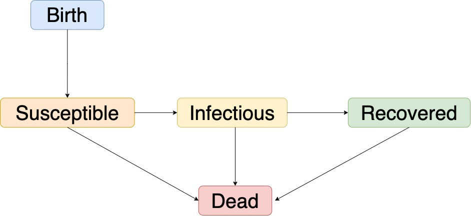

```{r setup, include=FALSE}
knitr::opts_chunk$set(echo = TRUE, warning = FALSE, message = FALSE)
```


```{r,echo=FALSE}
options(
  keep.source=TRUE,
  encoding="UTF-8"
)

set.seed(594709947L)
library(ggplot2)
library(plyr)
library(reshape2)
library(foreach)
library(pomp)
library(doParallel)
library(dplyr)

# cores = 8  # The number of cores on this machine 
# registerDoParallel(cores)
mcopts = list(set.seed=TRUE)
stopifnot(packageVersion("pomp")>="2.0")
theme_set(theme_bw())

# no_cores <- detectCores() - 1  
# cl <- makeCluster(no_cores, type="FORK")  
# registerDoParallel(cl) 
```


# Introduction

In this study, we would like to study the mumps data in Wisconsin from year 1968 to 1980. More specifically, I would like to learn if the transmission of mumps follow the compartment scheme and how we can use POMP framework to model the mumps data.

Mumps, an infectious viral disease that mainly affects saliva-producing (salivary) glands that are located near humah ears, can spread through respiratory tract secretions. Mumps is best known for the puffy cheeks and tender, swollen jaw that it causes[2]. Patients can have initial signs and symptoms including fever, muscle pain, headache, poor appetite, feeling generally unwell and painful swelling of one or both parotid salivary glands afterwards. A person who is infected can expect to show symptoms after 16 to 18 days and resolve in 7 to 10 days. Adults often experience more severe symptoms than children, and about a third of people have mild or no symptoms[3].

Mumps is highly contagious with an estimated $R_0$ of 10 to 12, and can be transmitted by respiratory droplets or direct contact with an infected person. Infectious period can start from about 7 days before onset of parotid inflammation until about 8 days after. A person who developed antibody typically immune for life. Reinfection is possible, but the ensuing infection tends to be mild[3].


# Exploratory Data Analysis 

This data set was collected from Project Tycho database which aims to advance the availablity of large scale public health data to the worldwide community to accelerate advancements in scientific discovery and technological progress (https://www.kaggle.com/pitt/contagious-diseases). The mumps dataset includes standardized counts at the state level in the United States from 1968 to 2000. 

## Data Visualization

Let's plot the time series data first. 

```{r, echo=FALSE}
mumps = read.csv("mumps.csv") %>% 
  mutate(week = week) %>% 
  filter(state == "WI") %>% 
  filter(week > 3200) %>%
  .[1:589,]


plot( ts( mumps$cases , start = c(1968,2), freq = 52), 
      main = "Time Series of Mumps Cases in Wisconsin from 1968 to 2000",
      ylab = "Cases")
```

An insteresting thing one may notice from the plot above is that the cases of mumps dropped drastically，as a result of the advancement of mumps vaccine in mid 1970s,  Here I am more interested in the spread of mumps in the "pre-vaccination era", and thus I would only study the cases from 1968 - 1980. To enrich the information of our dataset, I also acquired demographical information (population, birth and death rate) from https://www.macrotrends.net/states/wisconsin/population.


```{r, echo=FALSE}
mumps = 
  mumps %>%
  mutate(year = 1968 + as.integer((week-196800)/100),
         time = 1968 + as.integer((week-196800)/100) + ((week-196800)-1)%%100/52,
         weeks = 1:nrow(mumps)) %>% 
  left_join(data.frame(year = 1968:1980,
                       N = c(4345000, 4378000, 4417821, 4462155, 4502412, # population
                             4524244, 4545782, 4578986, 4595904, 4626514, 
                             4646108, 4682811, 4712045) ,
                       
                       mu_d = c(0.0102, 0.0124, 0.0084, 0.0075, 0.0085, 0.0127, # death rate
                                0.0127, 0.0070, 0.0106, 0.0076, 0.0101,
                                0.0064, 0.0097), 
                       
                       mu_b = c( rep(0.02,2), rep(0.0175, 5), rep(0.0143, 5), 
                                 0.0159) ), # birth rate 
            by = "year")

mumps_covar = 
  covariate_table(time = mumps$time,
                  N = mumps$N,
                  mu_d = mumps$mu_d,
                  mu_b = mumps$mu_b,
                  times = "time")
```


```{r}
par(mfrow=c(2,1),cex=0.8)
spectrum(mumps$cases, main="Unsmoothed Periodogram")
smoothed_spec = spectrum(mumps$cases, spans=c(3,5,3), main = "Smoothed Periodogram")
cat("Dominant Frequency: ", smoothed_spec$freq[which.max(smoothed_spec$spec)] )
```

One way of analyzing the time series data is to look at the data in the frequency domain. So here we plot the periodogram of mumps cases. Clearly there is a high peak around 0.02, which is consistent with the yearly cycle. Hence, we could add seasonality into the model if time permits.

```{r}
ts( mumps$cases , start = c(1968,2), freq = 52) %>% 
  decompose() %>% 
  plot()
```

One may also plot the decomposition of the time series data. From the plot above, we can see an obvious downward trend, while the seasonal part corroborates our finding in the periodogram.


# Pomp Models


## SIR

One can first think of applying susceptible-infectious-recovered (SIR) model into the  infectious disease study with taking into account the demography in the state of Wisconsin. Below is the simple flow of people between different compartments and their explanation[5]. 

+ Susceptible (S): The total number of people in the population who are not immune to the disease, and have yet to be exposed.

+ Exposed (E): People who have been exposed to mumps while not yet infectious to others.

+ Infected (I): People who have shown symptoms of mumps and are contagious.

+ Recovered (R): People who have recovered from the disease and are no longer infectious.


Besides S, I, and R, we also need a variable H to keep track of people entering the infectious group. For a given group of people, they would go through the process in the compartment specified below, and we can suppose each arrow would have a rate associated. Here is the list of notations we use:

+ mu_b: birth rate;
+ Beta: contact rate;
+ mu_IR: recovery rate;
+ rho: report rate;

### Flow Chart




### Model Equations

Here are the system of deterministic differential equations, where $N_{NS}$ is the nubmer of people added from new-borns, and $N_{SI}$ is the number moving from S to I. To keep track of number of people entering the infectious group, we also added H. From notes11, we can use Euler's method to approximate the ODEs and use binomial approximation of exponential transition as the stochastic Euler solution.

$$
S(t+\delta)=S(t)+N_{NS}(\delta)-N_{SI}(\delta) -N_{SD}(\delta) 
$$


$$
I(t+\delta)=I(t)+N_{S I}(\delta)-N_{I R}(\delta) -N_{ID}(\delta)
$$

$$
R(t+\delta)=R(t)+N_{I R}(\delta)-N_{RD}(\delta)
$$

$$
N_{NS}(\delta) = N \times \mu_b \times\delta
$$

$$
N_{SI} \sim \operatorname{Bin}\left(S(t), 1-e^{-\beta \times I \times \delta}\right)
$$


$$
N_{I R} \sim \operatorname{Bin}\left(I(t), 1-e^{-\mu_{I R} \delta}\right)
$$


$$
N_{SD} \sim \operatorname{Bin}\left(S(t), 1-e^{-\mu_d \delta}\right)
$$

$$
N_{ID} \sim \operatorname{Bin}\left(I(t), 1-e^{-\mu_d \delta}\right)
$$

$$
N_{RD} \sim \operatorname{Bin}\left(R(t), 1-e^{-\mu_d \delta}\right)
$$


```{r}
mumps_rprocess = "
double dN_SI = rbinom(S, 1-exp(-Beta*I*dt));
double dN_IR = rbinom(I, 1-exp(-mu_IR*dt));
double dN_SD = rbinom(S, 1-exp(-mu_d*dt));
double dN_ID = rbinom(I, 1-exp(-mu_d*dt));
double dN_RD = rbinom(R, 1-exp(-mu_d*dt));


int N_NS = nearbyint(N * mu_b * dt);

S += N_NS - dN_SI - dN_SD;
if(S<0) S = 0;
I += dN_SI - dN_IR - dN_ID;
if(I<0) I = 0;
R += dN_IR - dN_RD;
if(R<0) R = 0;
H += dN_IR;
if(H<0) H = 0;
"

mumps_rinit = "
S=100000;
I=600;
R=0;
H=0;
"
mumps_statenames = c("S","I","R", "H")
mumps_obsnames = "cases"

run_level = 2
switch(run_level, {
  mumps_Np=100; mumps_Nmif=10; mumps_Neval=10;
  mumps_Nglobal=10; mumps_Nlocal=10
},{
  mumps_Np=20000; mumps_Nmif=100; mumps_Neval=10;
  mumps_Nglobal=10; mumps_Nlocal=10
},{
  mumps_Np=60000; mumps_Nmif=300; mumps_Neval=10;
  mumps_Nglobal=100; mumps_Nlocal=20
}
)


mumps_rw.sd <- 0.02; mumps_cooling.fraction.50 <- 0.5
```

### The Measurement Model

Here we adopted the discretized normal distribution truncated at zero model assumption for the reported observations from case study of polio in Lecture 13, when conditioning on the state:

$$
Cases | H \sim \operatorname{\max}\left(\operatorname{Normal}\left(\mu=\rho H, \sigma^{2}= (\tau H )^2 + \rho H \right), 0 \right) 
$$


```{r}
mumps_dmeasure <- Csnippet("
double tol = 1.0e-25;
double mean_cases = rho*H;
double sd_cases = sqrt(pow(tau*H,2) + mean_cases);
if(cases > 0.0){
lik = pnorm(cases+0.5,mean_cases,sd_cases,1,0)
- pnorm(cases-0.5,mean_cases,sd_cases,1,0) + tol;
} else{
lik = pnorm(cases+0.5,mean_cases,sd_cases,1,0) + tol;
}
if (give_log) lik = log(lik);
")
mumps_rmeasure <- Csnippet("
cases = rnorm(rho*H, sqrt( pow(tau*H,2) + rho*H ) );
if (cases > 0.0) {
cases = nearbyint(cases);
} else {
cases = 0.0;
}
")

mumps_paramnames = c("Beta","mu_IR","rho", "tau")

mumps_params_guess = c(Beta = 2, mu_IR = 20, rho = 0.05, tau = 0.001)

```


```{r}
mumps.pomp = pomp(data = mumps %>% select(cases, time),
                      times = "time", 
                      t0 = mumps$time[1]-1/52,
                      params = mumps_params_guess,
                      rprocess = euler(step.fun=Csnippet(mumps_rprocess),
                                       delta.t=1/365),
                      rmeasure = Csnippet(mumps_rmeasure),
                      dmeasure = Csnippet(mumps_dmeasure),
                      covar = mumps_covar,
                      obsnames = mumps_obsnames,
                      statenames = mumps_statenames,
                      paramnames=mumps_paramnames,
                      rinit=Csnippet(mumps_rinit),
                      partrans=parameter_trans(log=c("Beta","mu_IR", "tau"),
                                               logit="rho"),
                      # partrans=parameter_trans(log=c("Beta","mu_IR"),
                      #                          logit="rho"),
                      accumvars="H")

```

### Global Maximization

To avoid getting a local maxima, we choose to use gobal search to find the "best" parameters and maximize the likehood that involves using multiple starting values for the parameters. We can make a large box in parameter space containing all plaussible parameter vectors. If the estimation results appear to converge with different starting values, we could say it is an adequate global optimization. Because of computation complexity, here I only used 2 computation levels. 

```{r}
mumps_box <- rbind(
  Beta=c(0.001,0.01),
  mu_IR=c(0.5,2),
  rho = c(0.5,1),
  tau = c(0.001,0.02)
)

stew(file=sprintf("sir_box_eval-%d.rda",run_level),{
  t_global <- system.time({
    mifs_global <- foreach(i=1:mumps_Nglobal,
                           .combine=c,.packages='pomp') %dopar% {
                             mif2(
                               mumps.pomp,
                               params=c(apply(mumps_box,1,function(x)runif(1,x[1],x[2]))),
                               Np=mumps_Np,
                               Nmif=mumps_Nmif,
                               cooling.fraction.50=mumps_cooling.fraction.50,
                               rw.sd=rw.sd(
                                 Beta=mumps_rw.sd,
                                 mu_IR=mumps_rw.sd,
                                 tau=mumps_rw.sd,
                                 rho=mumps_rw.sd)
                               )}
    })
},seed=401374,kind="L'Ecuyer")


stew(file=sprintf("sir_lik_global_eval-%d.rda",run_level),{
  t_global_eval <- system.time({
    liks_global <- foreach(i=1:mumps_Nglobal,
      .packages='pomp',.combine=rbind) %dopar% {
        evals <- replicate(mumps_Neval,
      logLik(pfilter(mumps.pomp,params=coef(mifs_global[[i]]),Np=mumps_Np)))
          logmeanexp(evals, se=TRUE)
    }
  })
})

results_global <- data.frame(logLik=liks_global[,1],
  logLik_se=liks_global[,2],t(sapply(mifs_global,coef)))
summary(results_global$logLik,digits=5)
```

From the summary table, we can see that the best result of global search would yied a likelihood of -3583.

```{r}
plot(mifs_global)
```


This diagnostics plot can help confirm that the SIR model fits the data well. The effective sample size and conditional log-likelihood of the last iteration is high for some of the good starting parameters during the whole process. All the parameter combination choices that yield the highest loglikihood do appear to converge (e.g. pink and blue lines). 

```{r}
results_global[which.max(results_global$logLik),3:length(results_global)] %>%
  knitr::kable()
```


Above are the "best" parameters that gives the largest loglikihood. However, $\rho$ = 0.05314597 means only a very small proportion of infected people would be reported, which is unlikely since the symptoms of mumps are quite severe.   

### Simulation Study

```{r}
sims = simulate(mumps.pomp,
         params=c(results_global[which.max(results_global$logLik),3:length(results_global)] ),
         nsim=20,format = "data.frame",include=TRUE) 

ggplot(sims,mapping=aes(x=time,y=cases,group=.id,
                        color= ifelse(.id=="data",1,0),
                        alpha = ifelse(.id=="data",1,0),
                        main='SIR simulation for Mumps cases') )+
  geom_line()+
  guides(color=FALSE)
```

We can also check if the fitted model can yield a reasonable simulation. We thake the parameter values maximizing the likelihood to draw 20 simulations and compare the simulation data against the raw data. The black lines represent the SIR somulation and the blue line represents the raw data. From the plot, one may see that the simulated data captures the decreasing trend of the raw data indicating the parameters are suitable, while the peaks are not captured well which may suggest a more complex model.

## SEIR

Since our SIR simulation results did not capture some information of the raw data, here we would use a more complex model, SEIR. Similar as the SIR model, we just add a state, E, to capture the groups of people who are passing a period of latency before becoming infectious.

### Flow Chart


### Model Equations

$$
S(t+\delta)=S(t)+N_{NS}(\delta)-N_{SE}(\delta) -N_{SD}(\delta) 
$$

$$
E(t+\delta)=E(t)+N_{S E}(\delta)-N_{EI }(\delta) -N_{ED}(\delta)
$$

$$
I(t+\delta)=I(t)+N_{E I}(\delta)-N_{I R}(\delta) -N_{ID}(\delta)
$$

$$
R(t+\delta)=R(t)+N_{I R}(\delta)-N_{RD}(\delta)
$$

$$
N_{NS}(\delta) = N \times \mu_b \times\delta
$$

$$
N_{SE} \sim \operatorname{Bin}\left(S(t), 1-e^{-\beta \times (E+I) \times \delta}\right)
$$


$$
N_{EI} \sim \operatorname{Bin}\left(E(t), 1-e^{-\mu_{EI} \times \delta}\right)
$$

$$
N_{IR} \sim \operatorname{Bin}\left(I(t), 1-e^{-\mu_{I R} \delta}\right)
$$


$$
N_{SD} \sim \operatorname{Bin}\left(S(t), 1-e^{-\mu_d \delta}\right)
$$

$$
N_{ED} \sim \operatorname{Bin}\left(E(t), 1-e^{-\mu_d \delta}\right)
$$

$$
N_{ID} \sim \operatorname{Bin}\left(I(t), 1-e^{-\mu_d \delta}\right)
$$

$$
N_{RD} \sim \operatorname{Bin}\left(R(t), 1-e^{-\mu_d \delta}\right)
$$


```{r}
mumps_rprocess = "
double dN_SE = rbinom(S, 1-exp(-Beta*(E+I)*dt));
double dN_EI = rbinom(E, 1-exp(-mu_EI*dt));
double dN_IR = rbinom(I, 1-exp(-mu_IR*dt));
double dN_SD = rbinom(S, 1-exp(-mu_d*dt));
double dN_ED = rbinom(E, 1-exp(-mu_d*dt));
double dN_ID = rbinom(I, 1-exp(-mu_d*dt));
double dN_RD = rbinom(R, 1-exp(-mu_d*dt));


int N_NS = nearbyint(N * mu_b * dt);

S += N_NS - dN_SE - dN_SD;
if(S<0) S = 0;
E += dN_SE - dN_EI - dN_ED;
if (E<0) E = 0;
I += dN_EI - dN_IR - dN_ID;
if(I<0) I = 0;
R += dN_IR - dN_RD;
if(R<0) R = 0;
H += dN_IR;
if(H<0) H = 0;
"

mumps_rinit = "
S=100000; 
E=600;
I=600;
R=0;
H=0;
"
mumps_statenames = c("S","E","I","R", "H")
mumps_obsnames = "cases"

run_level = 2
switch(run_level, {
  mumps_Np=100; mumps_Nmif=10; mumps_Neval=10;
  mumps_Nglobal=10; mumps_Nlocal=10
},{
  mumps_Np=20000; mumps_Nmif=100; mumps_Neval=10;
  mumps_Nglobal=10; mumps_Nlocal=10
},{
  mumps_Np=60000; mumps_Nmif=300; mumps_Neval=10;
  mumps_Nglobal=100; mumps_Nlocal=20
}
)


mumps_rw.sd <- 0.02; mumps_cooling.fraction.50 <- 0.5
```


### The Measurement Model

Here we will keep using the same model assumption as the one from SIR model:
$$
Cases | H \sim \operatorname{\max}\left(\operatorname{Normal}\left(\mu=\rho H, \sigma^{2}= (\tau H )^2 + \rho H \right), 0 \right) 
$$


```{r}
mumps_dmeasure <- Csnippet("
double tol = 1.0e-25;
double mean_cases = rho*H;
double sd_cases = sqrt(pow(tau*H,2) + mean_cases);
if(cases > 0.0){
lik = pnorm(cases+0.5,mean_cases,sd_cases,1,0)
- pnorm(cases-0.5,mean_cases,sd_cases,1,0) + tol;
} else{
lik = pnorm(cases+0.5,mean_cases,sd_cases,1,0) + tol;
}
if (give_log) lik = log(lik);
")
mumps_rmeasure <- Csnippet("
cases = rnorm(rho*H, sqrt( pow(tau*H,2) + rho*H ) );
if (cases > 0.0) {
cases = nearbyint(cases);
} else {
cases = 0.0;
}
")

mumps_paramnames = c("Beta","mu_EI","mu_IR","rho", "tau")

mumps_params_guess = c(Beta = 2,mu_EI = 10, mu_IR = 20, rho = 0.05, tau = 0.001)

```


```{r}
mumps.pomp = pomp(data = mumps %>% select(cases, time),
                      times = "time", 
                      t0 = mumps$time[1]-1/52,
                      params = mumps_params_guess,
                      rprocess = euler(step.fun=Csnippet(mumps_rprocess),
                                       delta.t=1/365),
                      rmeasure = Csnippet(mumps_rmeasure),
                      dmeasure = Csnippet(mumps_dmeasure),
                      covar = mumps_covar,
                      obsnames = mumps_obsnames,
                      statenames = mumps_statenames,
                      paramnames=mumps_paramnames,
                      rinit=Csnippet(mumps_rinit),
                      partrans=parameter_trans(log=c("Beta","mu_EI","mu_IR", "tau"),
                                               logit="rho"),
                      accumvars="H")


```

### Global Maximization

```{r}
mumps_box <- rbind(
  Beta=c(0.001,0.01),
  mu_EI = c(0.5,5),
  mu_IR=c(0.5,2),
  rho = c(0.5,1),
  tau = c(0.001,0.02)
)

stew(file=sprintf("seir_box_eval-%d.rda",run_level),{
  t_global <- system.time({
    mifs_global <- foreach(i=1:mumps_Nglobal,
                           .combine=c,.packages='pomp') %dopar% {
                             mif2(
                               mumps.pomp,
                               params=c(apply(mumps_box,1,function(x)runif(1,x[1],x[2]))),
                               Np=mumps_Np,
                               Nmif=mumps_Nmif,
                               cooling.fraction.50=mumps_cooling.fraction.50,
                               rw.sd=rw.sd(
                                 Beta=mumps_rw.sd,
                                 mu_EI=mumps_rw.sd,
                                 mu_IR=mumps_rw.sd,
                                 tau=mumps_rw.sd,
                                 rho=mumps_rw.sd)
                               )}
    })
},seed=401374,kind="L'Ecuyer")


stew(file=sprintf("seir_lik_global_eval-%d.rda",run_level),{
  t_global_eval <- system.time({
    liks_global <- foreach(i=1:mumps_Nglobal,
      .packages='pomp',.combine=rbind) %dopar% {
        evals <- replicate(mumps_Neval,
      logLik(pfilter(mumps.pomp,params=coef(mifs_global[[i]]),Np=mumps_Np)))
          logmeanexp(evals, se=TRUE)
    }
  })
})

results_global <- data.frame(logLik=liks_global[,1],
  logLik_se=liks_global[,2],t(sapply(mifs_global,coef)))
summary(results_global$logLik,digits=5)


plot(mifs_global)

```

This diagnostics plot is slightly different than that of the SIR model. Even though quite a few lines converge to global maxum likelihood, all of them do have at least one parameter that still appears to fluctuate in the plot. This may suggest multiple peaks on the global likelihood suface. We may need to increase the computation level to draw a more solid conclusion.


### Simulation Study

```{r}
sims = simulate(mumps.pomp,
         params=c(results_global[which.max(results_global$logLik),3:length(results_global)] ),
         nsim=20,format = "data.frame",include=TRUE) 

ggplot(sims,mapping=aes(x=time,y=cases,group=.id,
                        color= ifelse(.id=="data",1,0),
                        alpha = ifelse(.id=="data",1,0),
                        main='SIR simulation for Mumps cases') )+
  geom_line()+
  guides(color=FALSE)
```

We can see that the simulations are very similar as in SIR model. The simulated data (black lines) captures the decreasing trend of the raw data, while the peaks and seasonality are not captured well. 

# Conclusion

In this study, we applied two compartment models, the simple SIR model and SEIR model where we added the state of latency period into the model. Both models fit the data well in the sense of convergence, indicating that mumps transmission follows the structure of SIR model in general. However, adding the additonal state E did not help improve the performance much, as it only yields a slightly larger maximum likehood. Both sets of converged parameters are hard to explain in realistic meaning. For example, $\rho$=0.05 suggests few infected people would be reported. Using simulation study, we also found that our models lacks seasonality component since the seasonal trend was not captured.

In the future, there might be a few things we can do to improve our model:

+ Take into account the seasonality as shown in the periodogram;

+ Include the vaccination data into the model as there is a clear decreasing pattern of the cases, which might be a result of vaccination.


# Reference 

[1]. Mumps at Harvard: Modeling the Spread of Disease on College Campuses: https://dash.harvard.edu/bitstream/handle/1/38811555/SHAH-SENIORTHESIS-2018.pdf?sequence=3&isAllowed=y

[2]. CDC-Mumps: https://www.cdc.gov/mumps/about/signs-symptoms.html

[3]. Wikipedia Page of Mumps: https://en.wikipedia.org/wiki/Mumps

[4]. Shigellosis Transmission in South Korea from 2001 to 2016:  https://ionides.github.io/531w18/final_project/37/final.html

[5]. Lecture Slides: https://ionides.github.io/531w20/

[6]. A TS and POMP model for Tuberculosis: https://ionides.github.io/531w18/final_project/29/final.html
