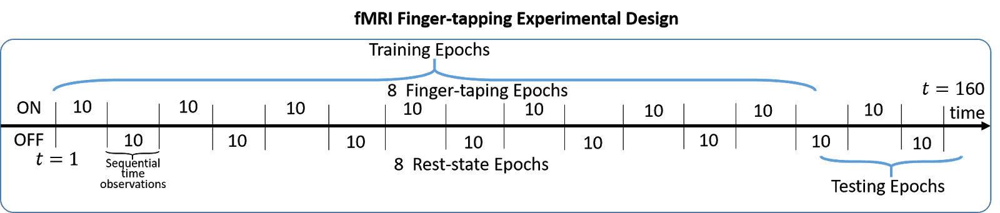

```{r setup, include=FALSE}
knitr::opts_chunk$set(echo = FALSE,cache = FALSE,warning=FALSE,message = FALSE)
```

```{r}
library(fmri)
library(plotly)
library(pracma)
library(forecast)
library(prettydoc)
library(knitr)
library(doParallel)
load("MOD1.RData")
```

# Preface: Project outline

## fMRI time-series analysis and Primary Motor Area (PMA) detection

Functional magnetic resonance imaging (fMRI) is one of the most widely used tools to study the neural underpinnings of human cognition. One of the most important application for fMRI time-series data is to detect the Primary Motor Area (PMA) of the brain. My goal in this report is to develop several simple and general methods to detect PMA based on a given brain scan experimental design (like the following finger tapping experiment in this report) and the corresponding fMRI data. A typical fMRI data is a 4 dimension time-series data consists of 3 spatial dimensions (X, Y, and Z axes) representing the brain area. Each X, Y, and Z coordinate represents a cuboid element (a brain area) of the fMRI scan result, we call each of them as a "voxel". The last dimenson is a temporal dimension representing the time when the MRI machine conducts a brain scan on every voxel, which makes each voxel contain a time-series data which mainly captures the changes in blood flow and oxygenation associated with neural activity (the hemodynamic response), and on the differing magnetic properties of oxygenated and deoxygenated blood of that certain voxel. In particular, we call the signal captured by the time-series data in each voxel as the blood oxygen level-dependent (BOLD) signal. 

For any certain given biain scan experimental design, we would ask our subjects to conduct that certain experiment with a certain time, we call all MRI scans conducted in those periods as "ON epochs". By contrast, there are also certain time that our subjects are asked to rest without any certain movement. Those periods would act as the control group with the "ON epochs", which we call as "OFF epochs". Moreover, for a given experiment, we would expect that only a few certain brain areas would be activated, especially for a given experiment related to the movement of a certain human body, we would expect activation of one or several certain areas in the Primary Motor Area (PMA) of the brain.


Accurately detecting the Primary Motor Area of a certain experiment would be helpful for neural science researchers to research on the functionality of a human brain and neural activities. In this project, I try to achieve this goal by applying time series models on the time series data of each voxels. A straightforward intuitive idea is that for voxels in PMA, the BOLD signals for ON epochs and OFF epochs would be different. Thus would show some particular or seasonal pattern. (BOLD signal is high for ON epochs and low for OFF epochs). And voxels that are not activated wouldn't show a clear pattern (may be white noise signal). And I will try to develop a detecting mechanism based on this idea.

## Data description

In this report, the data I use comes from a sensitive source. It is stored in the file "MOD1.RData". It contains the fMRI data which comes from the following finger tapping experiment:



My data is a 4D fMRI data with $64*64*40$ voxel locations (i.e. Brain scan area: X axis: 64, Y axis: 64, Z axis: 40). Each voxel location has 160 scans arranged by time. There are 3 seconds pause between each scan. Thus each experiment would last for 8 minutes. Just like what is illustrated in the graph above, during those 160 scans there are alternant ON and OFF epochs, each ON and OFF epochs last for 30 seconds, thus give us 8 ON and OFF alternant periods for the whole experiment.

All analysis in this report is based on this fMRI data. But this report aims to introduce a simple and general method that could be applied in any similiar MRI scan experiment. More illustrations will be shown in the following report.

```{r}
GTSplot<- function(tsdata,NEWtitle="fMRI time series visualization",Ylab="fMRI",Xlab="Scan",Unit=NULL
                  ,ts_name=NULL,title_size=10,COLO=NULL) {
  TSP<-plot_ly(type="scatter",mode="lines")
  for (i in 1:ncol(tsdata)) {
    tsd<-tsdata[,i]
    tsn<-ts_name[i]
    Col<-COLO[i]
    TSP<-add_trace(TSP,x=time(tsd),text=paste(time(tsd),Unit),type="scatter",mode="lines",opacity = 0.75,
                   y=tsd,name=tsn,line=list(color=c(Col)))
  }
  TSP<-TSP%>%
    layout(title = list(text = NEWtitle,font = list(family = "Times New Roman",size = title_size,color = "black" )),
           paper_bgcolor='rgb(255,255,255)', plot_bgcolor='rgb(229,229,229)',
           xaxis = list(title = Xlab,
                        gridcolor = 'rgb(255,255,255)',
                        showgrid = TRUE,
                        showline = FALSE,
                        showticklabels = TRUE,
                        tickcolor = 'rgb(127,127,127)',
                        ticks = 'outside',
                        zeroline = FALSE),
           yaxis = list(title = Ylab,
                        gridcolor = 'rgb(255,255,255)',
                        showgrid = TRUE,
                        showline = FALSE,
                        showticklabels = TRUE,
                        tickcolor = 'rgb(127,127,127)',
                        ticks = 'outside',
                        zeroline = FALSE))
  return(TSP)
}
```

```{r}
plotfMRI_TS <- function(fMRIdata,option="auto",X=NULL,Y=NULL,Z=NULL,T=NULL) {
  if(option=="auto"){
    print("Please key in x, y, z, and time in sequence")
    x=0
    y=0
    z=0
    t=0
    while (x>64 | x<1 | x %% 1 != 0) {
      x<-scan(n=1)
      if(x>64 | x<1 | x %% 1 != 0){
        print("input x is not in range or is not an integer! Please retype!")
      }
    }
    while (y>64 | y<1 | y %% 1 != 0) {
      y<-scan(n=1)
      if(y>64 | y<1 |  y %% 1 != 0){
        print("input y is not in range or is not an integer! Please retype!")
      }
    }
    while (z>40 | z<1 | z %% 1 != 0) {
      z<-scan(n=1)
      if(z>40 | z<1 | z %% 1 != 0){
        print("input z is not in range or is not an integer! Please retype!")
      }
    }
    while (t>160 | t<1 | t %% 1 != 0) {
      t<-scan(n=1)
      if(t>160 | t<1 | t %% 1 != 0){
        print("input time is not in range or is not an integer! Please retype!")
      }
    }
  }
  else if(option=="manually"){
   x=X
   y=Y
   z=Z
   t=T
  }
  #time series
  try1<-fMRIdata[x,y,z,]
  #try1<-detrend(try1,bp=seq(21,160,by=20))
  tstry1<-ts(try1)
  trymod1<-auto.arima(tstry1)
  ksmth<-loess(tstry1~c(1:160),span = 0.05)$fitted
  smth<-loess(tstry1~c(1:160),span = 0.5)$fitted
  ksth<-data.frame(tstry1,smth,ksmth)
  TScore<-GTSplot(ksth,ts_name = c("original","trend","noise"),COLO = c("3399FF","66FF33","FF6666"))
  
  #z slice
  
  zfMRI<-t(fMRIdata[,,z,t])
  zslice<-ggplotly(ggplot()+
                     geom_hline(yintercept = y,color="red") +
                     geom_vline(xintercept = x,color="red") +
                     xlim(0,64)+
                     ylim(0,64)
  )%>%
    add_contour(z= ~zfMRI)
  
  #x slice
  
  xfMRI<-t(fMRIdata[x,,,t])
  xslice<-ggplotly(ggplot()+
                     geom_hline(yintercept =z,color="red") +
                     geom_vline(xintercept =y,color="red") +
                     xlim(0,64)+
                     ylim(0,40)
  )%>%
    add_contour(z= ~xfMRI)
  
  #y slice
  yfMRI<-t(fMRIdata[,y,,t])
  yslice<-ggplotly(ggplot()+
                     geom_hline(yintercept = z,color="red") +
                     geom_vline(xintercept = x,color="red") +
                     xlim(0,64)+
                     ylim(0,40)
  )%>%
    add_contour(z= ~yfMRI)
  
  #combine all 4 plots:
  result<-plotly::subplot(TScore,zslice,xslice,yslice,nrows = 2)
  return(result)
}
```

# Data visualization

The following graph shows the time series data of two voxels. First voxel is located at X=44, Y=40, Z=32. And the other one is located at X=10, Y=10, and Z=10.

```{r}
p1<-GTSplot(as.data.frame(ts(bigim1_mod[41,40,32,])),ts_name = c("VOXEL_X41_Y40_Z32"),COLO = c("FF9966"))
p2<-GTSplot(as.data.frame(ts(bigim1_mod[10,10,10,])),ts_name = c("VOXEL_X10_Y10_Z10"),COLO = c("0099FF"))
plotly::subplot(p1,p2,nrows = 2)
```

To visualize more detailed information of each voxel, a function "plotfMRI_TS" is developed. By key in the spatial and temporal information of a certain voxel, researchers would see the time series data and the voxel location on each axis. Moreover, two smoothing trends are also added in the time series plot, they are both achieved by loess smoothing. One with span=0.5, intends to show the trend of this time series. The other with span=0.05, intends to show the noise.

Below is the visualization result of voxel X=41, Y=40, and Z=32. In the upper left time series plot, blue line is the raw time-series data, red line is for the noise signal, and the green line is for the trend signal. The upper right plot is the top view of the brain (Z axis view), the left bottom plot is the side view (X axis view) , and the right bottom is the front view (Y axis view).

This particular voxel location is chosen to show the time series signal of a typical activated location a brain in this finger tapping experiment. This will serve as a typical example in the following report.

```{r}
plotfMRI_TS(bigim1_mod,option = "manually",X=41,Y=40,Z=32,T=21)
```

By contrast, the following graph comes from voxel location X=10, Y=10, and Z=10. It is chosen to show the typical signal of an unactivated area in this MRI experiment. In fact, based on the visualization result, you can easily see that this is a voxel area outside the brain. Still, there are some BOLD signal detected in those areas. It is most likely caused by the noise when conducing a MRI scan. When comparing this data with the data inside the brain area, we can easily see that the intensity of the BOLD signal outside the brain area is much smaller than signal inside the brain area. This could serve as one method to rule out unactivated voxel locations outside the brain area. However, in this report, I will make the judgement based on the trend of each voxel time series, as this method is more general and could be applied to voxels inside the brain area.

This particular voxel location, X=10, Y=10, and Z=10 will also serve as a typical example in the following report.

```{r}
plotfMRI_TS(bigim1_mod,option = "manually",X=10,Y=10,Z=10,T=21)
```

# Time series analysis

## domain analysis

As our finger tapping experiment is based on 8 periods of ON and OFF epochs, each period contains 20 brain scans. Our first aim is to detect that whether a certain voxel would present a clear periodical behavior. 

```{r}
voxel1_spectrum<-spectrum(bigim1_mod[41,40,32,],span=c(3,5,3),main="Smoothed Periodogram")
paste("Dominant period for voxel","X =",41,"Y =",40,"Z =",33,"is",1/voxel1_spectrum$freq[which.max(voxel1_spectrum$spec)])
```

Voxel X=41, Y=40, and Z=33 shows a clear seasonal trend. Based on the smoothed periodogram, the dominant period given is around 23, which is close to the expected period (20) in this experiment.

```{r}
voxel2_spectrum<-spectrum(bigim1_mod[10,10,10,],span=c(3,5,3),main="Smoothed Periodogram")
paste("Dominant period for voxel","X =",10,"Y =",10,"Z =",10,"is",1/voxel2_spectrum$freq[which.max(voxel2_spectrum$spec)])
```

By contrast, the periodogram given by the unactivated voxel shows that there is not a very clear seasonal trend for unactivated voxels. And the detected dominant period doesn't make much sense.

Based on the results above, we could apply the periodogram graph as a intuitive way to detect PMA.

## Smoothing: filter trend, noise, and cycle

By loess smoothing, we could decompose the trend, noise, and cycle signal for each voxel.

```{r}
voxel1_sm<-data.frame(voxel=bigim1_mod[41,40,32,],scan=seq(1,160))
voxel_trend<-ts(loess(data = voxel1_sm,voxel~scan,span = 0.5)$fitted)
voxel_noise<-ts(loess(data = voxel1_sm,voxel~scan,span = 0.05)$fitted)
voxel_cycle<-voxel1_sm$voxel-voxel_trend-voxel_noise
plot(ts.union(raw=voxel1_sm$voxel,trend=voxel_trend,noise=voxel_noise,cycle=voxel_cycle),main="Trend, noise, cycle decomposition for voxel X=41, Y=40, Z=32")
```

Based on the decomposition of voxel X=41, Y=40, and Z=32, we can see that we might detect a clear linear trend of the time-series data of each voxel. But it is hard to detect any seasonal trend based on the ON and OFF epochs by this decomposition. Especially, the noise signal doesn't really make sence as it is too close to the original time-series data. This might be caused by the reason that we only have 160 time points in each voxel, and it is hard to detect local noise based on such a small sample size. Thus the cycle signla also doesn't make much sense here.

```{r}
voxel1_sm<-data.frame(voxel=bigim1_mod[10,10,10,],scan=seq(1,160))
voxel_trend<-ts(loess(data = voxel1_sm,voxel~scan,span = 0.5)$fitted)
voxel_noise<-ts(loess(data = voxel1_sm,voxel~scan,span = 0.05)$fitted)
voxel_cycle<-voxel1_sm$voxel-voxel_trend-voxel_noise
plot(ts.union(raw=voxel1_sm$voxel,trend=voxel_trend,noise=voxel_noise,cycle=voxel_cycle),main="Trend, noise, cycle decomposition for voxel X=10, Y=10, Z=10")
```

As for the unactivated voxel, the voxel and cycle signal also don't make much sense. And here we could find that there is not a very clear linear trend in this voxel. This is reasonable as we might expect that there is only white noise signal in unactivated voxel. However, we shouldn't be too suprised if we detect a linear trend for those voxels.

Based on the analysis above, for fMRI data with small sample size in each voxel, it is hard to detect the cycle signal based on the loess smoothing decomposition method. But we could still detect the linear trend based on this method. This also suggests that to truely if a voxel is an unactivated voxel, we might wish to detrend first and then judge that if the rest signal is stationary or even just pure white noise.

## Trend analysis: linear, quardatic, and cubic trend

The following part is to analysis that whether we might think about introducing higher order trends (quadratic, cubic trend) inside our time series model.

```{r}
aic_table <- function(data,P,Q,X)
  {
  table <- matrix(NA,(P+1),(Q+1))
  for(p in 0:P)
    {
    for(q in 0:Q)
      {table[p+1,q+1] <- arima(data,order=c(p,0,q),xreg = X)$aic}
    }
  dimnames(table) <- list(paste("AR",0:P, sep=""),paste("MA",0:Q,sep=""))
  return(table)
  }
```

The ARMA model is selected based on the AIC table. And all three trends information is added to the ARMA model as external regressors.

```{r}
X_trend<-data.frame(linear=seq(1,160),square=seq(1,160)^2,cubic=seq(1,160)^3)
X_trend_mat<-as.matrix(X_trend)
V_dtrend<-aic_table(bigim1_mod[41,40,32,],4,4,X=X_trend)
kable(V_dtrend)
V_dtrend_mod<-arima(bigim1_mod[41,40,32,],order = c(2,0,1),xreg = X_trend)
summary(V_dtrend_mod)
```

Based on the model, we see that only the linear trend is significant.

```{r}
GTSplot(as.data.frame(V_dtrend_mod$residuals),Ylab ="Residuals" ,ts_name = c("Residuals_X44_Y32_Z33"),COLO = c("green"))
```

```{r}
par(mfrow=c(2,2))
acf(V_dtrend_mod$residuals,main="ACF for residuals")
spectrum(V_dtrend_mod$residuals,span=c(3,5,3),main="Smoothed Periodogram")
qqnorm(V_dtrend_mod$residuals)
qqline(V_dtrend_mod$residuals,col="red",lty=2)
plot(V_dtrend_mod$residuals,xlab="Scan",ylab="Residuals")
abline(h=0,col="red",lty=2)
par(mfrow=c(1,1))
```

Based on the graphs given above, we see that this ARMA model with three trends could caputure the main characteristics of the activated voxel. The residuals left seem follow the normality assumption and doesn't show a clear lag. However, there still seems to have a dominant period similiar to the original data left in residuals, and the quadratic trend and cubic trend are not significant. This suggests that we might wish to change another common trend to represent the activated voxels.

```{r}
X_trend<-data.frame(linear=seq(1,160),square=seq(1,160)^2,cubic=seq(1,160)^3)
X_trend_mat<-as.matrix(X_trend)
V_dtrend<-aic_table(bigim1_mod[10,10,10,],4,4,X=X_trend)
kable(V_dtrend)
V_dtrend_mod<-arima(bigim1_mod[10,10,10,],order = c(0,0,0),xreg = X_trend)
summary(V_dtrend_mod)
```

For the unactivated voxel, all three trends are not significant, and we are suggested to apply an ARMA(0,0) model, which suggests that the original time series data might just be a white noise signal.

# Time series models with BOLD response signal

## Simulate BOLD response signal & BOLD signal regression model.

As we expect that for voxels inside the Primary Motor Area would show a different seasonal trend for ON and OFF epochs, we would expect that there is a common trend that is shared by all activated voxels that could represent the typical BOLD signal of activated PMA voxels. Based on package "fmri" and article "A General Statistical Analysis for fMRI Data", we find out that R could easily generated this certain BOLD response signal based on functions "fmri.stimulus" and "fmri.design". One more advantage we have here is that these two functions are also general methods that could apply to similiar experiments. We only need to know the particual experimental design to stimulate the expected BOLD response of activated voxels for each experiment.

```{r}
ons <- c(1, 21, 41, 61, 81, 101, 121, 141)
dur <- c(10, 10, 10, 10, 10, 10, 10, 10)
dur2<-c(1:10,21:30,41:50,61:70,81:90,101:110,121:130,141:150)

fixed_stim<-fmri.stimulus(160,ons = dur2,TR=3)
raw_design<-fmri.design(fixed_stim,order = 1)
X_fmri<-raw_design[,-2]
X_fmri<-as.data.frame(X_fmri)
colnames(X_fmri)<-c("BOLD_signal","linear_signal")
```

The following graph shows the expected BOLD response of this finger tapping experiment, along with the linear signal. Here we keep the linear trend as analysis above shows that we might face a significant liear trend in each voxel. These two trends would act as the external regressors for the time series models

```{r}
p1<-GTSplot(as.data.frame(X_fmri$BOLD_signal),ts_name = c("Simulated_BOLD_signal"),COLO = c("FF9966"))
p2<-GTSplot(as.data.frame(X_fmri$linear_signal),ts_name = c("Simulated_linear_signal"),COLO = c("0099FF"))
plotly::subplot(p1,p2,nrows = 2)
```

If we only combine those two signals above and fit a regression model with the time-series data, we would get the following result. We see that it could fit the overall trend well but it might not able to capture other time series information from the original time series data. Thus we might conside ARMA model with BOLD and linear trends.

```{r}
voxel1_df<-cbind(Y=bigim1_mod[41,40,32,],X_fmri)
lm_voxel1<-lm(data = voxel1_df,Y~.)
ts_voxel1<-data.frame(LM=ts(lm_voxel1$fitted.values),RAW=ts(bigim1_mod[41,40,32,]))
GTSplot(ts_voxel1,ts_name = c("BOLD_signal_regression","RAW_data"))
```

## ARMA model with BOLD and linear trends

We will conduct the same procedures as we've done for the linear, quadratic, and cubic trends.

```{r}
X_fmri_mat<-as.matrix(X_fmri)
V_dtrend<-aic_table(bigim1_mod[41,40,32,],4,4,X=X_fmri)
kable(V_dtrend)
V_dtrend_mod<-arima(bigim1_mod[41,40,32,],order = c(2,0,1),xreg = X_fmri)
summary(V_dtrend_mod)
```

```{r}
GTSplot(as.data.frame(V_dtrend_mod$residuals),Ylab ="Residuals" ,ts_name = c("Residuals_X44_Y32_Z33"),COLO = c("green"))
```

```{r}
par(mfrow=c(2,2))
acf(V_dtrend_mod$residuals)
spectrum(V_dtrend_mod$residuals,span=c(3,5,3))
qqnorm(V_dtrend_mod$residuals)
qqline(V_dtrend_mod$residuals,col="red",lty=2)
plot(V_dtrend_mod$residuals,xlab="Scan",ylab="Residuals")
abline(h=0,col="red",lty=2)
par(mfrow=c(1,1))
```

We could find that the results are very similiar to the linear, quadratic, and cubic analysis above. The residuals look like white noise and it follows the normality assumption. We also don't detect a clear lag inside the residuals. ARMA model with BOLD and linear signals could capture the main trend of the time series data and the residuals are close to white noise. But a huge advantage based on this method is that now inside the model, coefficient of the BOLD signal is significant.

```{r}
X_fmri_mat<-as.matrix(X_fmri)
V_dtrend<-aic_table(bigim1_mod[10,10,10,],4,4,X=X_fmri)
kable(V_dtrend)
V_dtrend_mod<-arima(bigim1_mod[10,10,10,],order = c(0,0,0),xreg = X_fmri)
summary(V_dtrend_mod)
```

Now, if we conduct the same thing on the unactivated voxel, we could find that coefficient of the BOLD signal is not significant anymore.

In conclusion, after introducing BOLD signal inside the ARMA model, we could detect whether a single voxel location is inside PMA or not by detecting whether the coefficient of the bold signal is significant or not.

# General methods for detecting Primary Motor Area

Combining all methods we applied above, we could apply the following methods to detect whether a voxel is inside the Primary Motor Area or not. 

The first method is a preliminary screening method aiming to detect voxels that couldn't be inside the PMA.

1. Plot the smoothed periodogram to detect whether the dominant period is close to the alternant ON and OFF epochs period.
2. If each voxel would have sufficent time series samples, we could think about conducting trend, noise, and cycle decomposition to detect potential cycle trend.
3. Fit an ARMA model with only linear trend by AIC table. An evidence for a voxel is not inside the PMA is that we get an ARMA(0,0) model with or without a significant linear trend.
4. Fit a linear model with linear and BOLD response. An evidence for a voxel is not inside the PMA is that the BOLD signal coefficient is not significant in this linear model.

A function "fMRI_TS_overview" is developed to conduct all procedures above. And if we would go to the next procedure to detect a certain voxel in more detail, an AIC table would be given based on the ARMA model with both linear and BOLD response. And we could select the best ARMA model that would be applied in the next procedure.

For voxels that might be inside the PMA, a function "fMRI_TS_analysis" is developed to conduct more detections.

1. The best ARMA model with both linear and BOLD signals are fitted. The dominant factor of detecting the PMA is to see whether the coefficient of the BOLD signal inside the ARMA model is significant. As if we get a significant BOLD signal, it represents that the time series data in this voxel could fit perfectly in the expected BOLD signal response, thus represent a high possibility of being an activated voxel.
2. Diagnosis of residuals are conducted. If the residuals are not close to white noise, we might need to dig deeper into that voxel to determine whether it is inside the Primary Motor Area.

```{r}
fMRI_TS_overview <- function(fMRI,X,Y,Z,option) {
  data_fmri<-fMRI[X,Y,Z,]
  msg<-try(arima(data_fmri,order = c(0,0,0)),silent = T)
  if(class(msg)=="try-error"){
   return("Voxel is not inside the mask area (brain area). Please select another voxel.") 
  }
  spectfMRI<-spectrum(data_fmri,span=c(3,5,3),plot=FALSE)
  perioddet<-paste("Dominant period for voxel","X =",X,"Y =",Y,"Z =",Z,"is",1/spectfMRI$freq[which.max(spectfMRI$spec)])
  voxel1_sm<-data.frame(voxel=data_fmri,scan=seq(1,160))
  voxel_trend<-ts(loess(data = voxel1_sm,voxel~scan,span = 0.5)$fitted)
  voxel_noise<-ts(loess(data = voxel1_sm,voxel~scan,span = 0.05)$fitted)
  voxel_cycle<-voxel1_sm$voxel-voxel_trend-voxel_noise
  
  #Linear model analysis
  voxel1_df<-cbind(Y=data_fmri,X_fmri)
  lm_voxel1<-lm(data = voxel1_df,Y~.)
  
  #Time-series analysis
  V_raw<-aic_table(data_fmri,4,4,X=X_fmri$linear_signal)
  V_dtrend<-aic_table(data_fmri,4,4,X=X_fmri)
  
  if(option=="spec_acf"){
    par(mfrow=c(1,2))
    spectrum(data_fmri,span=c(3,5,3),main="Smoothed Periodogram")
    acf(data_fmri,main="ACF for raw time series")
    print(perioddet)
    par(mfrow=c(1,1))
  }
  if(option=="AIC_raw"){
    return(kable(V_raw))
  }
  if(option=="AIC_BOLD"){
    return(kable(V_dtrend))
  }
  if(option=="LM_summary"){
    return(summary(lm_voxel1))
  }
  if(option=="trend_noise"){
    plot(ts.union(raw=voxel1_sm$voxel,trend=voxel_trend,noise=voxel_noise,cycle=voxel_cycle),main = paste("Trend, noise, cycle decomposition for voxel","X =",X,"Y =",Y,"Z =",Z))
  }
  # print(paste("The periodogram for voxel","X =",X,"Y =",Y,"Z =",Z, "is as follows:"))
  # spectrum(data_fmri,span=c(3,5,3),main="Smoothed Periodogram")
  # print(perioddet)
  # print(paste("Trend, noise, and cycle decomposition for voxel","X =",X,"Y =",Y,"Z =",Z, "is as follows:"))
  # plot(ts.union(raw=voxel1_sm$voxel,trend=voxel_trend,noise=voxel_noise,cycle=voxel_cycle),main = paste("Trend, noise, cycle decomposition for voxel","X =",X,"Y =",Y,"Z =",Z))
  # print(paste("Summary of linear model for voxel","X =",X,"Y =",Y,"Z =",Z, "with BOLD signal and LINEAR signal","is as follows:"))
  # print(summary(lm_voxel1))
  # print(paste("AIC table of ARMA model (LINAR detrend: only detecting white noise) for voxel","X =",X,"Y =",Y,"Z =",Z, "is as follows:"))
  # print(kable(V_raw))
  # print(paste("AIC table of ARMA model (with BOLD and LINEAR trends) for voxel","X =",X,"Y =",Y,"Z =",Z, "is as follows:"))
  # print(kable(V_dtrend))
}
```

```{r}
fMRI_TS_analysis <- function(fMRI,X,Y,Z,p,d,q,option) {
  data_fmri<-fMRI[X,Y,Z,]
  arima_model<-arima(data_fmri,order = c(p,d,q),xreg = X_fmri)
  # print(paste("Summary for ARIMA model(with BOLD and LINEAR signal) for voxel","X =",X,"Y =",Y,"Z =",Z, "is as follows:"))
  # print(summary(arima_model))
  # print(paste("Diagnosis for voxel","X =",X,"Y =",Y,"Z =",Z, "is as follows:"))
  P1<-GTSplot(as.data.frame(arima_model$residuals),Ylab ="Residuals" ,ts_name = paste("Residuals","X =",X,"Y =",Y,"Z =",Z),COLO = c("CC3399"))
  # acf(arima_model$residuals)
  # spectrum(arima_model$residuals,span=c(3,5,3))
  # qqnorm(arima_model$residuals)
  # qqline(arima_model$residuals,col="red",lty=2)
  P2<-GTSplot(data.frame(raw=data_fmri,pred=data_fmri-arima_model$residuals),ts_name = c("original","time-sereis fit"),COLO = c("3399FF","66FF33"))
  # print(paste("Residuals and time-series prediction visualization for voxel","X =",X,"Y =",Y,"Z =",Z, "is as follows:"))
  
  if(option=="Summary_ARIMA"){
    return(summary(arima_model))
  }
  if(option=="Residuals_visualization"){
    return(P1)
  }
  if(option=="Diagnosis"){
    par(mfrow=c(2,2))
    acf(arima_model$residuals)
    spectrum(arima_model$residuals,span=c(3,5,3))
    qqnorm(arima_model$residuals)
    qqline(arima_model$residuals,col="red",lty=2)
    plot(arima_model$residuals)
    abline(h=0,col="red",lty=2)
    par(mfrow=c(1,1))
  }
  if(option=="TS_visualization"){
    return(P2)
  }
}
```

## Examples and demos for the general Primary Motor Area detecting procedures.

### Example 1: voxel X=32, Y=32, Z=20

This voxel is chose as it is the center of the fMRI data. This voxel must be inside the brain but according to the knowledge about Primary Motor Area, it is not one of the part of the PMA.

```{r}
fMRI_TS_overview(bigim1_mod,32,32,20,option = "spec_acf")
```

The dominant period doesn't match the expected dominant trend.

```{r}
fMRI_TS_overview(bigim1_mod,32,32,20,option = "AIC_raw")
```

AIC table given by ARMA model with only linear trend suggests that after detrending, the fMRI signal is highly likely to be white noise.

```{r}
fMRI_TS_overview(bigim1_mod,32,32,20,option = "LM_summary")
```

The BOLD signal is not significant in the linear model.

```{r}
fMRI_TS_overview(bigim1_mod,32,32,20,option = "trend_noise")
```

No interesting information we could get from the decomposition plot.

Based on all information we gathered above, we could conclude that voxel X=32, Y=32, and Z=20 is not inside the PMA.

### Example 2: voxel X=41, Y=24, Z=32

This voxel is in the different Y axis position with the activated voxel X=41, Y=40, Z=32. It is in the back of the brain and in theory it is a typical unactivated area.

```{r}
plotfMRI_TS(bigim1_mod,option = "manually",X=41,Y=24,Z=32,T=21)
```

```{r}
fMRI_TS_overview(bigim1_mod,41,24,32,option = "spec_acf")
```

The dominant period doesn't match the expected dominant period.

```{r}
fMRI_TS_overview(bigim1_mod,41,24,32,option = "AIC_raw")
```

AIC table given by ARMA model with only linear trend suggests that after detrending, the fMRI signal is highly likely to be white noise or could be fitted by ARMA(0,1) model. Actually, there is not a very strong evidence that this is not a white noise signal after detrending.

```{r}
fMRI_TS_overview(bigim1_mod,41,24,32,option = "LM_summary")
```

The BOLD signal is not significant in the linear model.

```{r}
fMRI_TS_overview(bigim1_mod,41,24,32,option = "trend_noise")
```

No interesting information we could get from the decomposition plot.

Based on all information we gathered above, we could conclude that voxel X=41, Y=24, and Z=32 is not inside the PMA.

### Example 3: voxel X=42, Y=41, Z=33

This voxel is very close to the activaed voxel. And it is very likely to be a voxel inside the PMA as PMA should be a few concentrated area.

```{r}
fMRI_TS_overview(bigim1_mod,42,41,33,option = "spec_acf")
```

The dominant period matches the expected dominant period and the ACF plot shows a trend pattern.

```{r}
fMRI_TS_overview(bigim1_mod,42,41,33,option = "AIC_raw")
```

AIC table suggests an ARMA(0,4) model.

```{r}
fMRI_TS_overview(bigim1_mod,42,41,33,option = "LM_summary")
```

Clear signifance on the BOLD signal coefficient.

```{r}
fMRI_TS_overview(bigim1_mod,42,41,33,option = "trend_noise")
```

All information we gathered above suggest that this is a possible voxel inside the Primary Motor Area. Thus more detection should be conducted.

```{r}
fMRI_TS_overview(bigim1_mod,42,41,33,option = "AIC_BOLD")
```

Using this AIC table, we get that the best ARMA model with both BOLD and linear trend is ARMA(2,2)

```{r}
fMRI_TS_analysis(bigim1_mod,42,41,33,2,0,2,option = "Summary_ARIMA")
```

After applying the best ARMA model, coefficient of the BOLD signal (based on z-test) is significant. This is a good evidence to prove that this is a voxel inside the PMA.

```{r}
fMRI_TS_analysis(bigim1_mod,42,41,33,2,0,2,option = "Residuals_visualization")
```

```{r}
fMRI_TS_analysis(bigim1_mod,42,41,33,2,0,2,option = "Diagnosis")
```

Diagnosis on residuals show that the residuals are highly likely to be white noise. Thus prove that the ARMA model we developed above are reasonable.

Thus we could conclude that the voxel X=42, Y=41, and Z=33 is inside the PMA.

```{r}
fMRI_TS_analysis(bigim1_mod,42,41,33,2,0,2,option = "TS_visualization")
```

## A bold approach to apply a simple detecting method to all voxels

As we could see that the significance of the coefficience of BOLD signal inside the ARMA model with both linear and BOLD signal is a leading feature to determine whether a voxel is inside the PMA or not. Thus we could conduct a simple z-test on all voxels to calculate the p-value of the coefficient of BOLD signal for all voxels. This is not a very appropriate approach. There are two major flaws for this method. Firstly is that we might detect too many activated voxels. To solve this, we might apply FDR correction method or Benjamini-Hochberg Procedure to control detected voxels. Secondly, the detected voxels are likely to be scattered and not concentrated on several major area. To solve this issue, we might think about applying spatial clustering to concentrate the PMA we detected. However, this is not the only issue we face. As we didn't take the correlations between voxels into consideration. Some articles have addressed the inaccuracy for detecting the Primary Motor Area only based on single voxel. And we might be able to get a better method by some bayesian analysis approaches. But this is already beyond the discussion of this report. Nonetheless, this bold approach would serve as a good tool to have a overall visualization on the detected primary motor area.

```{r}
#This code would calculate p-value of each voxel based on the coefficient of BOLD signal. It will take approximately 2 hours to run

# p_value_array<-array(NA,dim = c(64,64,40))
# for (i in 1:64) {
#   for (j in 1:64) {
#     for (k in 1:40) {
#       temp_mod<-auto.arima(ts(bigim1_mod[i,j,k,]),xreg = X_fmri_mat,start.p = 0,start.q = 0,ic="aic")
#       val<-temp_mod$coef["BOLD_signal"]/sqrt(diag(temp_mod$var.coef))["BOLD_signal"]
#       if(is.na(val)==TRUE){
#         p_value_array[i,j,k]=1
#       }
#       else{
#         val<-ifelse(pnorm(val)<0.5,pnorm(val),1-pnorm(val))
#         p_value_array[i,j,k]=val
#       }
# 
#     }
#   }
# }


load("PVAL_R.RData")
```

```{r}
pval_visualization <- function(fMRIdata,one_min_pval,option="auto",X=NULL,Y=NULL,Z=NULL) {
  if(option=="auto"){
    print("Please key in x, y, z, and time in sequence")
    x=0
    y=0
    z=0
    t=0
    while (x>64 | x<1 | x %% 1 != 0) {
      x<-scan(n=1)
      if(x>64 | x<1 | x %% 1 != 0){
        print("input x is not in range or is not an integer! Please retype!")
      }
    }
    while (y>64 | y<1 | y %% 1 != 0) {
      y<-scan(n=1)
      if(y>64 | y<1 |  y %% 1 != 0){
        print("input y is not in range or is not an integer! Please retype!")
      }
    }
    while (z>40 | z<1 | z %% 1 != 0) {
      z<-scan(n=1)
      if(z>40 | z<1 | z %% 1 != 0){
        print("input z is not in range or is not an integer! Please retype!")
      }
    }
    while (t>160 | t<1 | t %% 1 != 0) {
      t<-scan(n=1)
      if(t>160 | t<1 | t %% 1 != 0){
        print("input time is not in range or is not an integer! Please retype!")
      }
    }
  }
  else if(option=="manually"){
   x=X
   y=Y
   z=Z
  }
  #time series
  try1<-fMRIdata[x,y,z,]
  #try1<-detrend(try1,bp=seq(21,160,by=20))
  tstry1<-ts(try1)
  trymod1<-auto.arima(tstry1)
  ksmth<-loess(tstry1~c(1:160),span = 0.05)$fitted
  smth<-loess(tstry1~c(1:160),span = 0.5)$fitted
  ksth<-data.frame(tstry1,smth,ksmth)
  TScore<-GTSplot(ksth,ts_name = c("original","trend","noise"),COLO = c("3399FF","66FF33","FF6666"))
  
  #z slice
  
  Z_axis<-t(one_min_pval[,,z])
  zslice<-ggplotly(ggplot()+
                     geom_hline(yintercept = y,color="red") +
                     geom_vline(xintercept = x,color="red") +
                     xlim(0,64)+
                     ylim(0,64)
  )%>%
    add_contour(z= ~Z_axis,colorscale = list(c(0,0.9,0.95, 1), c('FFFFFF', "FFCC66",'FF6600',"990000")),contours=list(showlines=FALSE,start=0,end=1,size=0.025))
  
  #x slice
  
  X_axis<-t(one_min_pval[x,,])
  xslice<-ggplotly(ggplot()+
                     geom_hline(yintercept =z,color="red") +
                     geom_vline(xintercept =y,color="red") +
                     xlim(0,64)+
                     ylim(0,40)
  )%>%
    add_contour(z= ~X_axis,colorscale = list(c(0,0.9,0.95, 1), c('FFFFFF', "FFCC66",'FF6600',"990000")),contours=list(showlines=FALSE,start=0,end=1,size=0.025))
  
  #y slice
  Y_axis<-t(one_min_pval[,y,])
  yslice<-ggplotly(ggplot()+
                     geom_hline(yintercept = z,color="red") +
                     geom_vline(xintercept = x,color="red") +
                     xlim(0,64)+
                     ylim(0,40)
  )%>%
    add_contour(z= ~Y_axis,colorscale = list(c(0,0.9,0.95, 1), c('FFFFFF', "FFCC66",'FF6600',"990000")),contours=list(showlines=FALSE,start=0,end=1,size=0.025))
  
  #combine all 4 plots:
  result<-plotly::subplot(TScore,zslice,xslice,yslice,nrows = 2)
  return(result)
}
```

```{r}
pval_visualization(bigim1_mod,1-p_value_array,option = "manually",41,40,32)
```

The concentrated red areas are the detected Primary Motor Area. But clearly, more visualizations could be done based on the detected p-value. We would be able to show a very nice 3D visualization of the brain primary motor area after conducing FDR correction and Spatial Clustering.

# Reference

1. Article: [*Statistical Analysis of fMRI Time-Series: A Critical Review of the GLM Approach*](https://www.ncbi.nlm.nih.gov/pmc/articles/PMC3062970/)
2. Article: [*A General Statistical Analysis for fMRI Data*](https://www.sciencedirect.com/science/article/pii/S1053811901909334)
3. Article: [*Analysis of fMRI Timeseries: Linear Time-Invariant Models, Event-related fMRI and Optimal Experimental Design*](https://www.fil.ion.ucl.ac.uk/spm/doc/books/hbf2/pdfs/Ch10.pdf)
4. Article: [*Bayesian Models for fMRI Data Analysis*](https://www.ncbi.nlm.nih.gov/pmc/articles/PMC4346370/#FD1)
5. Book: [*Spectral Analysis of fMRI Signal and Noise*](https://link.springer.com/chapter/10.1007/978-4-431-73242-6_4)
6. Slides: [The general linear model for fMRI](https://www.tnu.ethz.ch/fileadmin/user_upload/teaching/Methods_Models2017/04_GLM_HS2017.pdf)
7. Previous project:[Monthly Traffic Fatalities in Ontario (1960-1974)](https://ionides.github.io/531w18/midterm_project/project1/midterm_project.html)
8. Class notes and previous exams
9. Massive assistance from my friends Zhe Yin and Jinwen Cao
10. Suggestions and guidance from my professor Ivo Dinov.
